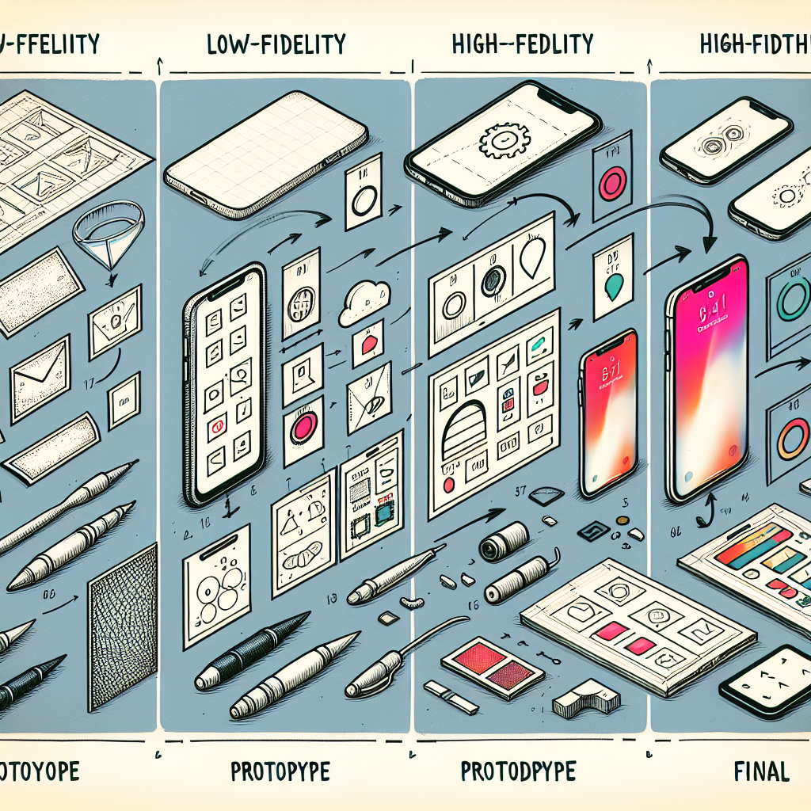
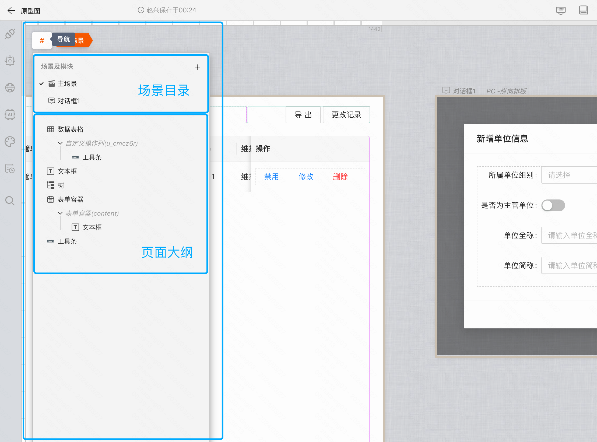
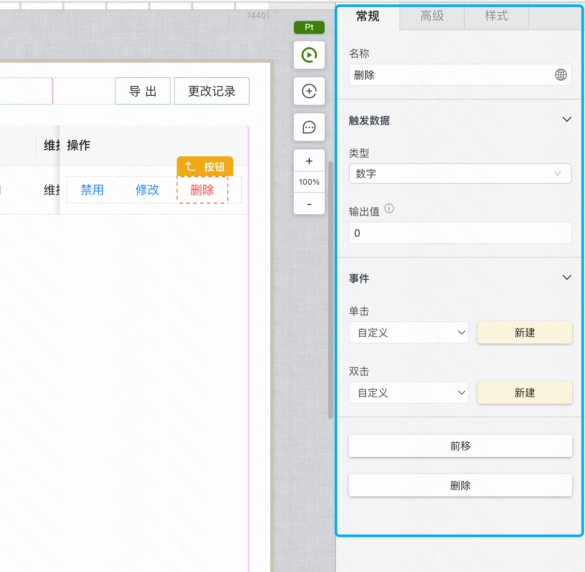
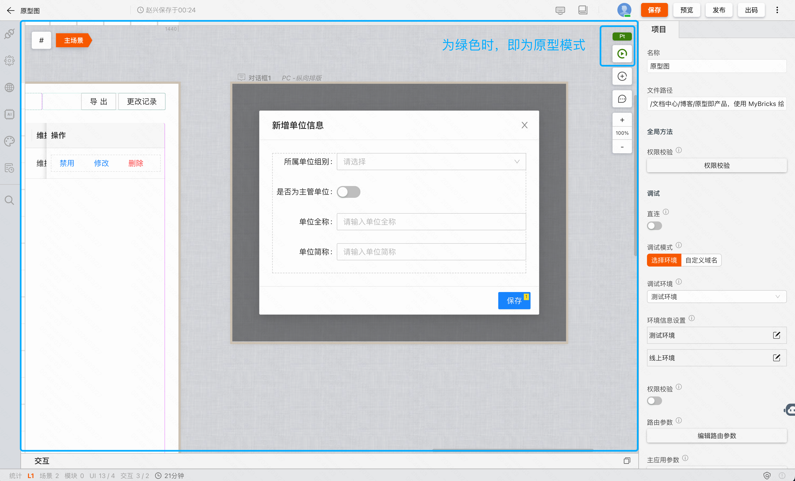
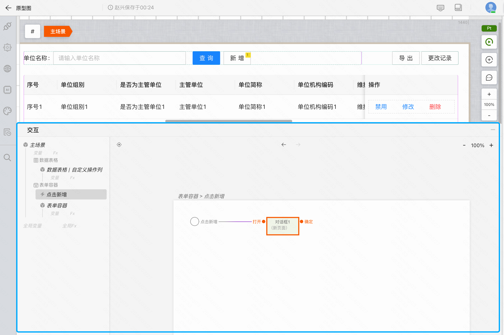
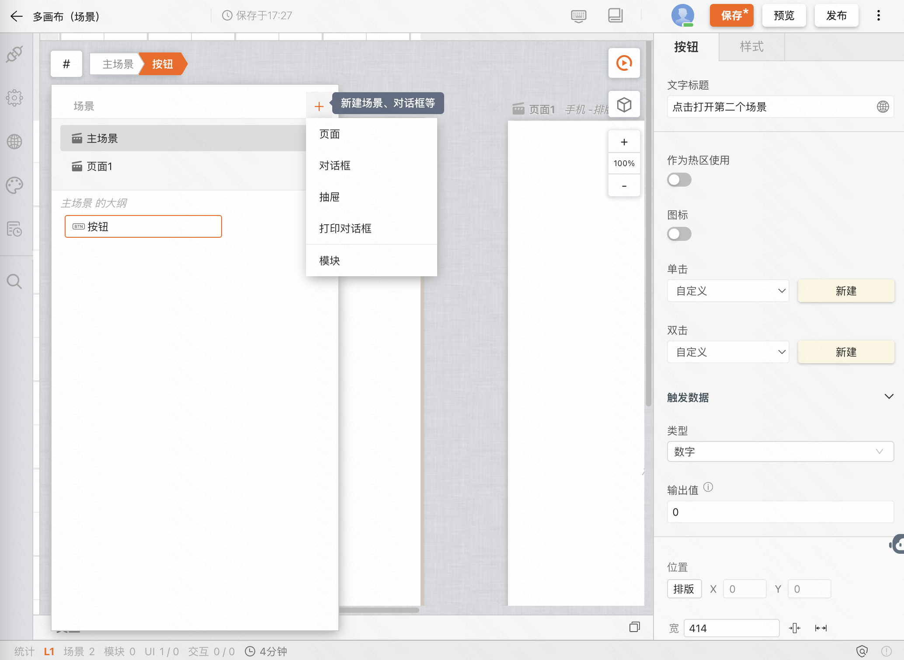
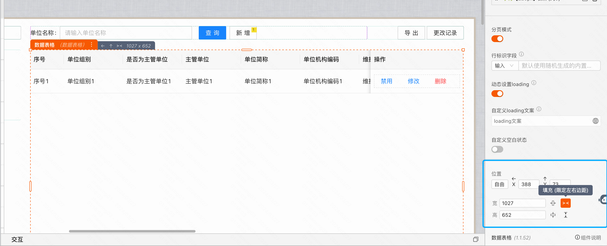
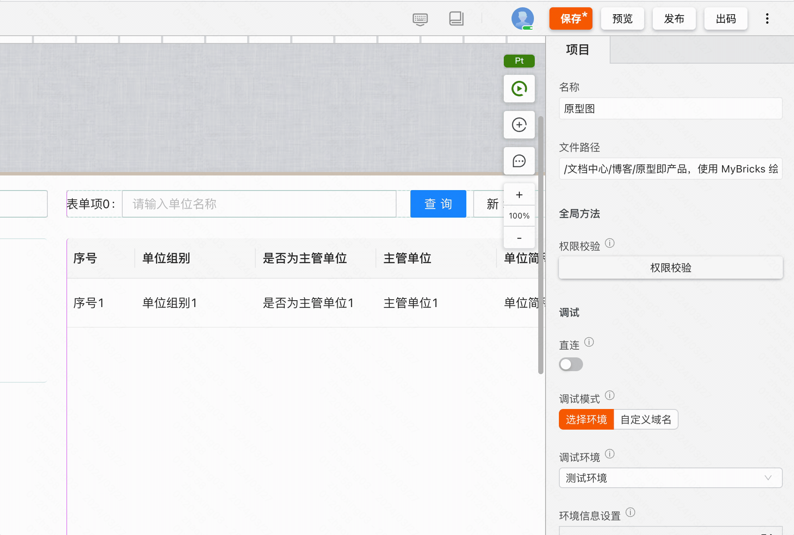
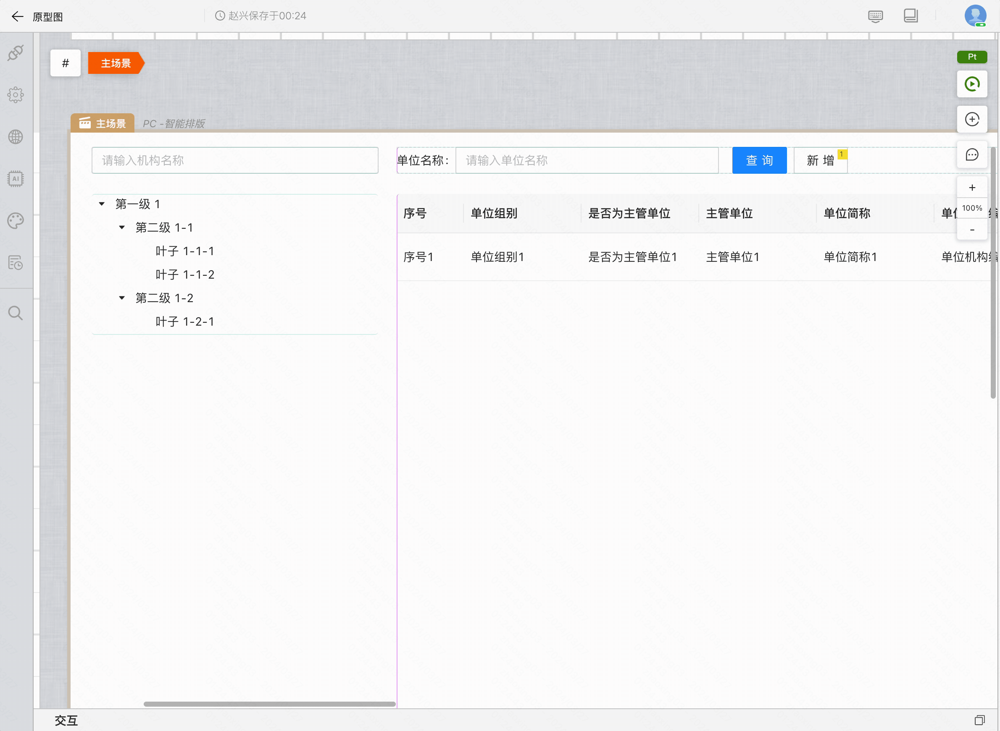
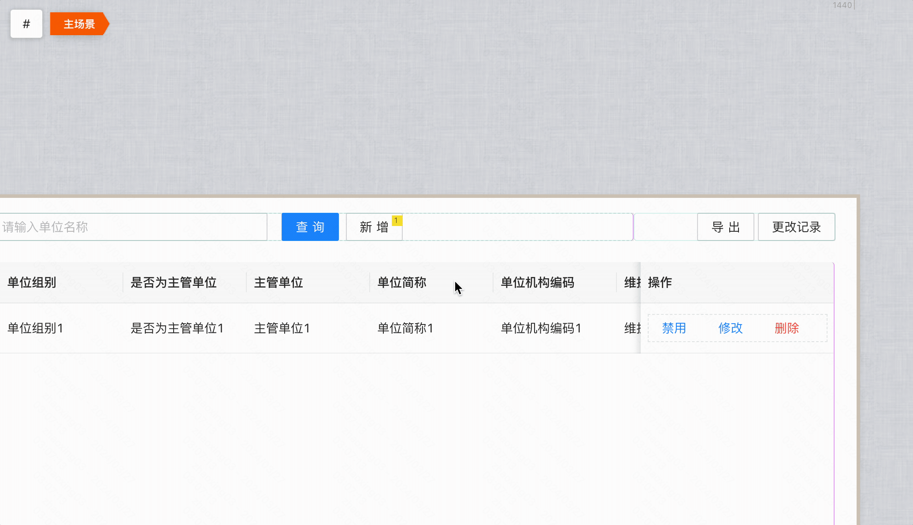

# 原型即产品，使用 MyBricks 绘制专业原型图

在产品开发的生命周期中，团队成员不断在 **「产品 > 设计 > 研发」** 的流程中进行协作。这个协作流程通常伴随着 **「原型图 > 设计稿 > 产品」** 的递进演变。各环节涉及的专业工具从 Axure 的原型模拟，到 Figma 的界面设计，再到 Vscode 的代码实现，每一个步骤不仅要求团队成员可以掌握上游成员的专业工具中的信息，还要求团队成员基于自己的专业技能，从 0 到 1 完成工作并交付下游。这无疑给团队带来了非常多冗余的开发成本。

**如果团队可以基于同一款专业工具进行无缝对接，从「原型图 > 设计稿 > 产品」，上游的交付物可以直接被下游团队所继承使用，认知差异和重复工作的问题就可以引刃而解了，实现更高效协同。**

今天就为大家讲解用 MyBricks 绘制专业原型图的一些基础操作。

<!--truncate-->

**原型图 Demo：** https://my.mybricks.world/mybricks-app-pcspa/index.html?id=547362613055557

通过上图可以看到，该原型图包含了高保证 UI，清晰展示产品的概貌，并且自动生成内容填充、原型交互等功能，帮助设计与开发准确拆分页面功能模块及信息展示。

### 视频讲解

<iframe style="position: absolute; width: 100%; height: 100%; left: 0; top: 0;" src="//player.bilibili.com/player.html?aid=1252250019&bvid=BV1XJ4m177tp&cid=1483289494&p=1&autoplay=0" frameborder="no" scrolling="no"></iframe>

[点击查看原视频](https://www.bilibili.com/video/BV1XJ4m177tp/?vd_source=38b33986c844f16af099700ca9b4c7c8)

### 基础布局

操作区主要分为四块：

左侧为导航。可以看到「场景目录」和「页面大纲」。

右侧为属性设置区。可以对某个元素进行具体参数的修改。

中间为画板区，可以进行所有的绘制工作，尤其注意，我们可以在原型绘制时，将画布状态切换到「Pt 原型模式」。

底部为交互区，可以设置动态交互内容。

### 开始绘制

点击导航按钮 `#` 可以依次通过「导航 > 新建场景」路径新建画布。通过多画布可以更直观的绘制页面、对话框等场景。

接下来开始绘制原型中的内容，组件库里面有各式各样现成的组件，可以直接使用。例如表单，表格、图表等等。我们找到合适的组件，拖入画布即可。

随后可以自由拖动或者输入数字，设置组件的位置和尺寸。以及为组件设置对齐等信息。

我们只需根据自己想要的效果，任意摆放即可。整体的自由度还是比较大的。

### 内容填充

聚焦组件，右侧属性设置区会发生对应的变化。编辑展示的文字信息可以让设计和研发更清晰的接收到页面的信息结构。

而对于「数据表格」等复杂的组件，只需要在「Pt」原型模式下点击「调试」，便会为组件自动填充内容。

### 原型交互

项目评审时，可交互的动态界面往往比静态更直观。

如下图，我们为组件创建单击事件，并且在交互面板中为事件配置打开对话框的指令。在调试时，就可以实现了打开对话框的交互动作。

### 添加评论

除了原型图，还可以为页面、组件添加评论来提供补充说明和对齐信息。操作方式为在空白处双击，然后连线到组件或空白区域单击。

### 最后

我们可以通过将项目连接发送给伙伴，这样他们就可以快速预览到你的原型图了。
