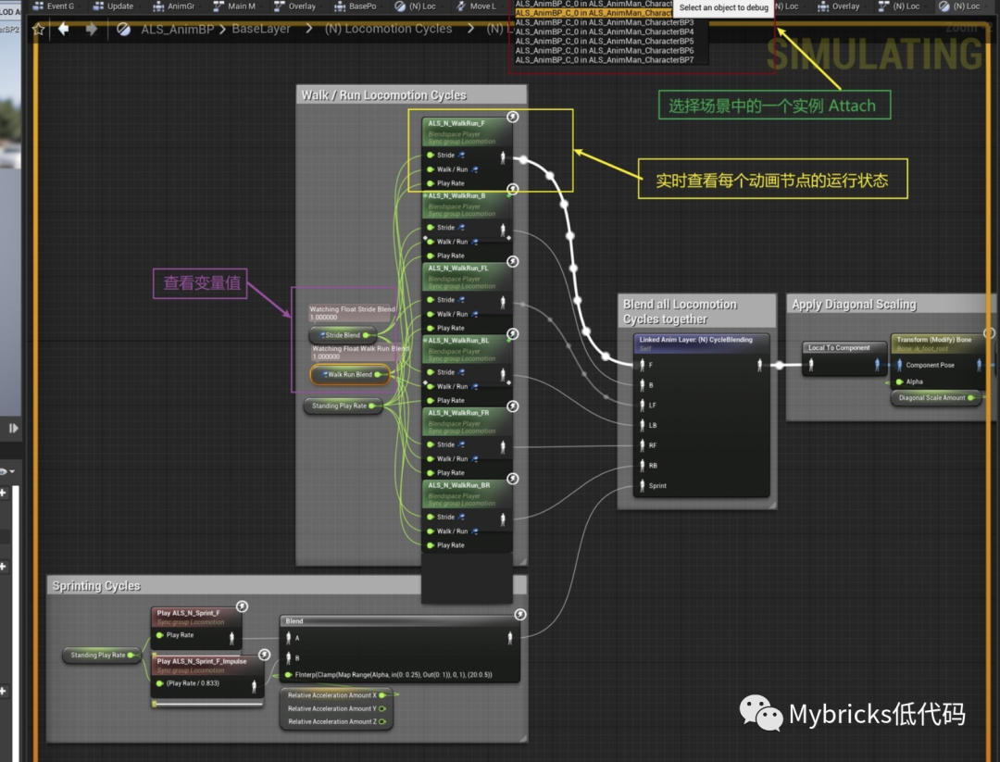
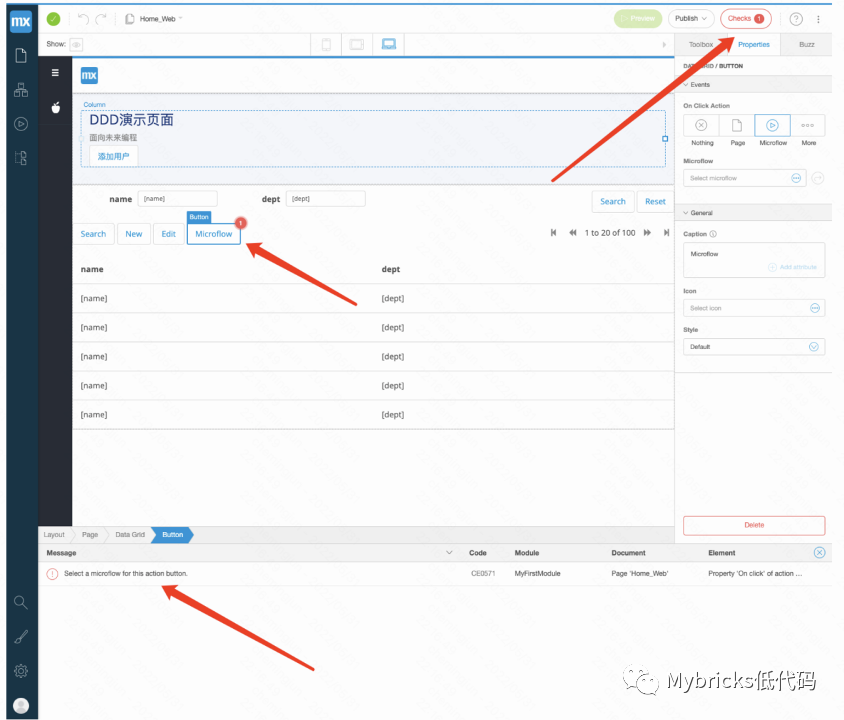
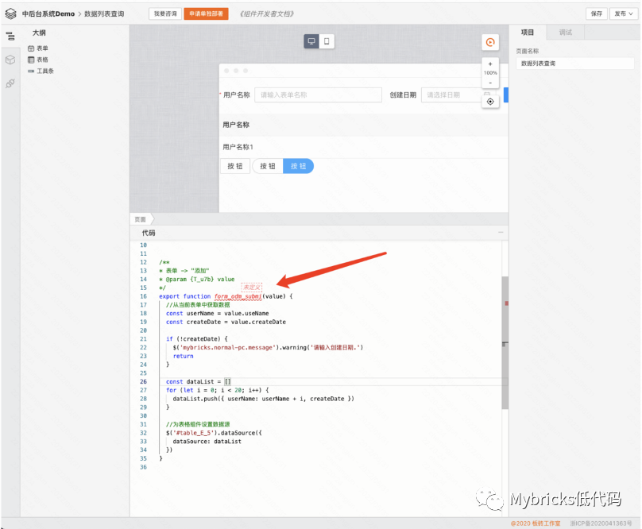
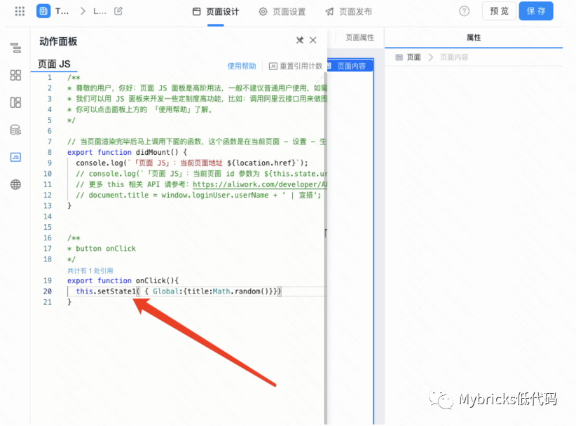
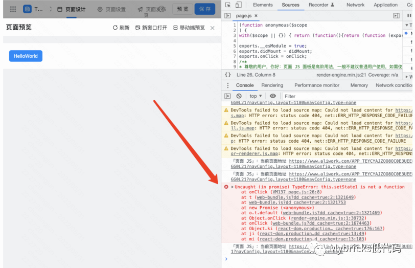
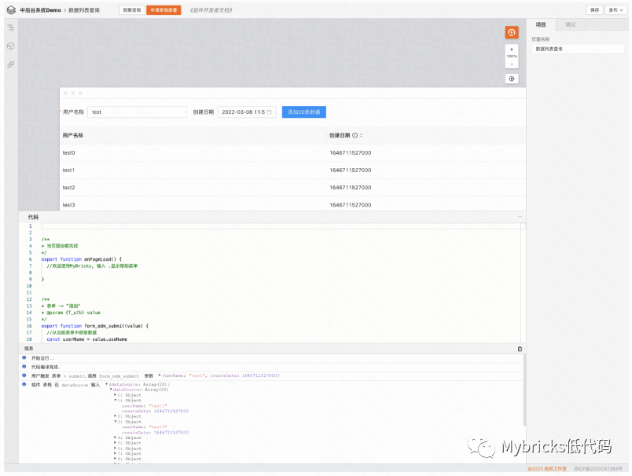
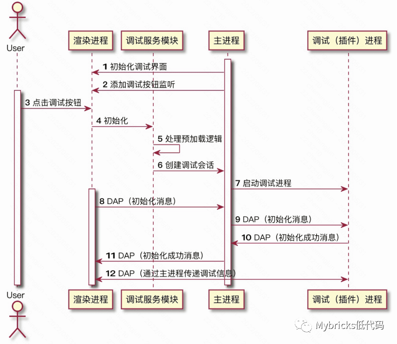

# 异常分类与调试方法

> 仿真与调试作为低代码系统中的重要功能，是在建模设计阶段对最终结果仿真的必要手段，功能完备的调试功能有助于快速定位发现并解决问题，是”所见即所得“原则的重要体现。

> 但是，实际的低代码产品设计中，”调试“往往得不到足够的重视，我们经常能在各类产品中看到”预览“功能，实际上”预览“与”调试“是不同的概念、承载的功能目的也不同。

<!--truncate-->

调试与预览以及实际运行都是有差异的，维基百科中词条”调试“（这里特指计算机程序调试）的定义是：**调试（英语：Debug）是发现和减少计算机程序或电子仪器设备中程序错误的一个过程。**


Mybricks 支持类似 Unreal 的图形化断点调试

## 调试的基本步骤
调试的基本步骤包括：

1. 发现程序错误的存在；
2. 以隔离、消除的方式对错误进行定位；
3. 确定错误产生的原因；
4. 提出纠正错误的解决办法；
5. 对程序错误予以改正或重构，重新测试。

**调试的目的是旨在发现错误或者那些表现不及预期的方面，为此，需要有配套的隔离、消除等手段帮助定位问题错误、确认问题原因，从而纠正、改正或重构，重新测试重复上述过程以最终达到预期的结果。**

在低代码设计系统中实现调试功能，关键点体现在于自定义代码聚合性。

自定义代码指的是在设计系统中，用户自己编写的“页面级”而非“组件级的低代码”（在前文面向组件的低代码 一节中有述）。**从方便调试的角度来讲，这些代码最好内聚而且自成体系。**

所谓聚合，简单来讲就是所有的自定义代码集中编写、维护、调试，这要求代码编写集中在一处、而非分散在各处，例如上文在”自定义代码编程范式“一节中提到的百度开源 Amis 框架的例子，组件自定义事件的代码是分布编写的，这种情况下就不太容易实现调试定位。

**聚合的根本原因，是将低代码 DSL 中的 C、A、T 三部分做清晰的边界划分，**我们在本章中提到的调试，主要还是面向 T 部分（自定义代码）的调试，T 部分应该与 C（编辑配置）、A（编排）有清晰的运行边界，自定义代码聚合的方式可以将大部分调试的过程内聚在 T 部分的逻辑分支中，避免与 C 部分相混合。

接下来，我们分析在建模设计阶段可能存在的各类异常情况。

## 设计阶段异常
设计阶段异常指的是因为违反设计规则导致出现的异常情况。设计系统中有很多限定规则，例如在”配置编辑“中，某些选项不能为空、组件的嵌套违反了 Schema 约束，在逻辑编排时，节点的连接违反了时序关系，或者在表达式编写时关键词非法、代码编写时语法错误等等。

下图是 Mendix 提示配置按钮的 Micflow 时因为没有选择具体的内容导致检查失败：

Mendix 的错误检查

这是 Mybricks 在设计阶段对代码中的组件事件函数进行检查：

Mybricks 的错误检查

## 运行阶段异常
设计阶段只能基于特定的建模规则、语法规则等进行检查，对于最终效果、代码中的语句执行是否出错的检查，就要依赖实际运行了。

下图中，我们在宜搭的代码编辑器中错误引用"this.setState1"：


宜搭平台中编写代码

点击预览后，需要在浏览器中打开”开发者工具“，才能看到错误信息：

打开浏览器的“开发者工具“检查问题

日志调试与断点调试是经常采用的手段

## 日志调试
通过输出日志的方式体现执行过程并跟踪定位问题，这是实现调试的常见思路，下图是 Mybricks 中调试时的日志输出：

Mybricks 中调试阶段的日志输出

实现全面、有效的日志输出，对低代码设计系统有很多架构方面的要求，体现在：

### 物料的日志管控

在物料规范中，需要提供日志 API，同时给出物料在不同生命周期阶段、不同的业务场景下的日志规范建议，物料开发过程中所产生的日志都应该通过 API 进行上报。

这里值得一提的是，虽然大部分前端开发者的习惯是在代码中通过 console.log 的方式打印日志，但是不建议提供这类 API---虽然可以通过沙箱中代理 console 对象的方式实现，原因包括：

很多时候我们需要更严格定义的日志 API，包括限定业务分类、异常码、日志内容、消息上报等等；

Console.log 严格来讲并不是 ECMA 规范（https://tc39.es/ecma262/）的一部分，在不同的环境中支持情况会有差异；

### 物料的异常管控

同样的，在物料规范中，需要提供对异常的处理约束（怎样声明异常、是否抛出等）以及对应的 API，在规范异常中，传递异常类型、错误码、异常信息等等内容。

同时，对于开发者不遵循规范的形式抛出异常等情况，需要有兜底处理策略，通过在沙箱中对错误（尤其是异步抛出的异常）的捕获处理，从而达到统一处理异常的目的。

### 日志消息与代码位置的对应

在调试过程中，当在日志列表中发现问题后，应该提供可以快速查看发生问题的代码（或功能）位置，实现的关键在于建立日志信息与源代码的映射关系。

技术实现上有多种思路，例如在代码运行之前的编译阶段，通过类似建立 Sourcemap 等方式进行源代码与运行代码的映射关系，对于日志 API 做代理处理。

## 断点调试
断点调试是在”日志调试“的基础上，通过在代码中增加断点（Break Point）的能力，从而能够在调试时实现中断，在断点处查看变量、执行栈等信息，并且可以手动控制执行步骤，从而能够进一步提升用户开发调试效率。

断点调试的技术实现，可以借助微软公司的 DAP 协议( https://microsoft.github.io/debug-adapter-protocol )，DAP ( Debug Adapter Protocol，调试适配协议)，顾名思义，它是用来对多种调试器进行抽象统一的适配层，将原有开发工具与调试工具直接交互的方式更改为通过 DAP 进行交互，该方法可以让开发工具集成多种调试器变得简单，且更具有灵活性。开发工具中的调试功能由很多功能组成，包括单步执行、断点、查看变量值等，常规的实现方式是在开发工具中去实现所有的逻辑，因为调试工具的接口不同，还需要为每个调试工具做一些适配工作，这将导致大量且重复的工作。DAP 协议的意义是将这些功能抽象为一个标准化协议，将开发工具具体的调试器解耦，同时提供了各种 SDK（开发者工具包）辅助快速实现。

借助 DAP 的调试过程的时序图：

DAP 调试时序图

### 消息通讯

消息层引入 reconnecting-websocket 模块作为 websocket 链接工具，创建 DAP 专用的通讯渠道，视图层通过监听该消息下的信息响应对应的调试操作，将对应的调试指令转化为视图可读的信息（正式项目中可将这层逻辑也下沉到 Node 层实现），代码片段如下：

```Typescript
dapWebSocket.addEventListener('open', () => {
    let outputSeq = 0
    dapWebSocket.addEventListener('message', (message:any) => {
        message = JSON.parse(message.data)
        console.log('client recive:', message)
        if (message.type === 'event') {
            if (message.event === 'output') {
                $output!.innerHTML += `[${outputSeq++}] ${message.body.output}</br>`
            } else if (message.event === 'initialized') {
                const getProcessPidMessage: any = {
                    seq: seq++,
                    command:"evaluate",
                    type:"request",
                    arguments: {expression:"process.pid"}
                }
                dapWebSocket.send(JSON.stringify(getProcessPidMessage))
                evalMap.set(seq-1, (data:any) => {
                    const setExceptionBreakpointsMessage:any = {
                        seq: seq++,
                        command:"setExceptionBreakpoints",
                        type:"request",
                        arguments: {
                            filters: []
                        }
                    }
                    dapWebSocket.send(JSON.stringify(setExceptionBreakpointsMessage))
                    defaultThreadId = data.result
                })
                isDebugging = true
            }  else if (message.event === 'terminated') {
                if (restart) {
                    const InitializeEvent: any = {
                        seq: seq++,
                        type: 'request',
                        command: 'initialize',
                        arguments: {"clientID":"vscode","clientName":"Code - OSS Dev","adapterID":"node2","pathFormat":"path","linesStartAt1":true,"columnsStartAt1":true,"supportsVariableType":true,"supportsVariablePaging":true,"supportsRunInTerminalRequest":true,"locale":"zh-cn"}
                        
                    }
                    dapWebSocket.send(JSON.stringify(InitializeEvent))
                    restart = false
                } else {
                    isDebugging = false
                    $output!.innerHTML += `[End] Debug session teminate</br>`
                    $threads!.innerHTML = ''
                    $callstack!.innerHTML = ''
                }
            }
            
        } else if (message.type === 'response') {
            if (message.command === 'initialize') {
                root = message.body.cwd
                // send launch command
                const args = {
                    type:"node2",
                    request:"launch",
                    name:"Launch Program",
                    program:`${path.join(root, 'index.js')}`,
                    cwd: root
                };
                const launchMessage: DebugProtocol.LaunchRequest = {
                    seq: seq++,
                    command: 'launch',
                    type:"request",
                    arguments: <DebugProtocol.LaunchRequestArguments>args,
                }
                dapWebSocket.send(JSON.stringify(launchMessage))
            } else if (message.command === 'launch') {
                // send loadedSources command
                const loadMessage: any = {
                    seq: seq++,
                    command:"loadedSources",
                    type:"request"
                }
                dapWebSocket.send(JSON.stringify(loadMessage))
            } else if (message.command === 'loadedSources') {
                // send breakpoint command
                const breakpointMessage: any = {
                    seq: seq++,
                    command:"setBreakpoints",
                    type:"request",
                    arguments: {
                        source: {
                            name: 'index.js',
                            path: path.join(<string>root, 'index.js'),
                        },
                        lines: breakpoints,
                        breakpoints: breakpoints.map(bp => {
                            return {line: bp}
                        }),
                        sourceModified: false
                    }
                }
                dapWebSocket.send(JSON.stringify(breakpointMessage))
            } else if (message.command === 'evaluate') {
                evalMap.get(message.request_seq)(message.body)
            } else if (message.command === 'setExceptionBreakpoints') {
                const configDoneMessage:any = {
                    seq: seq++,
                    command:"configurationDone",
                    type:"request"
                }
                dapWebSocket.send(JSON.stringify(configDoneMessage))
            } else if (message.command === 'configurationDone' || message.command === 'next' || message.command === 'stepIn' || message.command === 'stepOut' || message.command === 'continue') {
                const threadsMessage:any = {
                    seq: seq++,
                    command:"threads",
                    type:"request",
                }
                dapWebSocket.send(JSON.stringify(threadsMessage))
            } else if (message.command === 'threads') {
                if (message.body.threads.length === 0) return
                $threads!.innerHTML = ''
                message.body.threads.forEach((thread:any) => {
                    $threads!.innerHTML += `[${thread.id}] ${thread.name}</br>`
                });
                defaultThreadId = message.body.threads[0].id
                const stackTraceMessage:any = {
                    seq: seq++,
                    command:"stackTrace",
                    type:"request",
                    arguments: {threadId: defaultThreadId,startFrame:0,levels:1}
                }
                dapWebSocket.send(JSON.stringify(stackTraceMessage))
            } else if (message.command === 'stackTrace') {
                if (isDebugging) {
                    if (!message.success) {
                        const stackTraceMessage:any = {
                            seq: seq++,
                            command:"stackTrace",
                            type:"request",
                            arguments: {threadId: defaultThreadId,startFrame:0,levels:1}
                        }
                        dapWebSocket.send(JSON.stringify(stackTraceMessage))
                        return
                    }
                    defaultFrameId = message.body.stackFrames[0].id
                    $callstack!.innerHTML = `Node(${excutedThreadsPid})</br>`
                    message.body.stackFrames.forEach((stackFrame:any) => {
                        $callstack!.innerHTML += `  [${stackFrame.name}]  <small>${stackFrame.source.name} ${stackFrame.column}:${stackFrame.line}</small> </br>`
                    });
                }
            } else if (message.command === 'terminate') {
                const disconnectMessage:any = {
                    seq: seq++,
                    command:"disconnect",
                    type:"request",
                    arguments: {restart: false}
                }
                dapWebSocket.send(JSON.stringify(disconnectMessage))
            }
        }
    })
});
```

服务层我们需要实现对应在/dap 路径下的调试服务器，新建一个对应的 DebugSession 类用于创建调试链接，实现如下几个功能：

1. 接收 initialize 指令，启动 Debug Adaptor 进程；
2. 接收 Debug Adaptor 进程消息，转发到视图层 Socket；
3. 接收视图层消息，转发至 Debug Adaptor 进程;

### 调试进程

调试进程需实现 debugAdapter 类，用于 Lanunch 或 Attach 调试器，通过消息转化逻辑将对应的 JSON 消息转换为调试器可读的信息，以 Node 为例，需要将如下消息：
```Typescript
{
    "seq": 153,
    "type": "request",
    "command": "next",
    "arguments": {
        "threadId": 3
    }
}
```
转换为 Node Debugger 可读的消息：

```Typescript
{
    "seq": 153,
    "type": "request",
    "command": "next",
    "arguments": {
        "threadId": 3
    }
}
```

同时，Debug Adaptor 需要管理与调试器间的进程通讯，所有的调试器均需要在子进程中启动，并通过进程间通信来实现消息传递，基础的启动逻辑如下：

```Typescript
async startSession(): Promise<void> {
    const nodeDebug2 = path.join(__dirname, `../../downloads/vscode-node-debug2/out/src/nodeDebug.js`);
    const forkOptions: cp.ForkOptions = {
      env: process.env,
      execArgv: [],
      silent: true
    };
    const child = cp.fork(nodeDebug2, [], forkOptions);
    if (!child.pid) {
      throw new Error(`Unable to launch debug adapter from ${nodeDebug2}`);
    }
    this.serverProcess = child;

    this.serverProcess.on('error', err => {
      console.error(err);
    });
    this.serverProcess.on('exit', (code, signal) => {
      console.log(code);
    });

    this.serverProcess.stdout.on('close', (error:any) => {
      console.error(error);
    });
    this.serverProcess.stdout.on('error', error => {
      console.error(error);
    });

    this.serverProcess.stdin.on('error', error => {
      console.error(error);
    });

    this.connect(this.serverProcess.stdout, this.serverProcess.stdin);

  }
```

调试器引入了 VSCode 中使用的 node-debug2 模块作为调试器，支持 Node 7.6+ 版本调试，通过进程中的 stream.Writable 及 stream.Readable 接口接口读写对应的进程消息实现通信。

上述参考案例中，调试进程是基于 NodeJS 的，在实际的低代码设计系统中，实现真正意义的调试还是非常有挑战的，除以上围绕 DAP 协议的实现之外，难点还包括：

- 能否在浏览器端直接实现调试进程；
- 自定义代码如何编译为可运行的完整版本，这包括自定义代码本身的编译、与物料资源的连接、加载依赖资源、在单独的进程中如何与 UI 接口（页面事件响应）联动等等；
