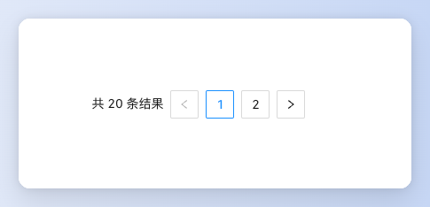
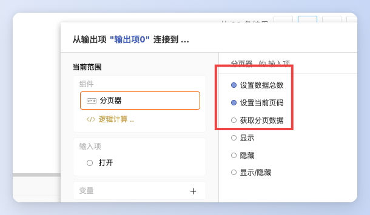
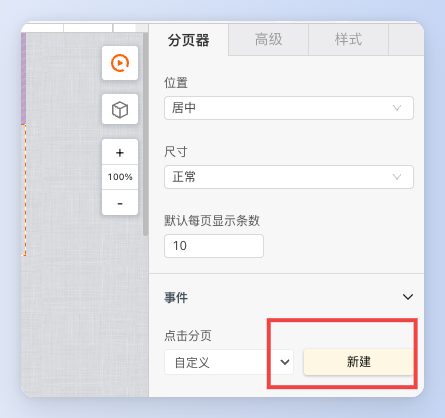
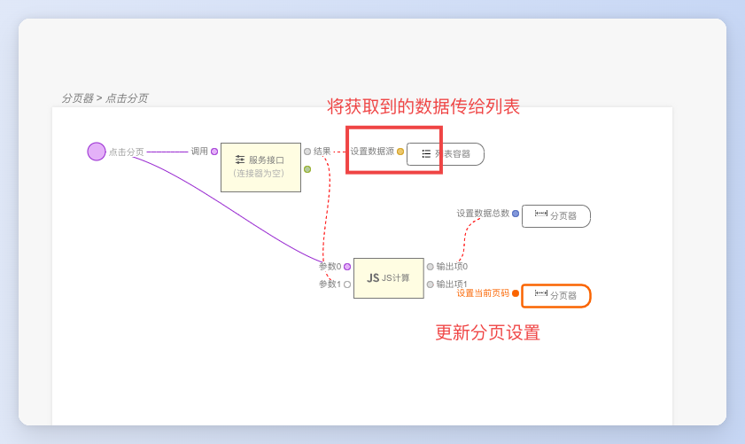
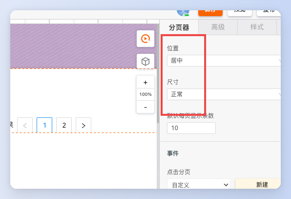
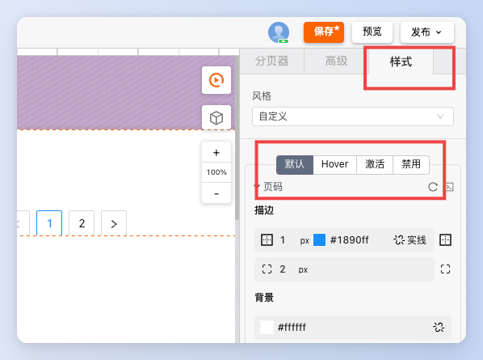

> **应用场景**\
1.当加载/渲染所有数据将花费很多时间时；\
2.可切换页码浏览数据。
  

## 基本操作

1.  ### 设置分页页码

可以在逻辑面板中通过连线设置分页器的数据

# 逻辑编排

点击分页获取新数据

1.  新建分页点击事件

2.  分页事件内连线接口获取数据

 **样式** 

### 设置分页器样式

1.调整分页器的尺寸和位置

2.  设置分页的字体、边框和颜色

