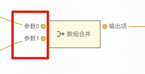

```
应用场景：表格里的数据来自多个接口，在多个接口请求完成后，可以通过数组合并来将接口返回值合并，再把合并后的数据给到表格
注：逻辑组件，可以在连线中的逻辑组件中找到
```

Demo地址：[【数组合并】基本使用](https://my.mybricks.world/mybricks-app-pcspa/index.html?id=475479851741253)

-----

## 基本操作
### 添加输入项




说明：参数默认有两个，可以通过添加参数来增加输入项，表示把更多的数组合并为一个数组

----

## 逻辑编排
### 数组合并


多个连入的输入项（数组）会合并成一个输出项（数组）输出

----

## 样式
无
