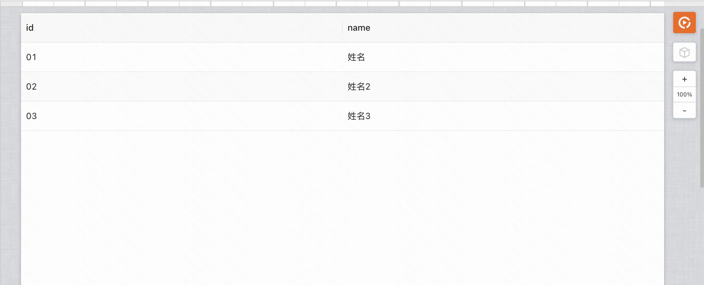

## 何时使用

- 展示和组织数据，有大量结构化数据需要展示（可进行排序、搜索、过滤、分页操作）
- 数据表格支持以下能力：
  - 数据进行编辑、删除、新增等操作
  - 分页逻辑（前端分页、后端分页）
  - 表格列内容增加插槽（自定义标签等等）
  - 表格行展开
  - ……

<!-- 
## 搭建案例链接
demo搭建链接：[查看当前文档全部搭建案例](https://my.mybricks.world/mybricks-app-pcspa/index.html?id=515009026859077) 
-->

## 案例一：表格展示固定数据
### 案例介绍
展示静态的表格数据

### 搭建案例链接
demo搭建链接：[查看固定数据表格搭建案例](https://my.mybricks.world/mybricks-app-pcspa/index.html?id=515038555824197)

### 操作步骤
1、从右侧组件面板拖入 数据表格 组件

2、选中画布中的数据表格，使用逻辑连线，输入定义好的数据表格结构

### 效果展示

## 案例二：如何开启分页
### ① 前端分页模式
#### 案例介绍
服务端一次性返回全部的数据，由前端来做分页处理。

#### 搭建案例链接
demo搭建链接：[查看表格前端分页搭建案例](https://my.mybricks.world/mybricks-app-pcspa/index.html?id=515040043778117)

#### 操作步骤

1、选中画布中的 **表格组件主体**，然后在右侧数据表格属性面板中，打开分页模式开关

2、选中到表格中的分页器区域，然后在右侧编辑项的高级tab中，打开前端分页开关

#### 效果展示

### ② 后端分页模式
#### 案例介绍
服务端根据前端传入的分页参数，返回对应的数据。

#### 搭建案例链接
demo搭建链接：[查看表格后端分页搭建案例](https://my.mybricks.world/mybricks-app-pcspa/index.html?id=515041498882117)

#### 操作步骤
1、打开分页模式开关，同时关闭前端分页开关，然后点击聚焦到数据表格中的分页器区域，然后在右侧编辑项的事件一栏，新建点击分页自定义逻辑   

2、然后在交互逻辑面板中，会自动传回分页参数

3、使用刚刚拿到的分页参数，请求后端接口获取数据列表   

4、将后端接口返回的数据列表，赋值给数据表格的数据源，结构要求如下   

5、【添加首次加载表格的分页初始化逻辑】在主场景打开的时候，使用初始的分页参数请求一次接口获取表格数据,然后将返回值赋值给表格数据源

> pageNum:1,   
> pageSize:5

#### 效果展示

## 案例三：如何给表格列内容增加插槽
### 案例介绍
要给表格列内容增加图片之类的自定义元素，此时需要用到 **插槽** 功能

### 搭建案例链接
demo搭建链接：[查看表格列插槽搭建案例](https://my.mybricks.world/mybricks-app-pcspa/index.html?id=515045600526405)

### 操作步骤
1、选中要开启自定义插槽的列的表头，然后在右侧的编辑项中，在类型一栏选中自定义插槽，即可开启自定义插槽功能

2、从组件库中，往刚刚新增的插槽拖入图片组件

### 效果展示

## 案例四：如何给表格列内容增加编辑按钮
### 案例介绍
列表数据展示后，需要对数据进行编辑、删除、新增等操作，此时对表格增加操作列   

### 搭建案例链接

demo搭建链接：[查看表格列增加编辑按钮案例](https://my.mybricks.world/mybricks-app-pcspa/index.html?id=515009026859077)

### 操作步骤
1、选中数据表格，然后在右侧的编辑项中，点击添加列，新增一列   

2、选中新增的列，然后在右侧的编辑项中，将类型设置为自定义插槽，并且根据需要设置为右固定

3、往刚刚开启的插槽内拖入工具条，修改按钮的标题，然后在按钮的事件中，添加点击事件

4、如下图获取行数据后，传递给对话框进行编辑
> 这里仅仅表述出获取当前行数据的基本逻辑，如果要对当前行数据进行编辑，还需要配合后端提供的修改数据接口进行进一步的实现

### 效果展示
