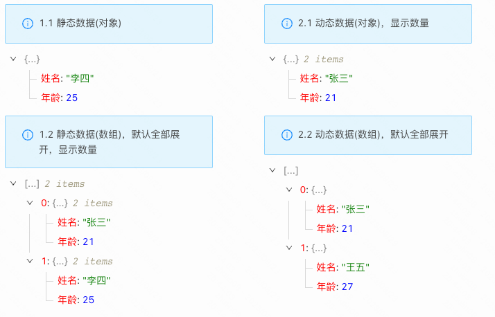

> **应用场景**：展示数组、对象或JSON字符串格式的数据时

Demo地址 [【JSON展示】基本使用](https://my.mybricks.world/mybricks-app-pcspa/index.html?id=470865296592965)

----

## 基本操作
### JSON展示
#### 数据源

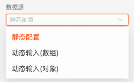

说明：配置JSON数据的来源。如果为静态配置，通过“默认JSON数据”配置JSON数据；如果为动态输入，通过输入项设置JSON数据。
#### 默认展开深度

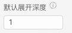

说明：JSON结构的默认展开深度。0表示全部折叠，-1表示全部展开。
#### 字符串超出省略展示

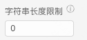

说明：为字符串类型的属性设置长度限制，超出部分以...表示，鼠标悬浮气泡展示完整内容。0表示不限制
#### 大小标记/数目统计

说明：开启时，在每一级节点后展示对象的属性数目，或者数组的长度
#### 单击节点复制

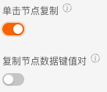

说明：开启时，单击节点，节点数据将复制到剪切板
##### 复制节点数据键值对

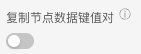

说明：关闭时，单击节点仅复制属性值到剪切板；开启时，单击节点会将属性的键值对复制到剪切板
#### 默认JSON数据

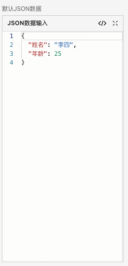

说明：开启“静态配置”时，这里配置需要展示的JSON数据
## 逻辑编排
#### 单击节点

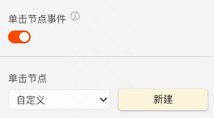

1.  开启“单击节点事件”，点击“新建”
2.  创建该事件的逻辑卡片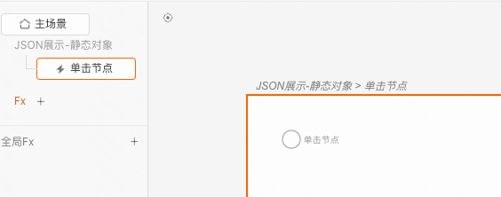

说明：单击节点事件的输出数据为当前点击的节点数据
## 样式
#### 字体颜色

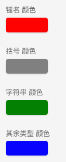
#### 背景色

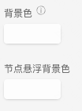
