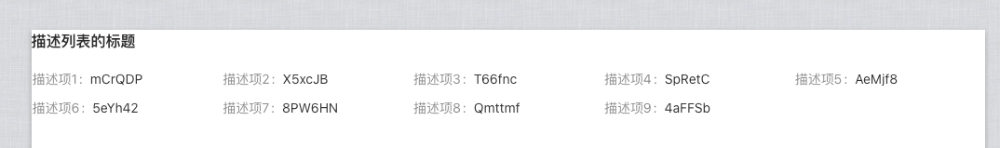
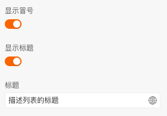
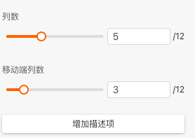
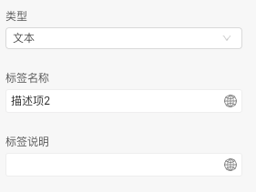
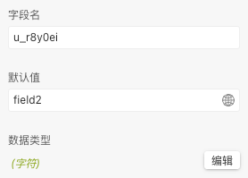
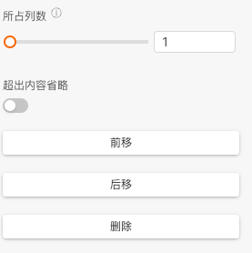
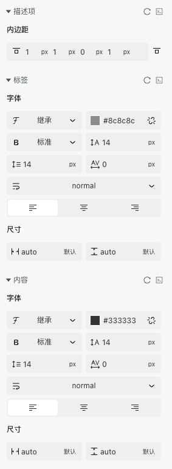
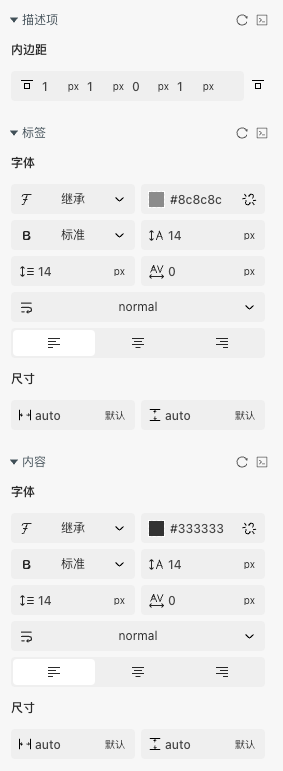

> 成组展示多个只读字段\
> 应用场景\
> 场景1：常见于详情页的信息展示

Demo地址：[【描述列表】基本使用](https://my.mybricks.world/mybricks-app-pcspa/index.html?id=514958657699909)

## 基本操作

### 描述列表

#### 文字配置

开启显示冒号,控制描述项的冒号是否显示\
开启显示标题可以静态设置描述列表标题,也可以通过输入动态修改

#### 右上角操作区

开启后右上角新增插槽,可以自由放置内容

#### 列数和增加描述项

可以配置每一列展示的描述项

### 描述项

聚焦到需要配置的描述项单独配置

#### 基本配置

可以配置该描述项的类型,设置为插槽可以自定义内容,可静态配置名称和说明

#### 字段和值

可以设置字段名和默认值,便于后续动态传入设置

#### 列数和位置配置

说明:配置该描述项的所占列数和是否超出内容省略(类型为文本生效)

还可以设置该项在整体描述列表中所占位置

## 逻辑编排

### 设置标题

动态配置标题

### 设置数据源

按照设置的数据字段格式传入即可

## 样式

### 描述列表

### 描述项

聚焦到需要配置的描述项单独配置

