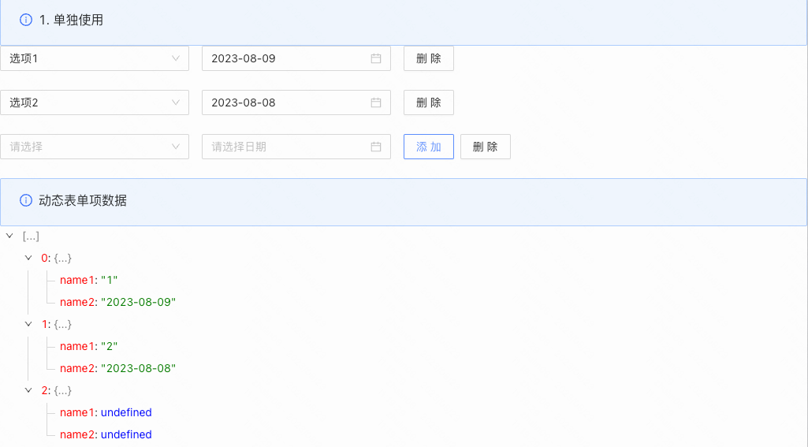
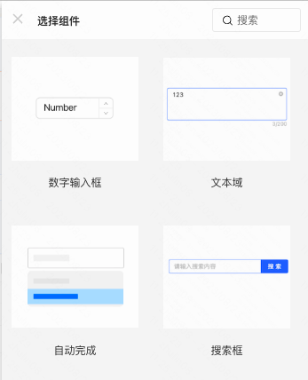
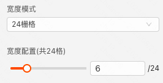
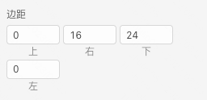

  

> **概述**\
> 表单项的容器，用于列表类型数据的增删改操作

> **应用场景**\
> 场景1：单独使用\
> 场景2：在表单容器中，作为表单项使用

Demo地址：[【动态表单项】基本使用](https://my.mybricks.world/mybricks-app-pcspa/index.html?id=470721353818181)

----

## 基本操作
### 动态表单项
#### 每行展示的表单项数量

说明：用于实现平均分布各表单项及操作项，仅对“宽度配置”为“24栅格”的表单项及操作项生效
#### 添加子表单项

说明：点击按钮，左侧弹出可添加的组件列表，选中即可添加组件作为动态表单项的子项
#### 配置隐藏的表单项是否参与提交

说明：开启后，隐藏的表单项也会进行校验和数据提交
#### 数据校验

说明：配置动态表单项的校验规则，需要在表单容器中使用才能生效
### 操作区
#### 操作区的显示隐藏

#### 操作区宽度配置

#### 按钮在操作区的对齐方式

#### 操作区的外边距

#### 将操作区的边距配置，应用到动态表单项中的其他子表单项的配置上

#### 操作区的按钮列表

说明：

1.  可以通过左侧手柄，拖拽改变按钮的相对位置
2.  可以通过右侧小眼睛图标，配置按钮的显示隐藏
3.  点击“添加操作”，在操作区新增一个按钮
## 逻辑编排
#### 值初始化事件

输出时机：

1.  给动态表单项的“ **设置初始值** ”输入项设置数据
2.  给动态表单项所在表单容器的“ **设置表单数据** ”输入项设置数据

输出内容：

动态表单项的当前值
#### 值更新事件

输出时机：

1.  给动态表单项的“ **设置值** ”输入项设置数据
2.  给动态表单项所在表单容器的“ **设置表单数据(触发值变化)** ”输入项设置数据
3.  用户操作动态表单项的增删改操作时

输出内容：

动态表单项的当前值

说明：

可以用于实现监听联动
## 样式
#### 作为表单项的样式

