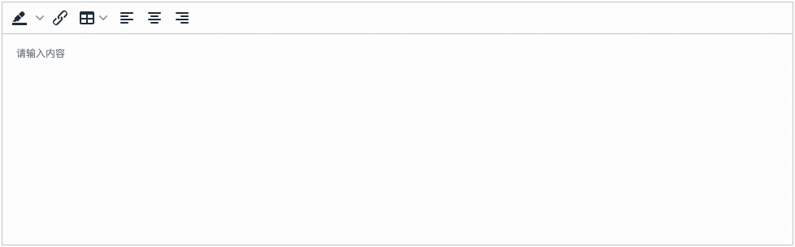

> **应用场景**\
需要富文本输入的场景，可以作为表单项


Demo地址：[【富文本输入框】基础使用](https://my.mybricks.world/mybricks-app-pcspa/index.html?id=475040217903173)

----
## 基本操作
### 配置提示内容
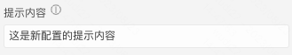

在没有输入数据的情况下，会展示配置的提示内容


### 配置禁用状态


禁用的情况下，富文本输入框无法输入，在只需要展示的情况下可以使用


### 配置编辑栏
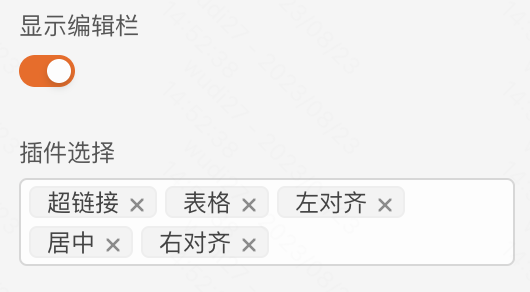

开启显示编辑栏，选择需要的插件，可以增强富文本输入框的能力

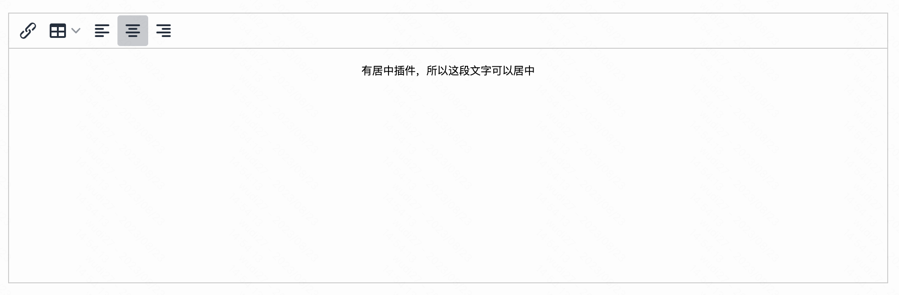

### 配置校验规则
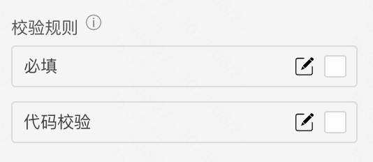

其中代码校验可以通过写 js 代码的形式，自定义各种校验规则

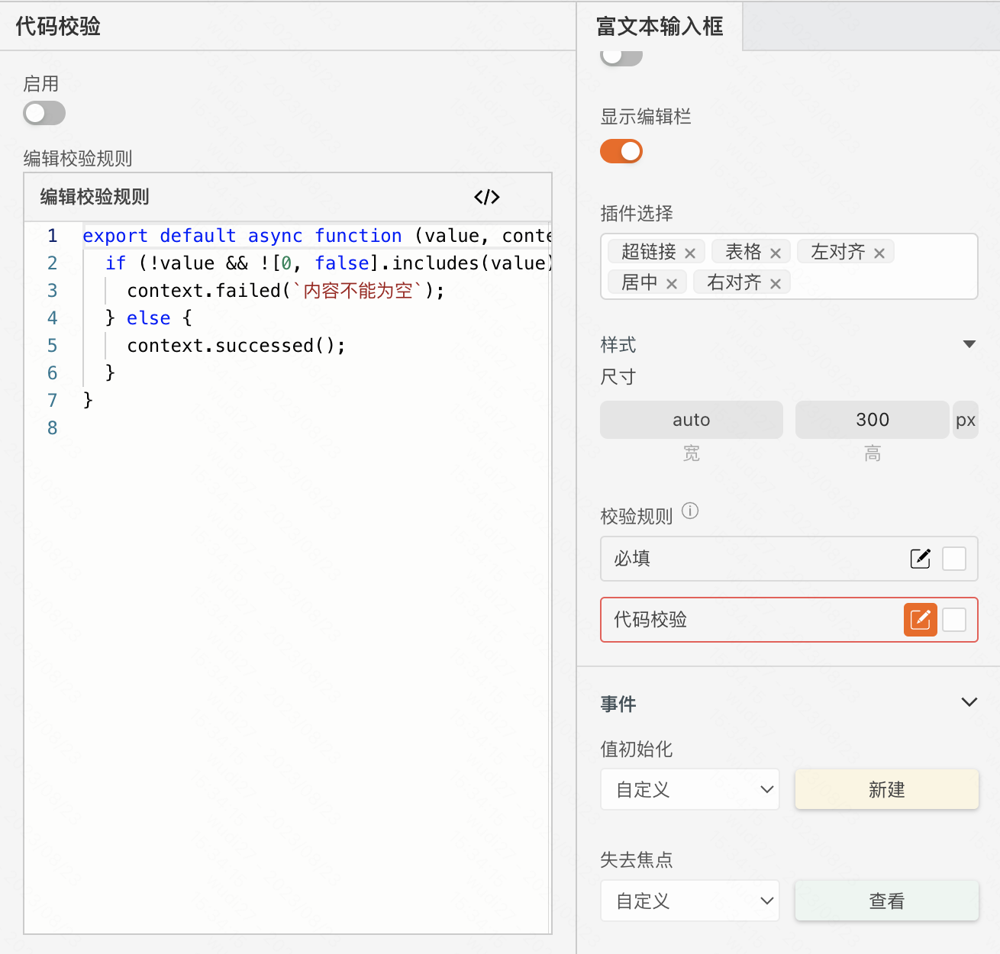

## 逻辑编排
### 值初始化、失去焦点、值更新

```
这三个富文本输入框的生命周期钩子会触发对应的逻辑流
```
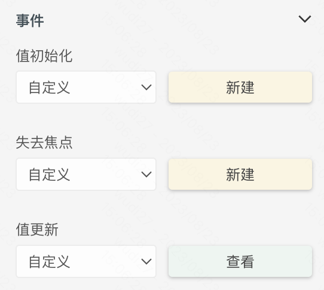

以失去焦点为例，点击“新建”后，在 交互 面板

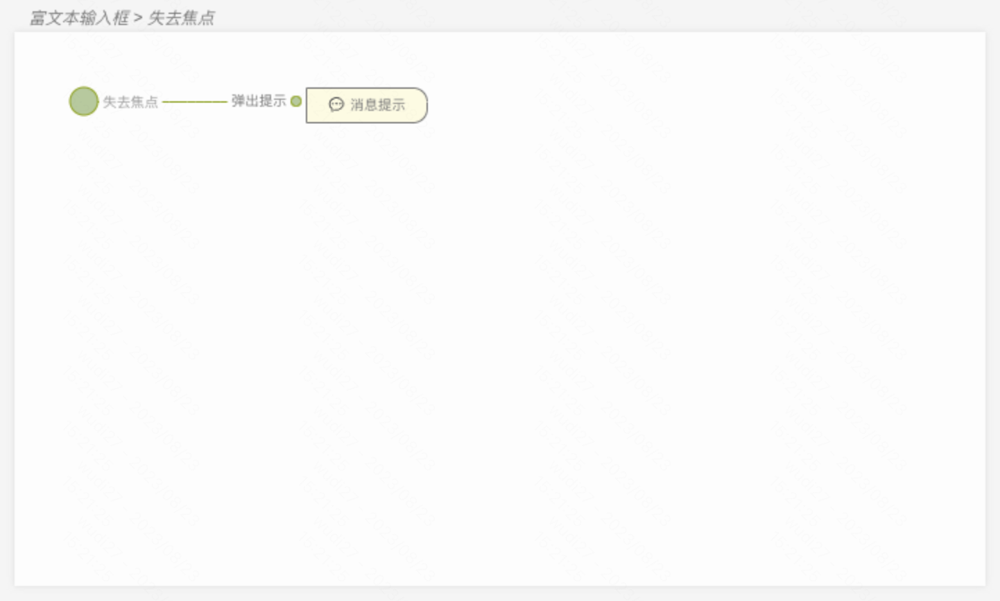

这样的配置下，可以达成效果：富文本输入框失去焦点后，出现消息提示，消息提示的内容为富文本输入框里输入的内容（tip：富文本输入框的产物是一段HTML）

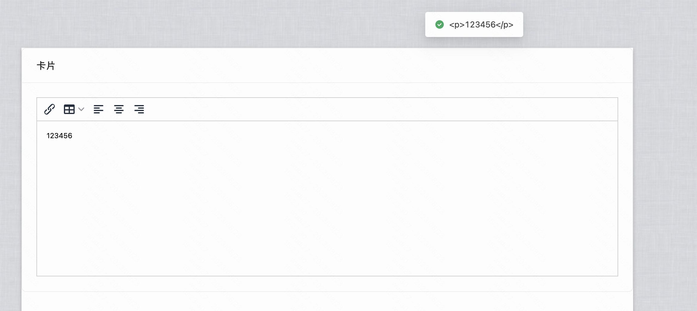

### 设置富文本的各种状态
富文本有以下状态

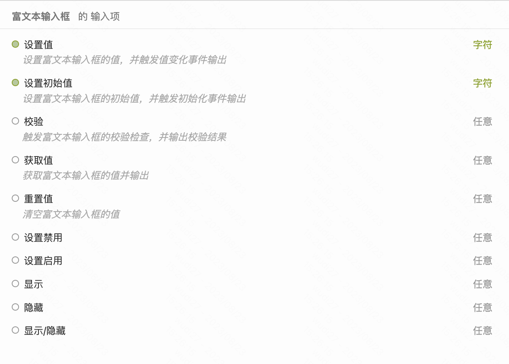

以设置禁用为例，添加一个按钮，并给按钮的点击事件添加禁用富文本输入框的逻辑


点击按钮后富文本输入框被禁用

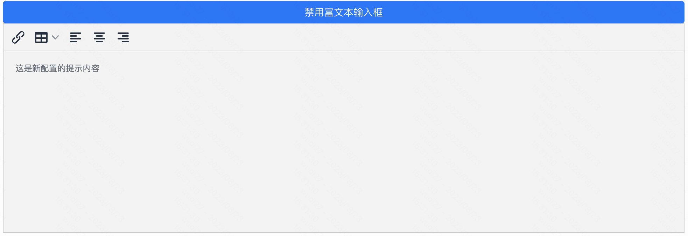

----

## 样式
### 富文本输入框的尺寸


### 富文本输入框的详细样式
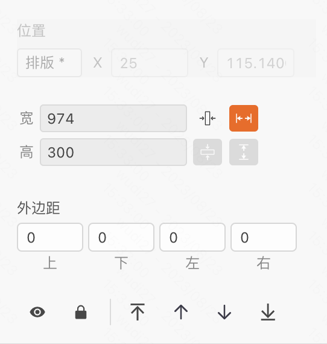


