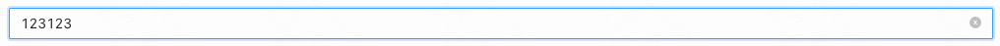
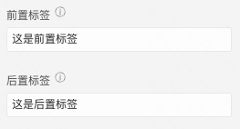
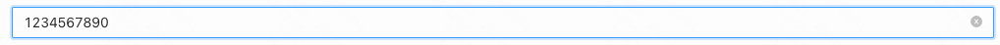
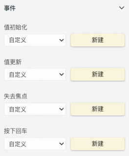
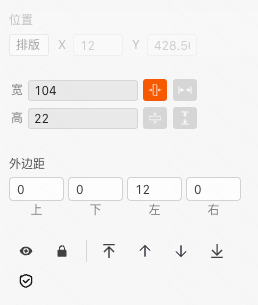
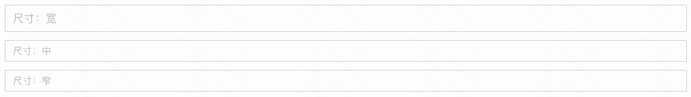
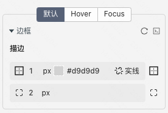
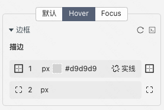
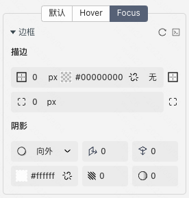

> **应用场景**\
作为表单项使用，提供字符串输入能力


Demo地址：[【文本框】基础使用](https://my.mybricks.world/mybricks-app-pcspa/index.html?id=473981263577157)

----
## 基本操作
### 提示内容


说明：没有输入内容的时候，文本框会展示提示内容，提交数据时不会把提示内容提交上去

### 显示清除图标




说明：在输入数据后，文本框右侧会出现清除按钮

### 前置后置标签



说明：用于配置开关在两种状态下展示的文案

### 禁用状态


说明：禁用状态下不可输入

### 显示字数


说明：会在文本框的末端显示字数

### 最大长度




说明：在文本框输入的字符无法超过最大长度

----

## 逻辑编排
### 值初始化、值更新、失去焦点、按下回车

```
文本框在以下四个生命周期时触发事件，并将当前的值作为事件入参
```



----

## 样式
### 通用组件样式


### 风格


说明：默认为自定义，可以选择提前预制好的风格样式作为组件的兜底样式

### 尺寸




说明：默认为自定义，可以选择提前预制好的风格样式作为组件的兜底样式

### 文本框默认状态的描边配置


说明：默认状态下文本框的样式配置

### 文本框的 Hover 状态描边配置


说明：Hover状态下文本框的样式配置

### 文本框的 Focus 状态描边配置


说明：Focus 状态下文本框的样式配置