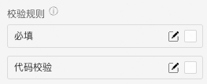

  

> **概述**\
当用户需要在数值区间/自定义区间内进行选择时，可为连续或离散值。

> **应用场景**\
场景1：单独使用\
场景2：在表单容器中，作为表单项使用

Demo地址：[【滑动输入条】基本使用](https://my.mybricks.world/mybricks-pc-page/index.html?id=470855501824069)

----

## 基本操作
### 滑动输入条
#### 范围

说明：滑动输入条的数值范围
#### 展示单位

说明：数值格式化展示的单位，仅用于展示，不影响组件的值
#### 区间选择

说明：开启时，滑动输入条的值是数值范围
#### 输入功能

说明：开启时，滑动输入条右侧增加一个数字输入框，同时支持选择和输入。仅在 **非区间选择** 时可用。
##### 滑动条宽度

说明：开启“输入功能”时，左侧滑动输入条的宽度占比
##### 数字输入框宽度

说明：开启“输入功能”时，右侧数字输入框的宽度占比
#### 显示清除图标

说明：开启后，滑动输入条有选中项后，右侧显示清除图标
#### 默认是否禁用

#### 数据校验

说明：

1.  配置的校验规则，需要在表单容器中使用才能生效
2.  点击右侧的勾选框，启用该项校验规则
3.  点击右侧的“编辑”按钮，弹出校验规则的配置项
## 逻辑编排
#### 值初始化事件

输出时机：

1.  给滑动输入条的“ **设置初始值** ”输入项设置数据
2.  给滑动输入条所在表单容器的“ **设置表单数据** ”输入项设置数据

输出内容：

滑动输入条的当前值
#### 值更新事件

输出时机：

1.  给滑动输入条的“ **设置值** ”输入项设置数据
2.  给滑动输入条所在表单容器的“ **设置表单数据(触发值变化)** ”输入项设置数据
3.  用户操作滑动输入条的增删改操作时

输出内容：

滑动输入条的当前值

说明：

可以用于实现监听联动
## 样式
#### 基础样式
##### 已选区间的样式

##### 滑动轴的样式

##### 滑块的样式

#### 作为表单项的样式

