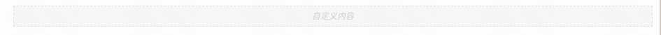
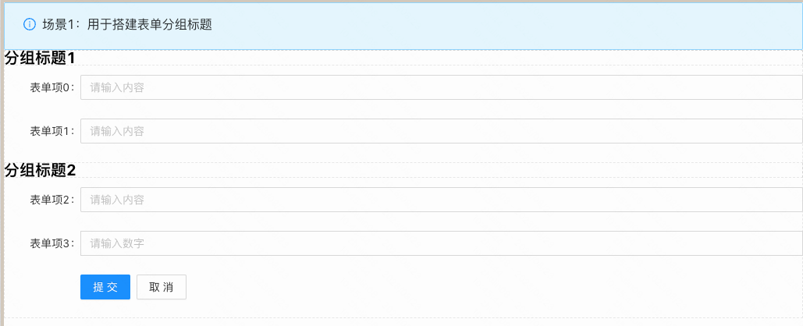

> **概述**\
表单容器中，放置非表单项内容的容器。支持拖入任意组件，不参与表单提交。

> **应用场景**\
场景1：作为表单分组标题的容器

Demo地址：[【自定义内容项】基本使用](https://my.mybricks.world/mybricks-pc-page/index.html?id=470716390289477)

----

## 基本操作

### 自定义内容项

仅作为容器使用，无更多功能配置

## 逻辑编排

仅作为容器使用，不需要逻辑编排

## 样式

仅作为容器使用，无样式相关配置