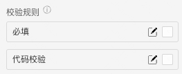

> **应用场景**\
场景1：单独使用\
场景2：在表单容器中，作为表单项使用

Demo地址：[【评分】基本使用](https://my.mybricks.world/mybricks-pc-page/index.html?id=472915664228421)

----
## 基本操作
### 评分
#### 评分总数

说明：自定义评分总数，默认总数是5
#### 默认值

说明：设置初始默认值，默认是2.5
#### 可读状态

说明：开启后为可读状态，不可改变评分值
#### 其他字符

开启后，可以切换字符类型，包括文字和图标

#### 颜色

自定义字符颜色
#### 数据校验

说明：

1.  配置的校验规则，需要在表单容器中使用才能生效
2.  点击右侧的勾选框，启用该项校验规则
3.  点击右侧的“编辑”按钮，弹出校验规则的配置项

## 逻辑编排
#### 值初始化事件

输出时机：

1.  给评分“ **设置初始值** ”输入项设置数据
2.  给评分所在表单容器的“ **设置表单数据** ”输入项设置数据

输出内容：

评分的当前值
#### 值更新事件

输出时机：

1.  给评分的“ **设置值** ”输入项设置数据
2.  给评分所在表单容器的“ **设置表单数据(触发值变化)** ”输入项设置数据
3.  用户操作评分的增删改操作时

输出内容：

评分的当前值

说明：

可以用于实现监听联动
## 样式