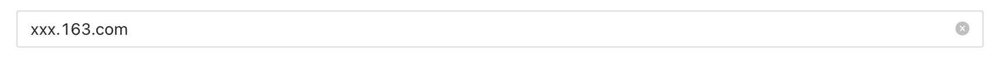
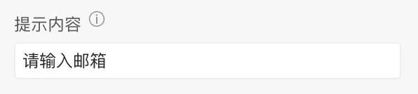
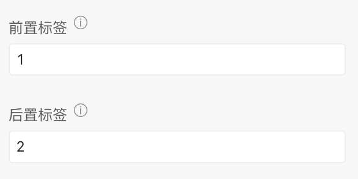
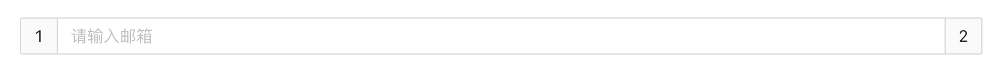
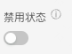
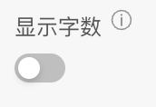
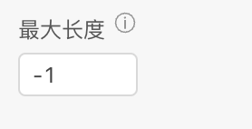
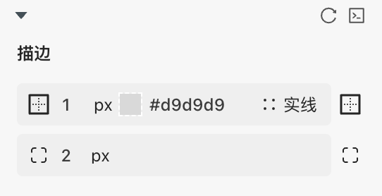

> **应用场景**\
填写邮箱，放入表单容器后，默认自带邮箱校验\
场景1：单独使用\
场景2：在表单容器中，作为表单项使用

Demo地址：[【邮箱】基本使用](https://my.mybricks.world/mybricks-pc-page/index.html?id=472925004267589)

----

## 基本操作
### 邮箱
#### 提示内容

说明：值为空时的提示文字
#### 显示清除图标

说明：默认打开，输入内容后点击清除按钮可清除内容
#### 前置后置标签

说明：输入内容后，可设置前后标签
#### 禁用状态

#### 显示字数

开启后，可以显示输入字数
#### 最大长度

默认不限制数字，可以自定义最大长度
#### 数据校验

说明：

1.  配置的校验规则，需要在表单容器中使用才能生效
2.  点击右侧的勾选框，启用该项校验规则
3.  点击右侧的“编辑”按钮，弹出校验规则的配置项

## 逻辑编排
#### 值初始化事件

输出时机：

1.  给日期选择框“ **设置初始值** ”输入项设置数据
2.  给日期选择框所在表单容器的“ **设置表单数据** ”输入项设置数据

输出内容：

日期选择框的当前值
#### 值更新事件

输出时机：

1.  给日期选择框的“ **设置值** ”输入项设置数据
2.  给日期选择框所在表单容器的“ **设置表单数据(触发值变化)** ”输入项设置数据
3.  用户操作日期选择框的增删改操作时

输出内容：

日期选择框的当前值

说明：

可以用于实现监听联动
## 样式
#### 边框

