> **概述**\
> 树形结构数据的展示，同时具备节点展开收起、选中、勾选、修改、删除以及更多自定义操作等交互功能。

> **应用场景**\
> 文件夹、组织架构、生物分类、国家地区等等。

Demo地址：[【树组件】基本使用](https://my.mybricks.world/mybricks-app-pcspa/index.html?id=470870747357253)

----

## 基本操作
### 树组件
#### 节点标识字段
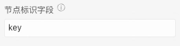

说明：默认为key，会根据节点位置生成唯一标识，存储在节点的key属性中。如果配置为节点的字段，要求所有节点的改字段值在整个树范围内不能重复。
#### 默认展开

说明：带有子项的树节点是否默认展开
#### 勾选
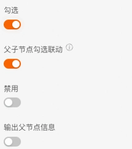

说明：开启时，树节点支持勾选
##### 父子节点勾选联动
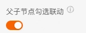

说明：开启时，当勾选子节点，父节点的勾选框会出现勾选样式
##### 禁用

说明：配置树节点勾选框，是否默认禁用
##### 输出父节点信息
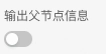

说明：开启时，当勾选子节点，获取的勾选数据会包含其父节点信息。
注：开启“父子节点勾选联动”配置项时，该配置项才生效。
#### 添加节点

说明：一个按钮，点击后，在树中追加一个节点。用于配置静态数据
#### 勾选

说明：开启时，可以定义勾选事件的逻辑处理
### 高级
#### 节点点击展开收起
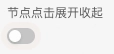

说明：开启时，点击树节点可以展开收起带有子项的节点。
#### 节点操作项
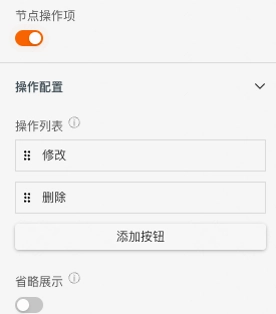

说明：开启时，树节点右侧出现操作按钮
##### 操作列表
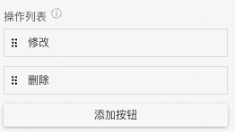

说明：展示当前树节点的操作项列表。使用方式如下

1. 点击“添加按钮”，为节点新增一个操作项
2. 选中左侧图标进行拖拽，可以修改按钮的相对位置
##### 省略展示
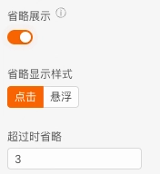

说明：开启时，可以配置树节点右侧操作项最多展示几个按钮，超出的按钮以下拉按钮的形式进行展示。
注：省略展示仅在 调试/预览/发布 生效
###### 省略显示样式

说明：下拉按钮的触发方式
###### 超过时省略

说明：展示在节点右侧的最大按钮数量，超出数量的按钮展示在下拉菜单中
#### 添加节点
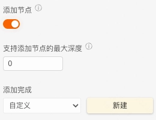

说明：开启时，树组件支持添加节点功能
##### 支持添加节点的最大深度
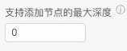

说明：设置允许添加节点的最大深度，0表示不限制
## 逻辑编排
#### 节点点击
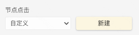

输出时机：点击树节点时
输出数据：长度为1的数组，数组项为当前节点的key字段
#### 勾选事件

输出时机：点击树节点前的勾选框时
输出数据：一个数组，数组项为已勾选的节点的key字段
#### 添加完成

关联配置项：“高级-添加节点”配置项开启时
输出时机：点击“添加节点”，在输入框中触发回车
输出数据：当前节点数据 和 当前节点的父节点数据
## 样式
### 树组件
#### 显示连线

#### 树节点公共样式
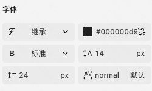
#### 树节点选中样式
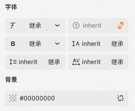
#### 树节点勾选样式

#### 树节点图标配置

### 树节点
#### 当前节点样式

说明：用于静态数据的节点样式配置

