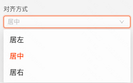
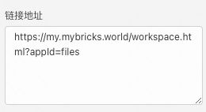
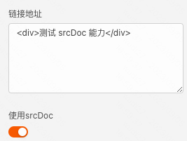
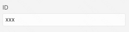
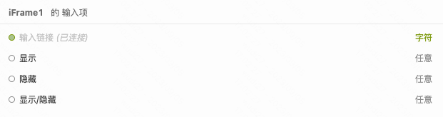
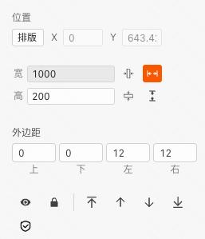

> **应用场景**\
场景：在页面中嵌入广告

Demo地址：[【iFrame】基本使用](https://my.mybricks.world/mybricks-pc-page/index.html?id=475065336168517)

----

## 基本操作
### 链接地址

说明：配置链接地址，iFrame 组件内部就会加载并展示链接对应的页面

### 使用 srcDoc

说明：开启「使用srcDoc」时，iFrame 组件内部会将链接地址当成 HTML 解析

### ID

说明：此 ID 会直接作为 iFrame 组件的的 DOM ID

----
## 逻辑编排
### 动态配置 IFrame 的链接地址

说明：直接设置 iFrame 的输入链接输入项即可

## 样式
### 通用组件样式

