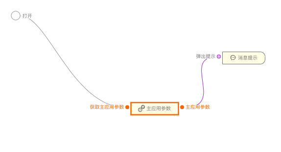
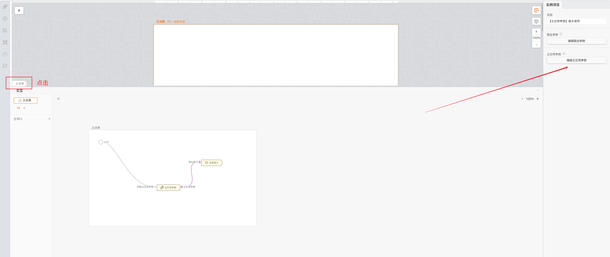

```
应用场景：获取到主应用传入的参数，多用于微前端场景
注：逻辑组件，在连线中的逻辑组件中可以找到
```

Demo地址：[【主应用参数】基本使用](https://my.mybricks.world/mybricks-pc-page/index.html?id=471077490954309)

----

## 基本操作
### 调试
调试和预览态可以在主场景模拟设置想要获取的参数



### 预览、发布后
拿到的就是主应用下发的参数，会获取到主应用下发的所有参数

----
## 逻辑编排
### 使用、处理数据

在主应用参数组件后连线使用或者处理拿到的数据，在任意需要消费的地方都可以获取使用。

----

## 样式
暂无