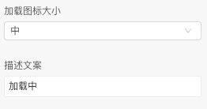
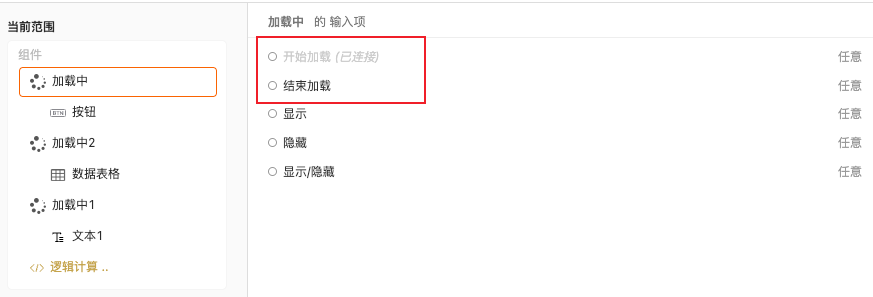

```
应用场景1：接口未返回数据，需要展示加载状态
应用场景2：更新、切换部分组件，提高用户体验
应用场景3：其他页面局部处于等待异步数据或正在渲染过程时，合适的加载动效会有效缓解用户的焦虑。
注：UI组件，可以在组件中找到
```

Demo地址：[【加载中】基本使用](https://my.mybricks.world/mybricks-pc-page/index.html?id=471085316874309)

----

## 基本操作
### 加载中
#### 内容
拖入一个加载中组件，将想要被覆盖的内容放入内容即可，开始加载时会加上遮罩和loading，当结束加载时展示原有内容，默认是不开启加载


#### 加载图标
图标大小可以调整

#### 描述文案
描述文案可以自定义



----
## 逻辑编排
### 开始加载
连线加载中组件的开始加载，会进入加载状态，内容部分会加上遮罩和loading加载中




### 结束加载
连线加载中组件的结束加载，会结束加载状态，展示内容部分


----

## 样式
暂无