> **应用场景**\
场景1：作为一组按钮。\
场景2：嵌入其他组件的插槽中，作为一组操作项使用，例如在表格组件的列中、提供“编辑”、“删除”等操作。\

----

## 基本操作
### 工具条
#### 添加一个按钮
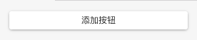

#### 设置总体对齐方式
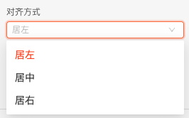

#### 调整按钮间的间距
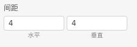

#### 省略配置
```
配置后在运行时通过...隐藏部分按钮
```
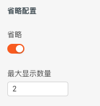

运行时效果：

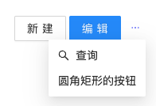

### 按钮
#### 修改显示文案
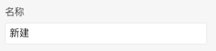

#### 修改图标
```
选择按钮，在 样式 选项卡中，开启 “图标”
```
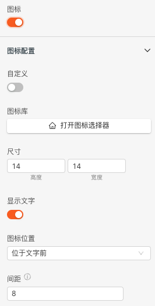

#### 触发数据
```
当按钮单击或双击时，触发的数据
```
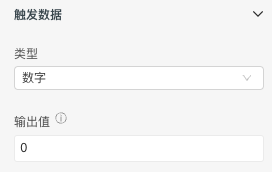

#### 前移、后移
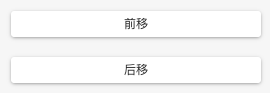

----

## 逻辑编排
### 按钮单击、双击事件
```
选中某个按钮、在常规选项卡中的事件进行操作
```
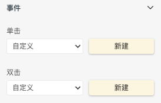

以单击为例，点击“新建”后，在 交互 面板

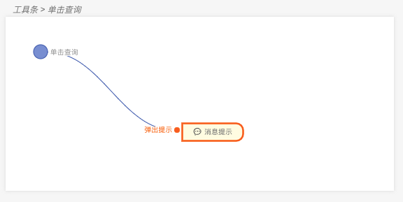

### 设置按钮Loading
```
选中某个按钮、在高级选项卡中进行操作
```
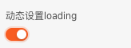

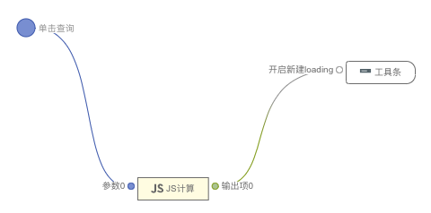

### 设置按钮的文案
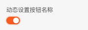

### 设置按钮的使用/禁用
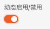

### 设置按钮的显示/隐藏
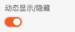

----
## 样式
### 按钮的主体风格
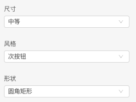

### 按钮的详细样式
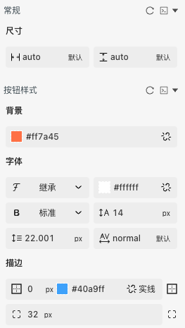
