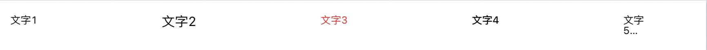
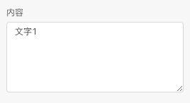
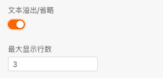
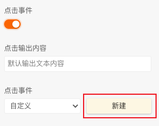
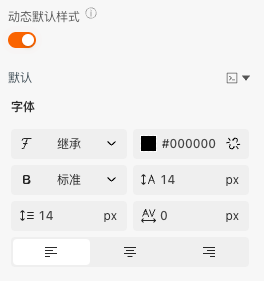
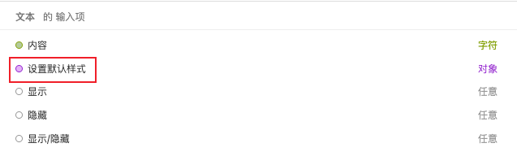
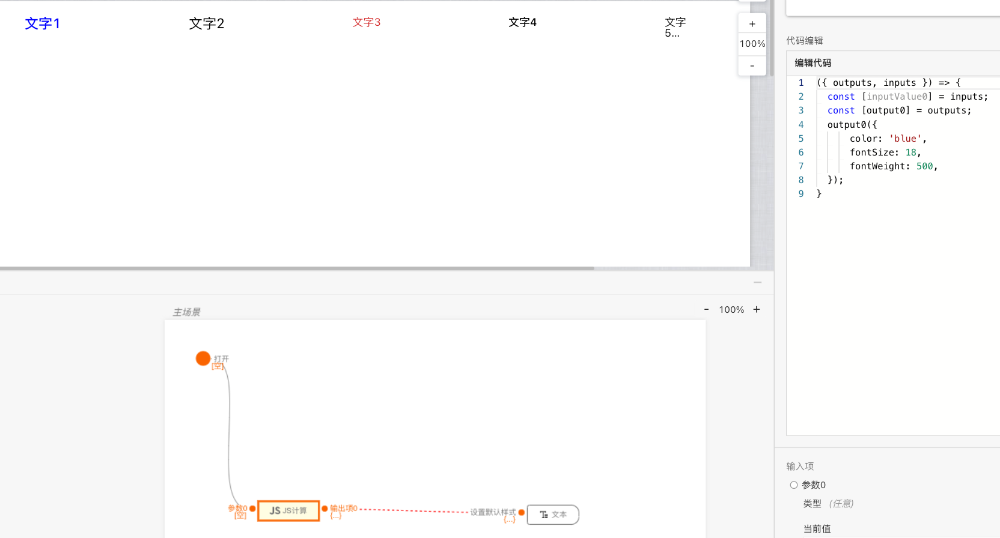
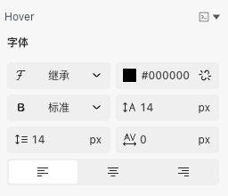

> **应用场景**：展示一段文字

Demo地址：[【文本】基本使用](https://my.mybricks.world/mybricks-pc-page/index.html?id=470777164365893)

----

## 基本操作
### 文字
#### 配置展示内容（文案）

说明：支持动态传入，为空时展示文字

#### 配置文本溢出省略

----

## 逻辑编排
### 点击事件
当需要添加文本的点击事件，并且可以配置点击的输出内容

----

## 样式
### 默认样式

打开动态默认样式，可以动态配置文本的默认展示样式，动态设置 字体颜色、字号、字重

### Hover样式
