## 步骤条 

> **场景**：引导用户按照流程完成任务的导航条

Demo：[步骤条](https://my.mybricks.world/mybricks-app-pcspa/index.html?id=475427467677765)

----

## 基本操作
### 步骤条
#### 类型
##### 默认类型

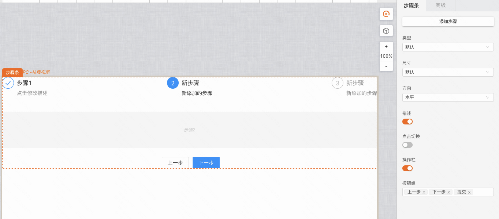
##### 导航类型

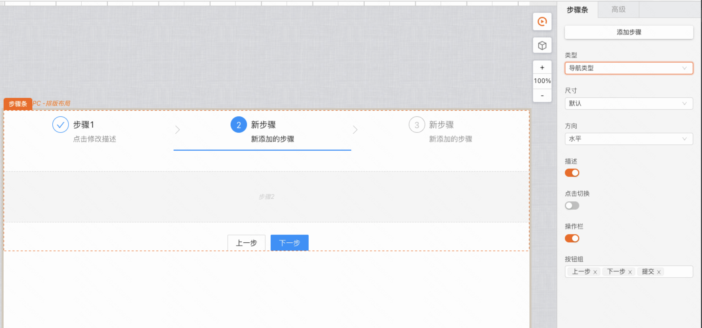
##### 点状类型

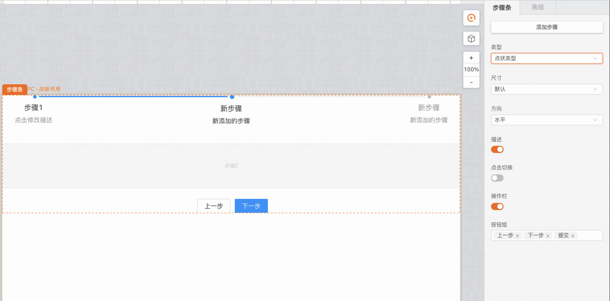
#### 尺寸
##### 默认尺寸

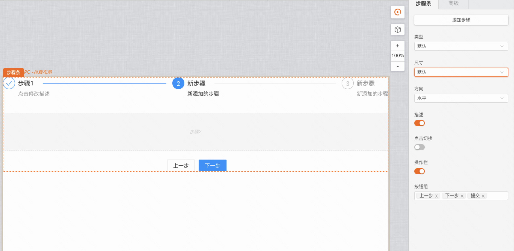
##### 迷你尺寸

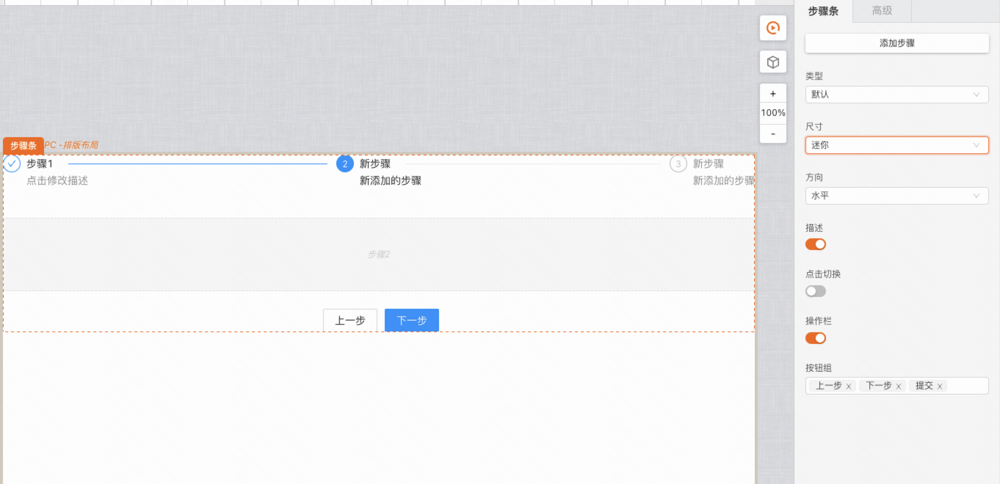
#### 方向
##### 水平

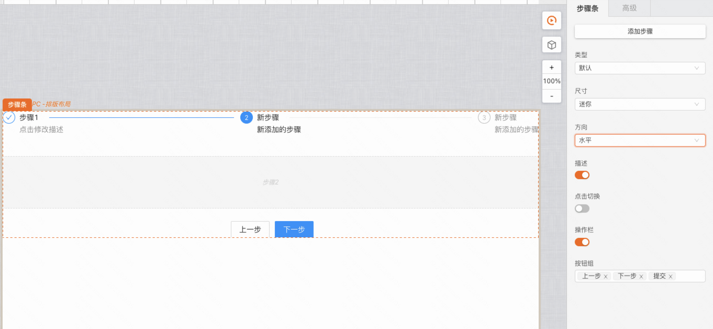
##### 垂直

### 步骤

聚焦到步骤，可以设置步骤的标题、子标题、描述信息等

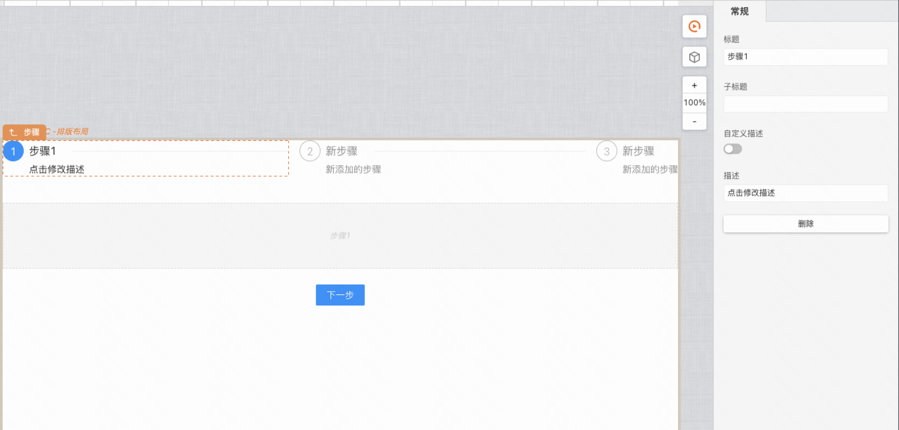
### 操作栏

聚焦到操作栏，可以设置按钮、对齐方式、按钮位置等
#### 按钮组

设置操作栏显示的按钮

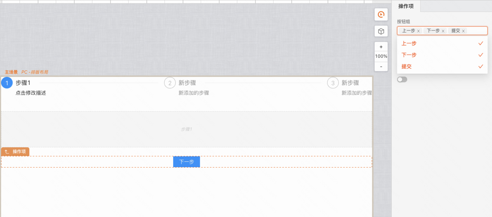
#### 按钮对齐方式

默认居中对齐

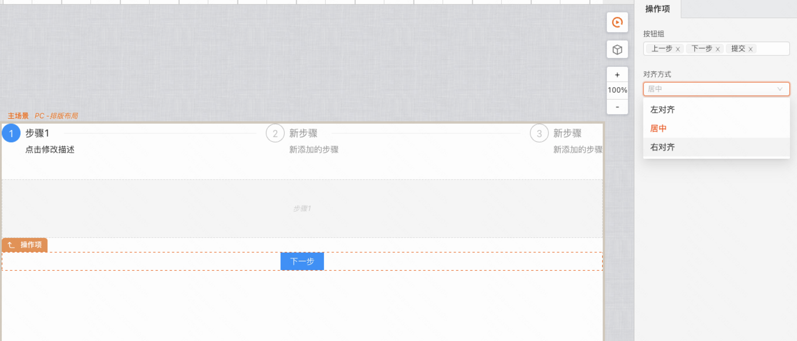
#### 按钮位置

默认跟随步骤区域，可以设置按钮置底及与底部距离

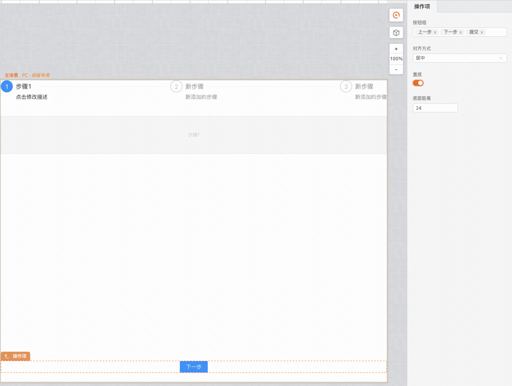
#### 按钮设置

聚焦到操作栏的按钮，可以设置按钮文本和点击事件。

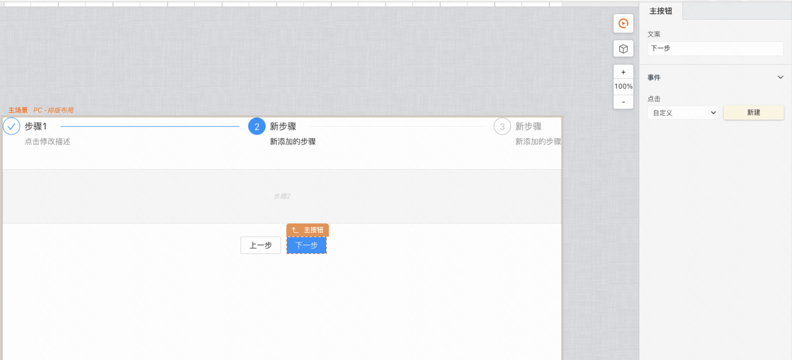
## 逻辑编排
### 步骤切换

给每一步的下一步按钮添加点击事件，点击按钮时连线到步骤条“显示下一步”

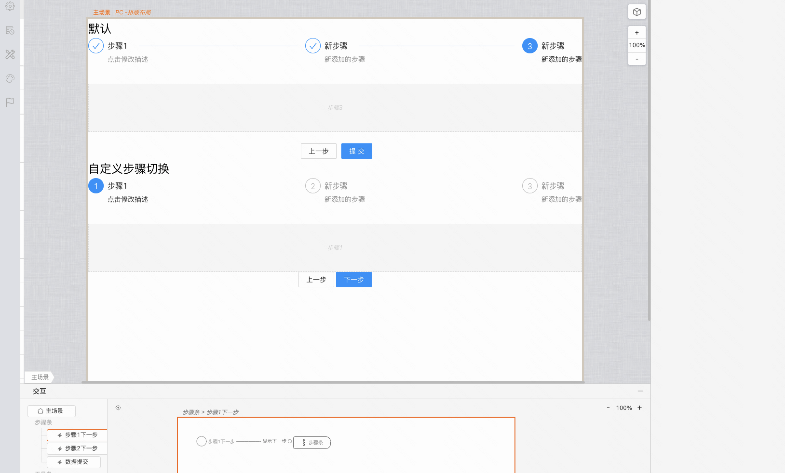

说明：“上一步”按钮不需要添加点击事件触发步骤返回上一步，组件内部已集成，默认返回上一步
### 步骤
#### 跳转到

设置跳转到步骤，连线传入步骤序号，从0开始

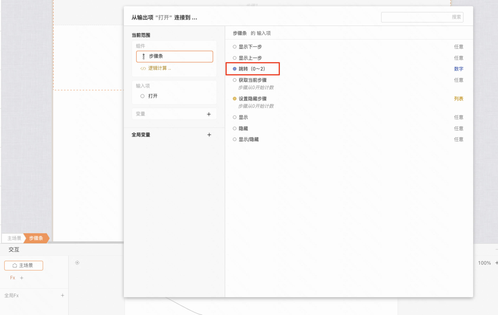
#### 隐藏步骤

设置步骤动态隐藏，连线传入步骤序号，从0开始

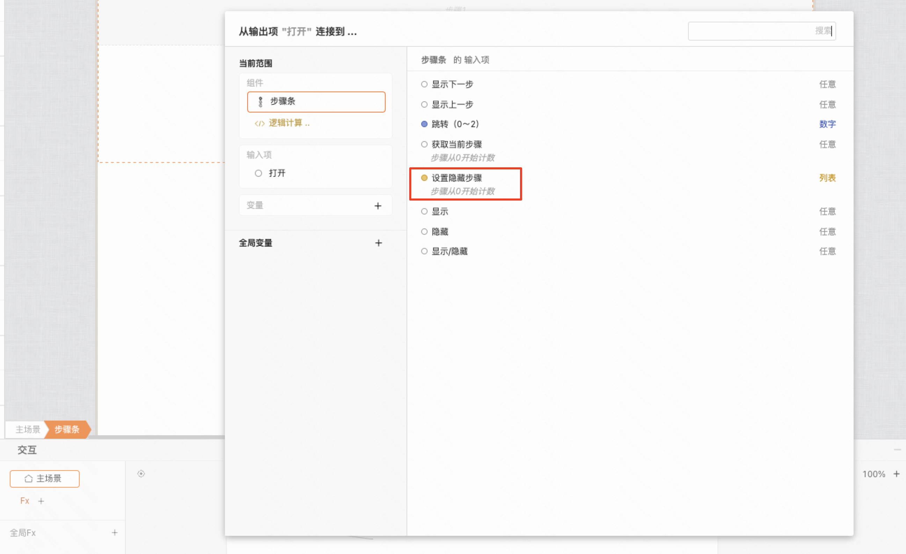
#### 自定义步骤切换

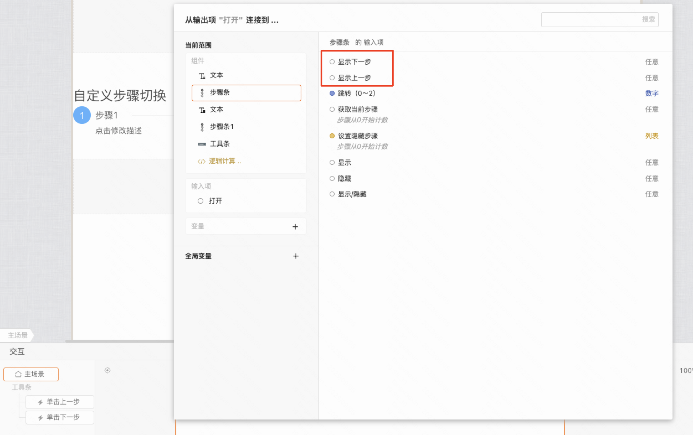