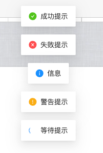
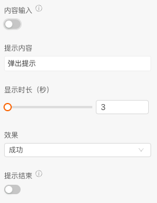
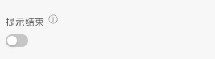

```
应用场景：弹出各种信息提示
注：逻辑组件，在连线中的逻辑组件中可以找到
```
Demo地址：[【消息提示】基本使用](https://my.mybricks.world/mybricks-pc-page/index.html?id=470823128916037)

----

## 基本操作
### 提示内容
#### 配置展示内容（文案）
提示内容默认展示连线的输入，关闭内容输入可以设置静态提示内容



#### 效果
选择不同效果，展示不同效果


#### 显示时间
配置消息提示的展示时间，默认是3秒


----

## 逻辑编排
### 提示结束事件
开启后，提示完成后可在后面连线触发其他事件



----

## 样式
暂无