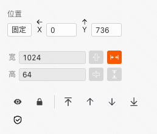

```
应用场景
场景：长表单的提交按钮可以放在置底工具栏
```

Demo地址：[【置底工具栏】基本使用](https://my.mybricks.world/mybricks-pc-page/index.html?id=475057675788357)

---
## 基本操作
### 对齐方式


### 高度


说明：用于调整置底工具栏的高度，单位为 px

### 宽度


说明：用于调整置底工具栏的宽度，单位可以自行选择，一般使用 % 为单位

### 自定义挂载父节点


说明：可以选择一个容器作为父节点，置底工具栏会定位到目标容器的底部

### 添加按钮


说明：用于增加置底工具栏中的按钮数量

----

## 逻辑编排
## 样式
### 通用组件样式
