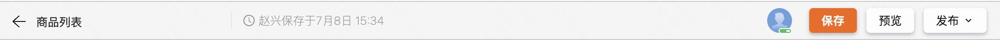
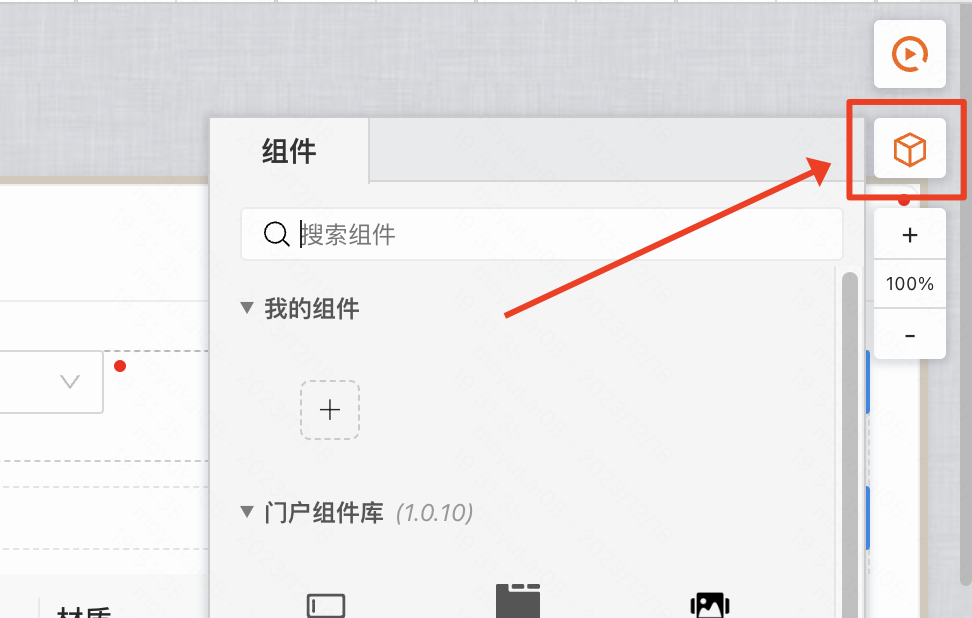

## MyBricks 设计器功能结构

整个MyBricks设计器分为了五个部分：导航栏、左侧插件栏、中间画布、右侧组件编辑区、底部交互面板。

### 导航栏

- 返回按钮：点击后返回到上一页
- 标题：显示当前页面的名称
- 保存按钮：点击立即保存当前页面
- 预览按钮
- 发布按钮
  - 测试环境
  - 线上环境

### 左侧插件栏
- 连接器
- 保存/发布记录
- 调试工具
- 主题包配置
- 搜索

其中比较常用的是连接器，连接器一般用来获取到后端数据：

### 中间画布
- 调试按钮
- 选取组件入口
- 放大缩小
- 新建场景按钮
- 顶部面包屑导航

其中比较常用的是选取组件入口，用户需要从这里拖拽组件到画布中：

### 右侧组件编辑区
一般来说会分为下面三个tab
- [组件名]
- 高级
- 样式

具体编辑配置项需要根据组件的不同而不同，比如下面是按钮组件的编辑项：

### 底部交互面板
交互区可以编辑按钮等等业务动作的逻辑，比如下面是按钮组件的交互区：
