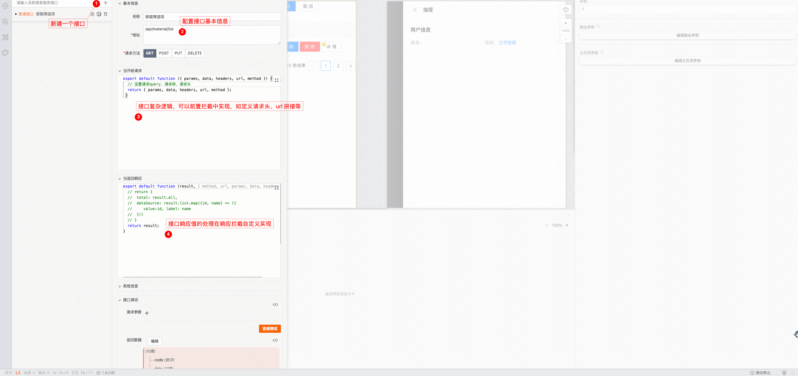
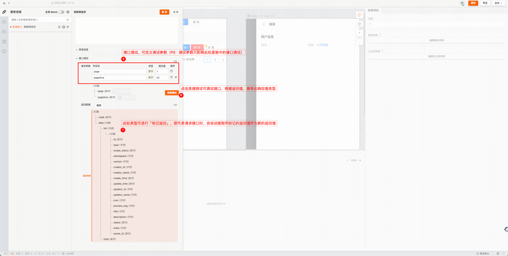
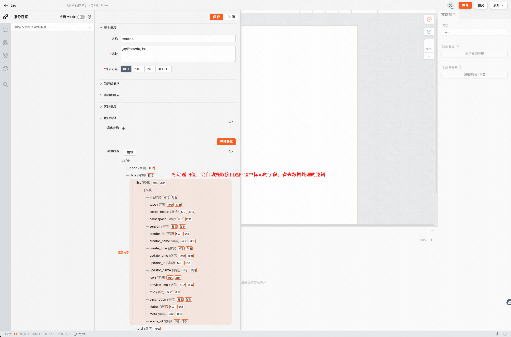
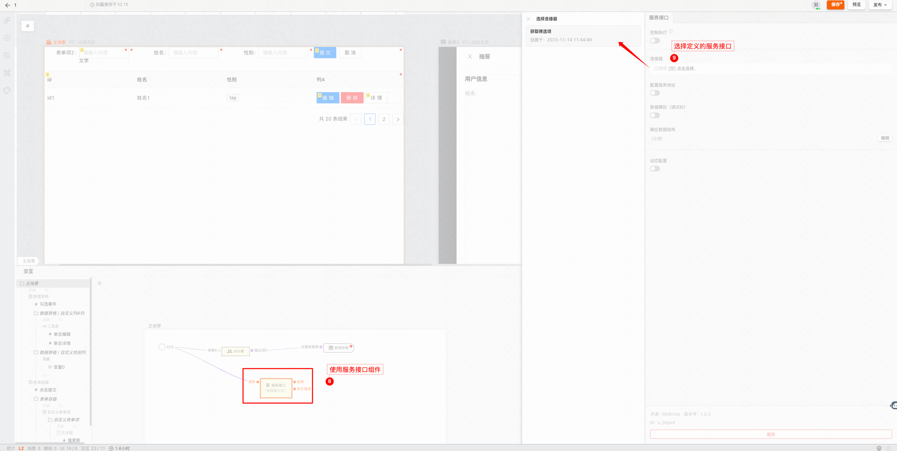
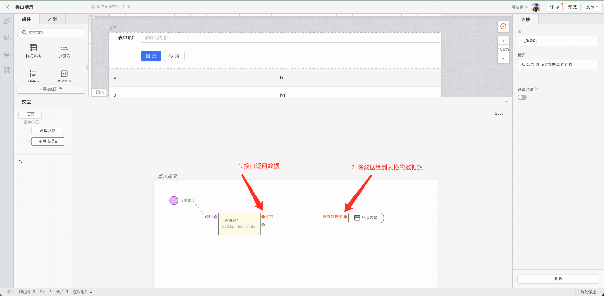
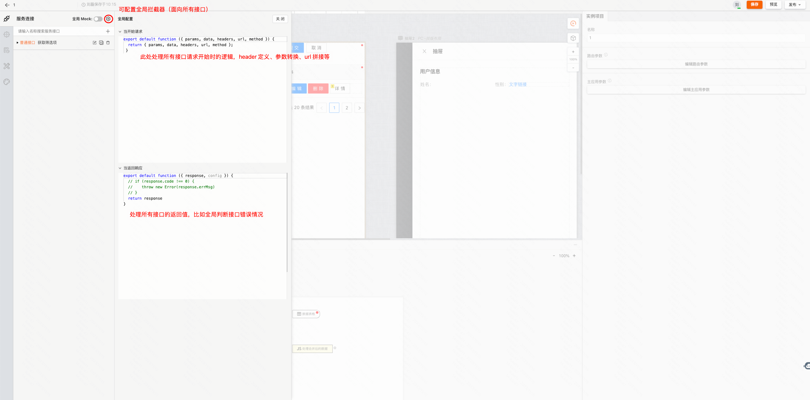
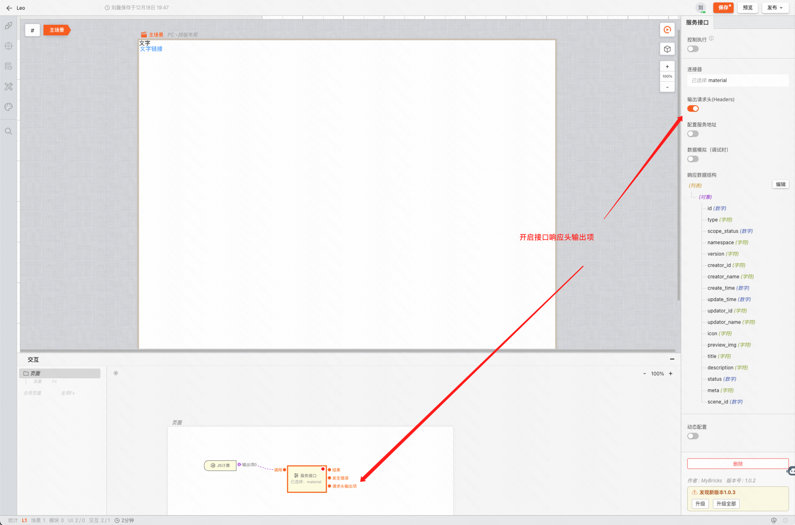

# 发起网络请求

发起网络请求能力依赖连接器，连接器是一种用于连接第三方服务、接口的工具。通过 MyBricks 开发者可以在轻松地访问其他系统中的数据和功能，从而实现不同系统之间的数据交换和应用集成

# 如何使用连接器发起网络请求

## 创建 HTTP 接口

**从左侧边栏打开「连接器」插件** > **点击「+」，添加接口** > **填写接口信息**

### 补充接口基础信息
- **必填项：**
请求方法、请求路径
- **可选项：**
    - 当开始请求：可以处理请求头、自定义参数等；
    - 当返回响应：可处理接口响应值

### 接口调试（重要）

**展开「接口调试」面板** > **定义接口参数** > **点击「连接测试」**

通过定义接口参数，连接测试请求，即可测试接口配置，同时获取返回值类型，以供后续使用。

> **注意事项**
>
> 调用接口时如果请求参数变更，后端接口返回的数据结构不一致，会导致结果异常
>
> 比如勾选的是 data，实际调用时后端接口返回的是 { result: {}, code: 0 }，则会获取不到任何数据**

### 数据标记
通过数据标记，标记返回值，可以在接口响应后自动提取数据值，省去处理数据的逻辑，以便快速搭建

## 使用 HTTP 接口

在逻辑面板连接「服务接口」组件，并选择对应的服务接口

## 使用接口返回的数据

**使用后端返回的真实数据**

## 全局配置

**当开始请求：此处的改动会影响所有接口发起请求的入参，适用与对请求的参数做统一处理，比如在 query 上都要带上 id**
**当返回响应：此处的改动会影响所有接口的返回结果，适用于对返回结果做统一的数据结构处理**

## 服务接口的输入/输出
### 输入
- **调用：**
支持传入对象类型数据，会自动识别为接口调用的参数。GET 请求将以问号传参的方式拼接在接口地址中；其他类型请求为 request payload 形式。

### 输出

- **结果：**
默认返回状态码非 4xx 或 5xx 时触发，输出数据为接口定义中处理的返回结果。
- **发生错误：**
默认在返回状态码为 4xx 或 5xx 时触发；当需要根据返回结果自定义触发条件时，可以使用 throw new Error 方法。
- **请求头输出项：**
可通过「服务接口」组件开启此输出项，将会输出接口的响应头(response header)。
