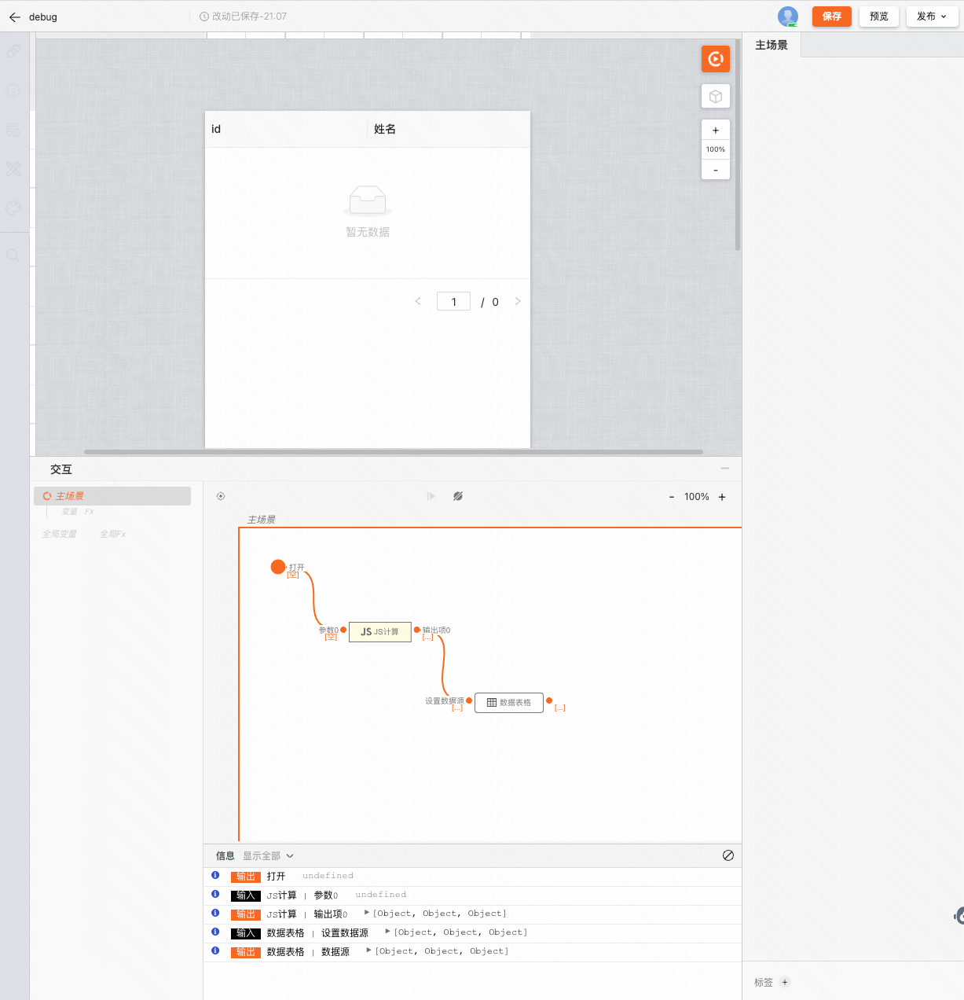
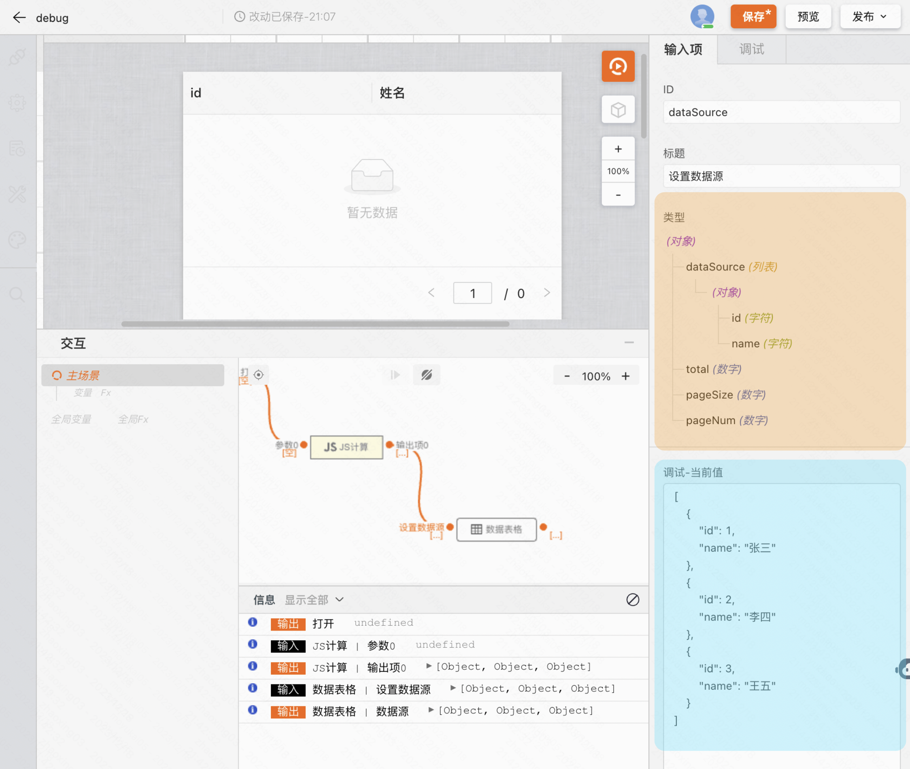
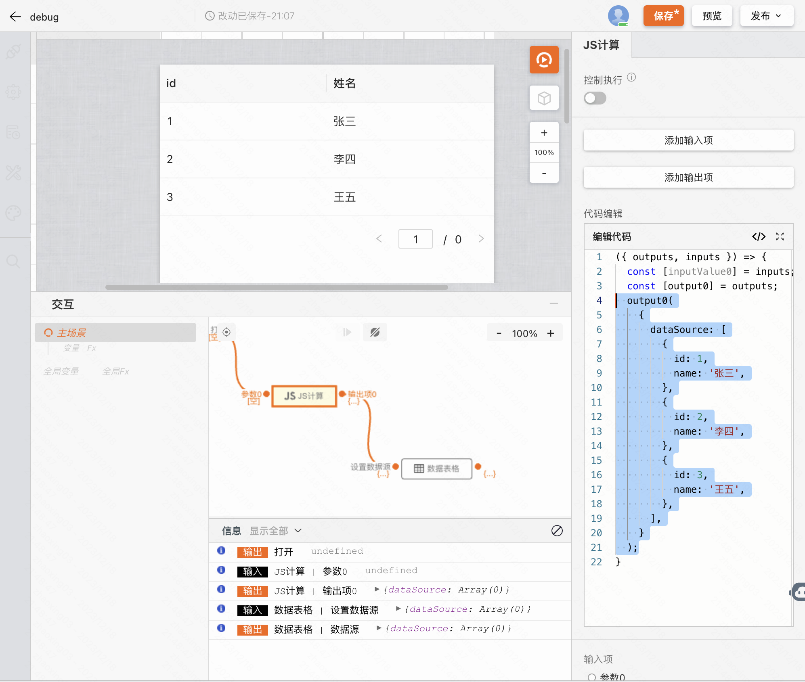

# 调试

本章将介绍在设计器中调试问题的基本工作流程。

## 第 1 步：重现 bug

找到一系列能够一致地重现 bug 的操作始终是调试的第一步。

1.  在新标签页中[打开此演示](https://my.mybricks.world/mybricks-pc-page/index.html?id=511158381592645)。
2.  点击调试，期望正确渲染数据表格。

## 第 2 步：熟悉「交互」面板界面

在点击调试后，我们可以通过「交互」面板中提供的日志等信息进行问题排查。分别有**每个组件的实时输入输出信息，以及逐行打印的日志**。

## 第 3 步：使用断点暂停代码

查看日志是调试这类问题的基本方法，但是随着页面复杂度的上升，海量的日志会让问题调试变得麻烦，这时候我们就可以使用断点调试的方式来优化执行。

使用方法为点击连线，激活「开启断点」即可

## 第 4 步：问题定位

通过右侧的日志信息我们可以看到：「数据表格」组件在接收设置数据源的事件时，期望的数据格式为对象（右侧橙色区域），但是收到的却为数组（右侧蓝色区域）。

通过以上信息定位到问题后，修改「JS计算」组件的输出内容，即完成了问题的修复。

## 相关阅读

[异常分类与调试方法](/blog/exception-debugging-methods)