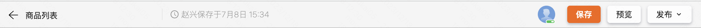
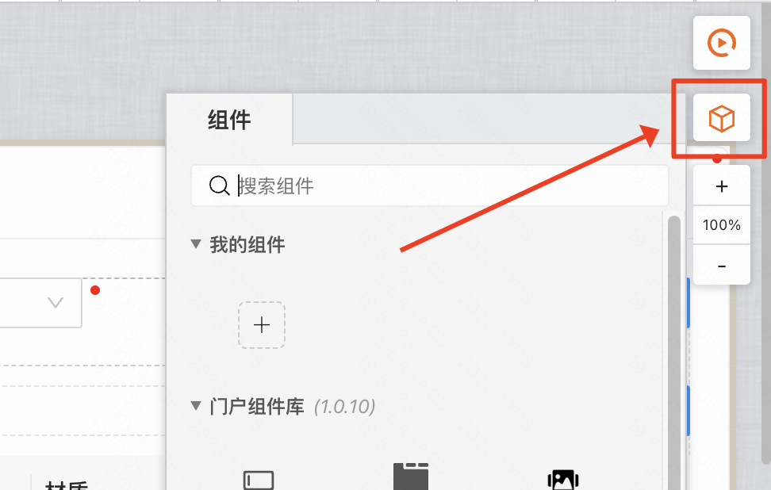
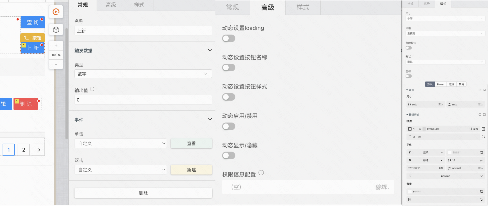
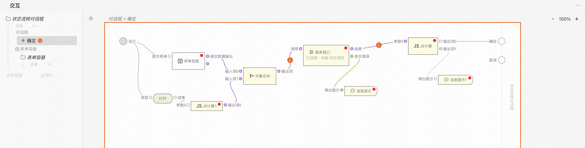

:::tip
通过本章节，了解 MyBricks-SPA 设计器（以下简称设计器）的界面与基本操作。
:::

<figure>总览图</figure>

## 基本布局

设计器具有简单直观的布局，可滚动、缩放、伸缩、展开收起等的交互方式可最大化为编辑操作提供空间，同时留出足够的空间来浏览完整上下文。UI 分为五个主要区域：

- **导航栏：** 顶部的导航栏默认包含了文件名称；保存、预览、发布控件等。
- **插件栏：** 左侧的插件栏可为设计器增强各种能力，设计器内置了：版本控制、连接器、主题包、国际化等插件。
- **画布视图：** 中间的画布视图用于制品的 UI 搭建。
- **交互视图：** 下方的交互视图用于制品的逻辑的搭建。
- **编辑视图：** 右侧的编辑视图会根据用户当前所聚焦的组件，切换展示对应的编辑器。

### 导航栏

- 返回按钮：点击后返回到上一页
- 标题：显示当前页面的名称
- 保存按钮：点击立即保存当前页面
- 预览按钮
- 发布按钮
  - 测试环境
  - 线上环境

### 插件栏
- 连接器
- 保存/发布记录
- 调试工具
- 主题包配置
- 搜索

其中比较常用的是连接器，连接器一般用来获取到后端数据：

### 中间画布
- 调试按钮
- 选取组件入口
- 放大缩小
- 新建场景按钮
- 顶部面包屑导航

其中比较常用的是选取组件入口，用户需要从这里拖拽组件到画布中：

### 右侧组件编辑区
一般来说会分为下面三个tab
- [组件名]
- 高级
- 样式

具体编辑配置项需要根据组件的不同而不同，比如下面是按钮组件的编辑项：

### 底部交互面板
交互区可以编辑按钮等等业务动作的逻辑，比如下面是按钮组件的交互区：
