在搭建的过程中，我们通常需要将多个组件进行编组，使其成为一个新的组件，这便有了**封装**。

**「模块」** 和 **「Fx」** 分别对应了 **UI组件** 的封装和 **逻辑组件** 的封装。

## 模块

### 创建模块

操作路径为「导航 > 新建场景 > 模块」，创建模块后，将在画布最右侧新增一个空的模块画布。

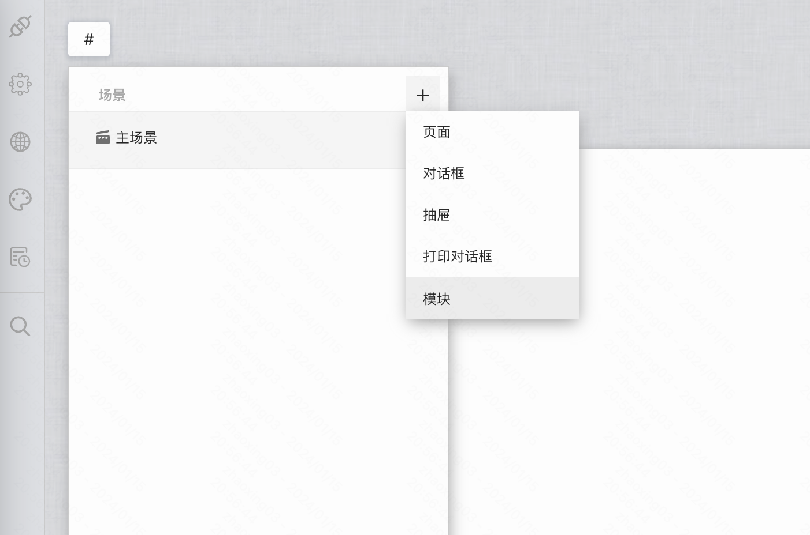

聚焦模块标题，我们可以对其画布进行名称、尺寸、背景、布局方式等的编辑。

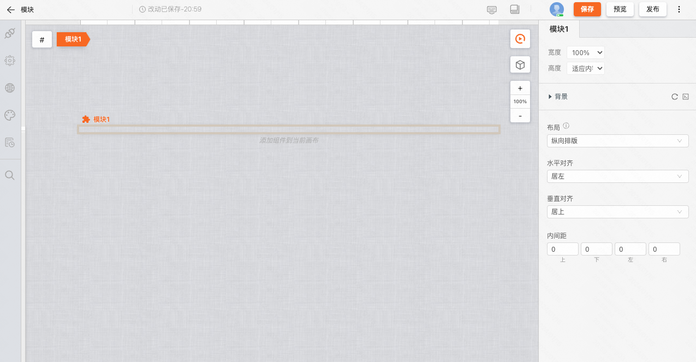

并且在模块中，我们可以进行 UI 和逻辑的搭建。

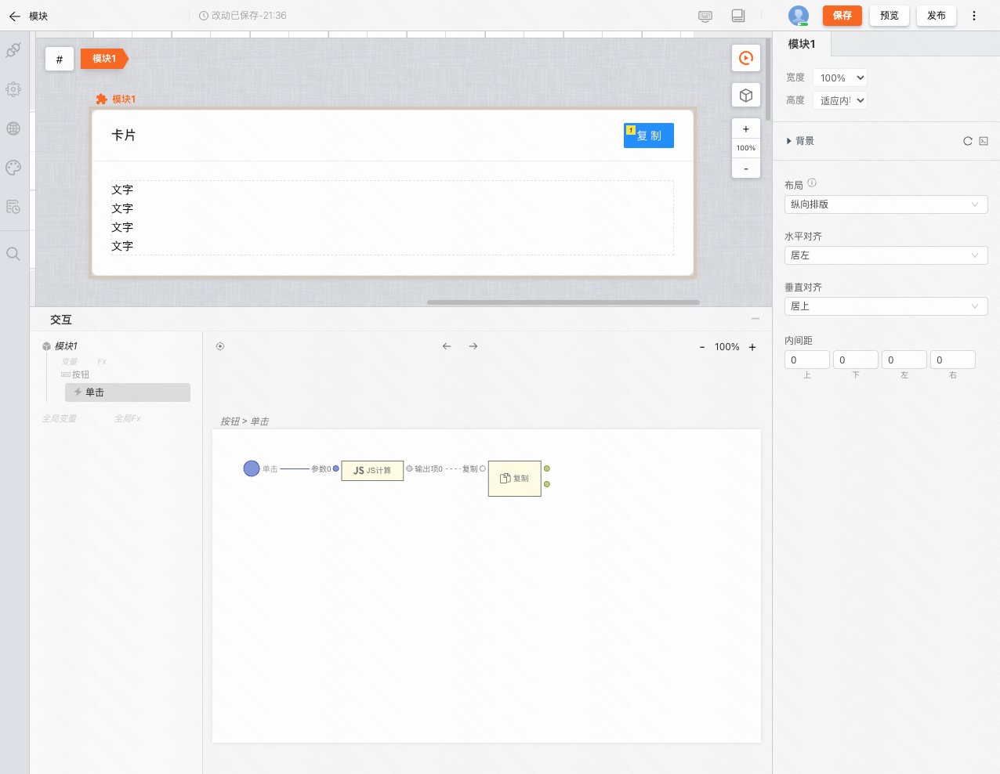

### 为模块添加配置项

当我们通过路径「导航 > 模块」把一个模块拖入画布时，便完成了一个模块的实例化。画布中的模块将会被斜着的网格覆盖。

但是此时的模块并没有配置项，如果我们期望实例化后的模块之间可以存在差异时，可以为模块添加配置项。

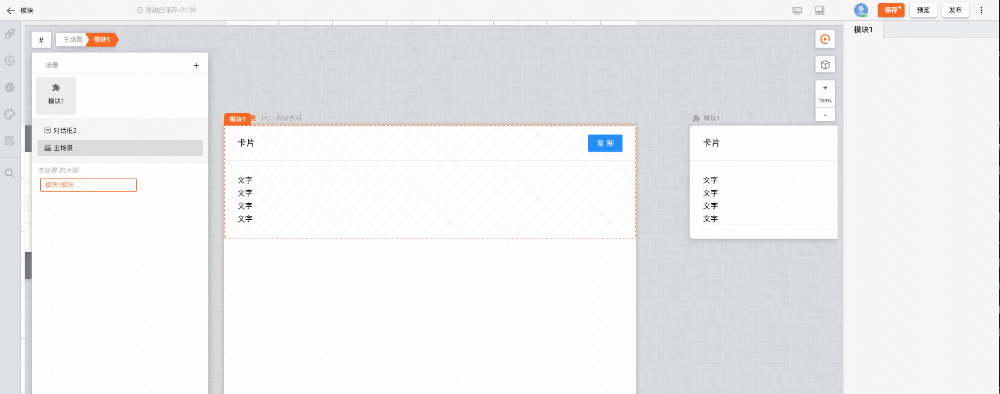

我们再聚焦回模块的交互主卡片，在编辑器中可以看到「添加编辑项」、「添加输入项」、「添加输出项」等三个按钮。点击按钮，我们可以为模块添加对应的接口。

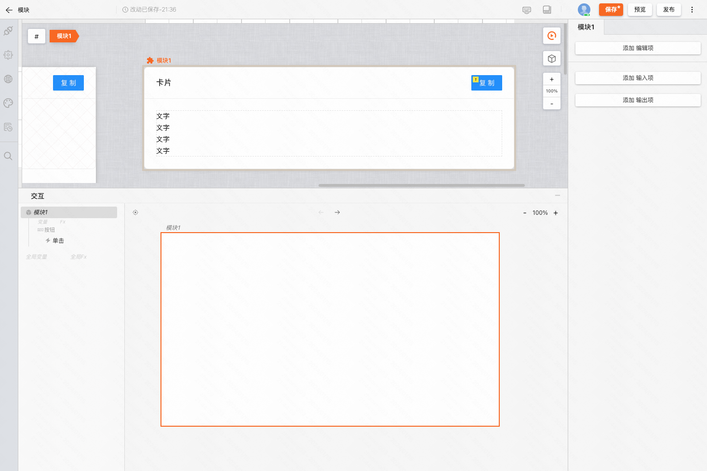

如下图，我们为模块添加了编辑项和输出项。

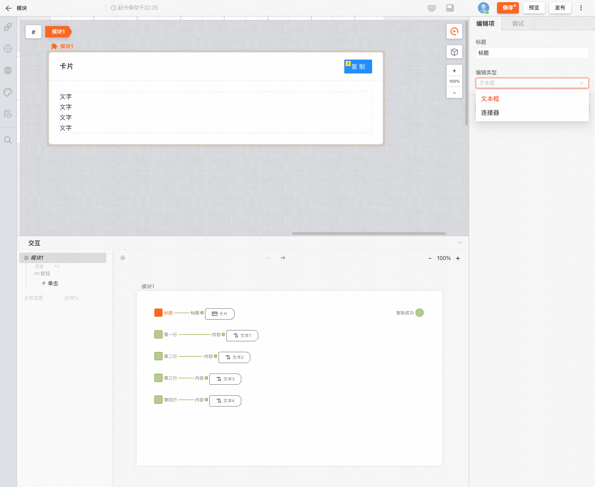

此时我们再次在主画布中聚焦实例化后的模块即可看到右侧的编辑项。

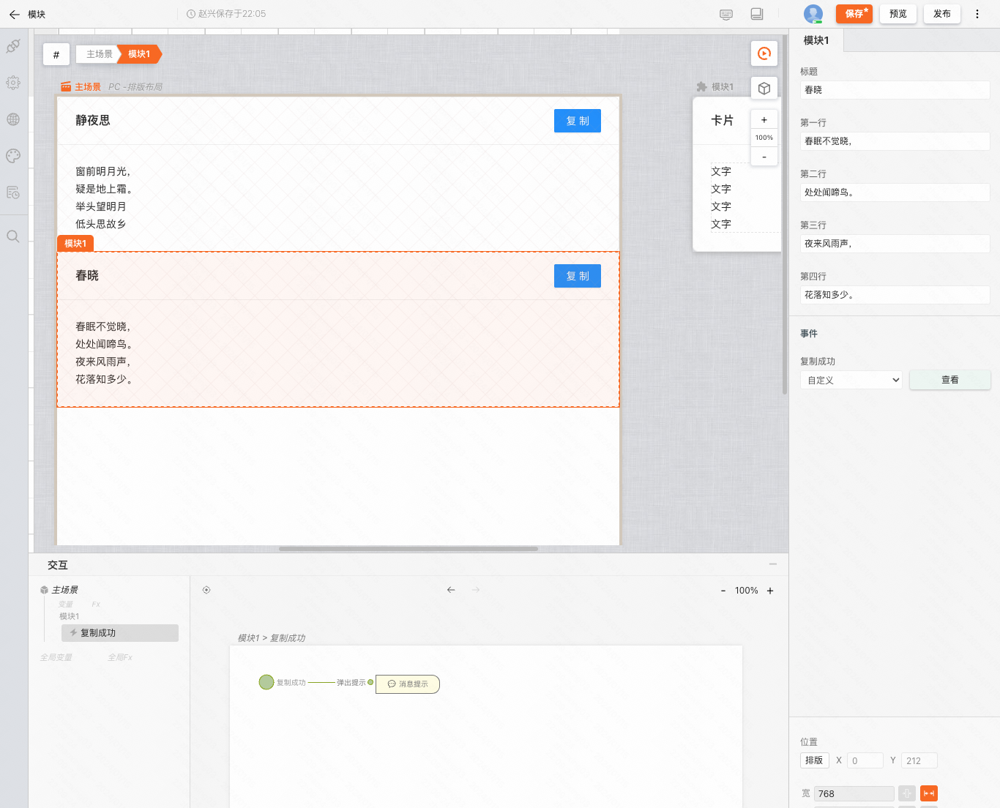

至此，我们便完成了一个UI组件的封装和使用。

## Fx

### 创建 Fx

在交互视图的左侧，我们可以通过「Fx」或者「全局 Fx」来创建 Fx 卡片。根据创建的位置不同，可以创建全局 Fx、页面级 Fx、作用域级 Fx等。

在 Fx 卡片中搭建逻辑时需要注意的是，连接 UI 组件等时，需要在交互弹窗面板的左上角切换「全局、主场景、作用域」等区域。

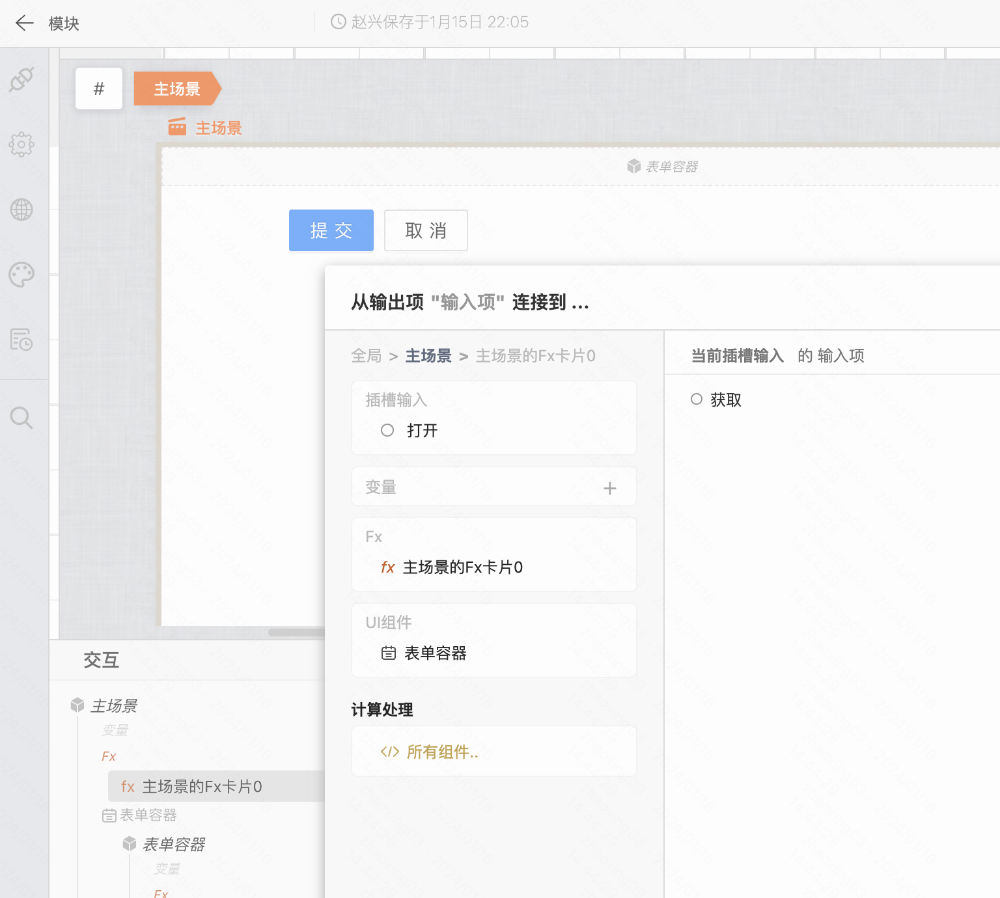

### 为 Fx 添加配置项

通过交互弹窗面板，选择 Fx 的输入项即可完成 Fx 的实例化。

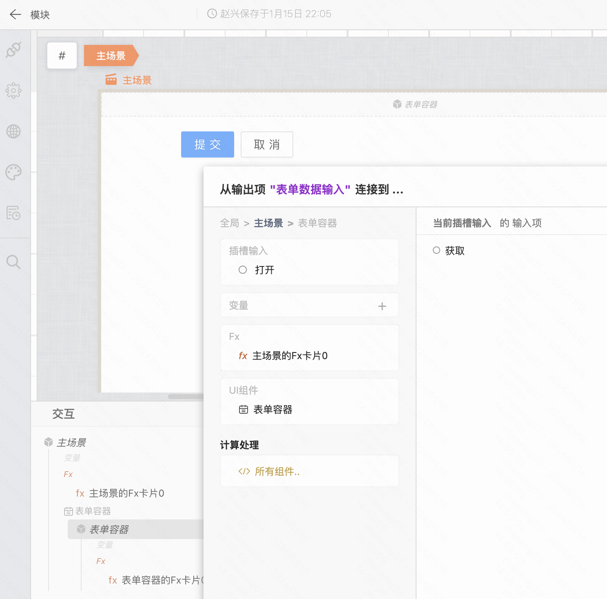

聚焦到 Fx 卡片，在编辑器中可以看到「添加配置项」、「添加输出项」等两个按钮。点击按钮，我们可以为 Fx 添加对应的接口。

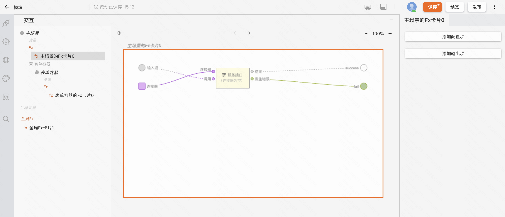

此时我们再次在交互画布中聚焦实例化后的 Fx 即可看到右侧的编辑项和节点的输出项。

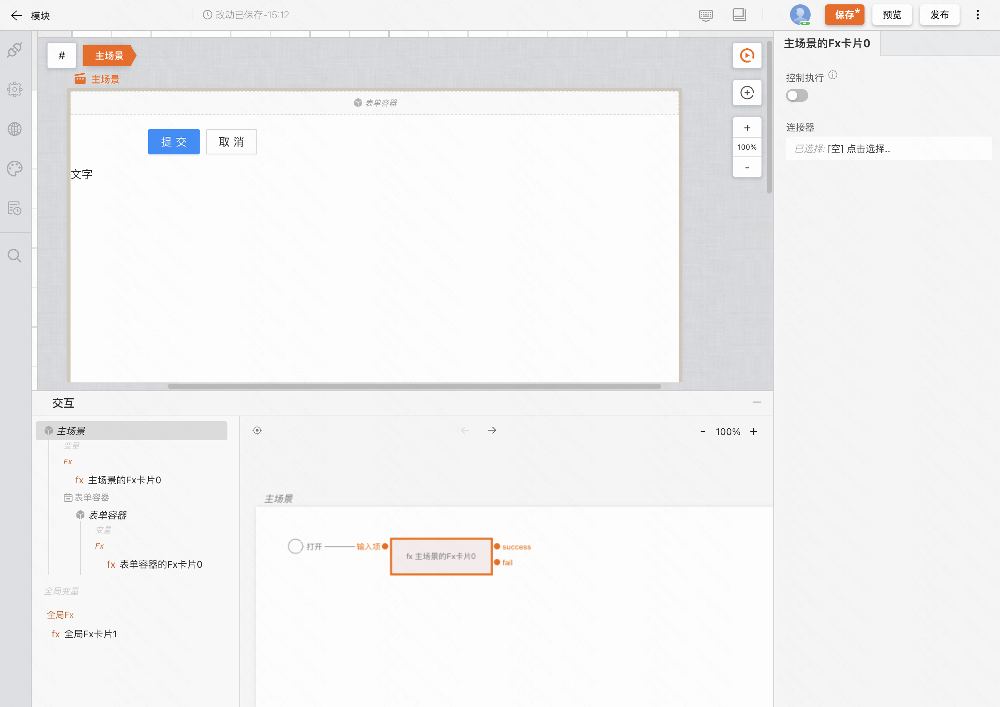

至此，我们便完成了一个逻辑组件的封装和使用。
