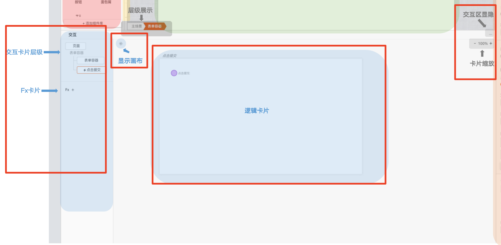
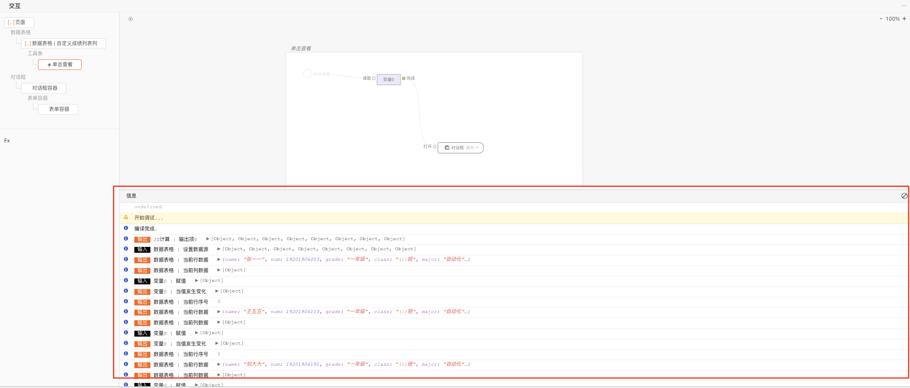
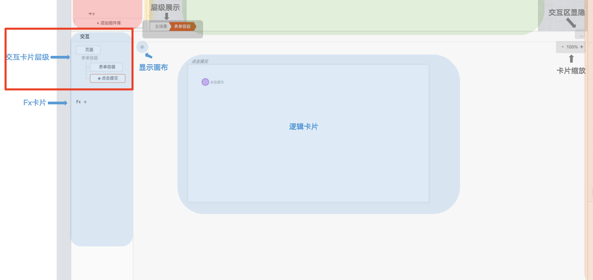
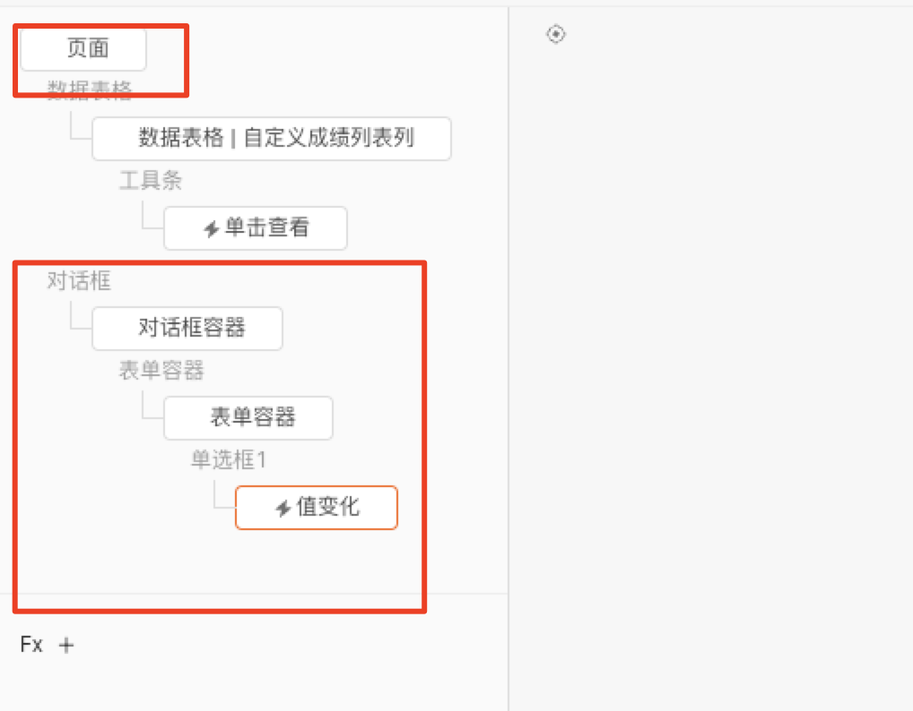
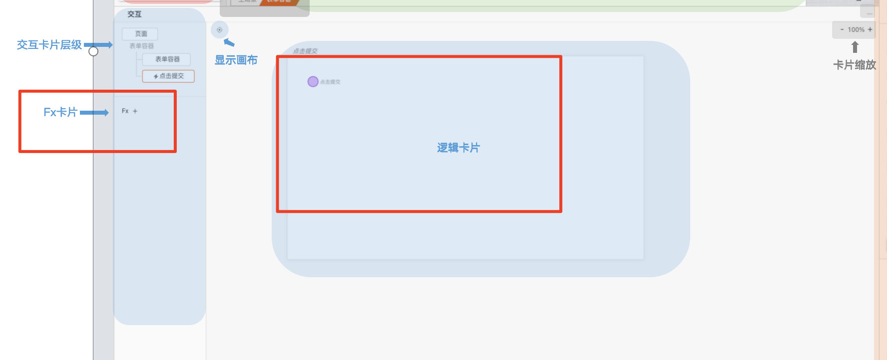
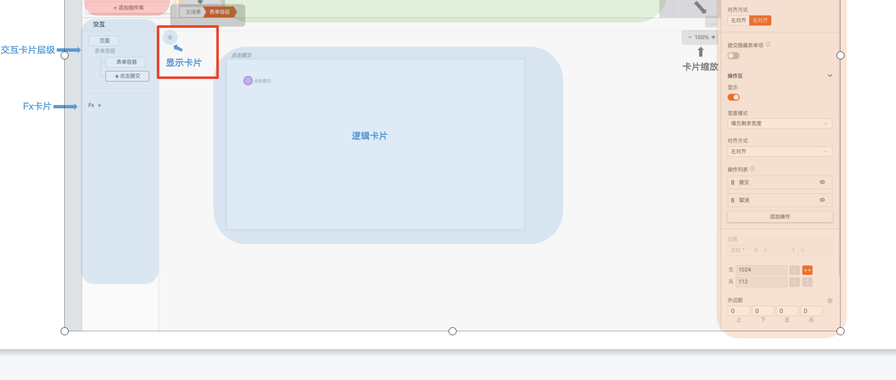
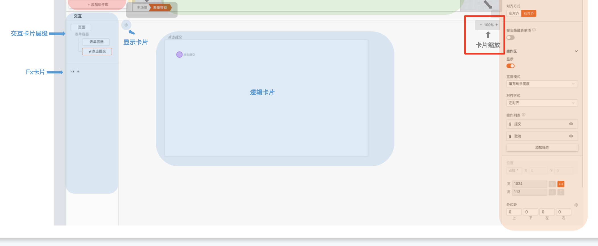
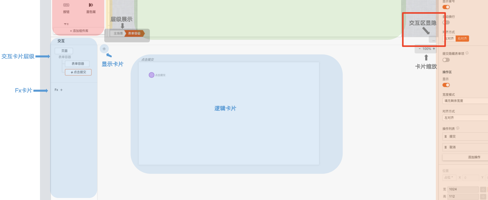

# 交互视图

用户在搭建过程中，涉及到逻辑部分的操作都需要在其区域连线，传递数据流和逻辑编排。在非调试态的时候交互区如图所示。

在调试态时，交互区如下图所示，多了一个数据流，信息的展示。

这里将的交互区分为三个部分来介绍，分别是逻辑卡片层级、逻辑卡片及Fx、附加功能。

## 逻辑卡片层级

这里的逻辑卡片层级会依照，页面里组件的层级关系进行展示，这里涉及到作用域的概念，可以参考「作用域插槽」

比如在页面里放里对话框组件，对话框插槽里放了表单容器，表单容器里放了表单项，其组件创建了对应的事件，那交互卡片的结构如图所示。

## 逻辑卡片及Fx

可以在对应组件创建事件的卡片和页面卡片中，连线实现交互逻辑，完成数据传递。当有交互逻辑存在复用的情况时，可以点击Fx的“➕”，将这段逻辑进行复用。比如表格的刷新等操作。

## 唤出逻辑面板

## 附加功能

### 1\. 显示卡片

当卡片不在可视区域后，可以点击显示卡片按钮，将卡片重新显示在可视范围内。

### 2\. 卡片缩放

点击卡片缩放按钮的“+”可以放大卡片，“-”可以缩小卡片。

### 3\. 交互区显隐

当点击后，可隐藏/显示卡片区域，方便预览画布页面。