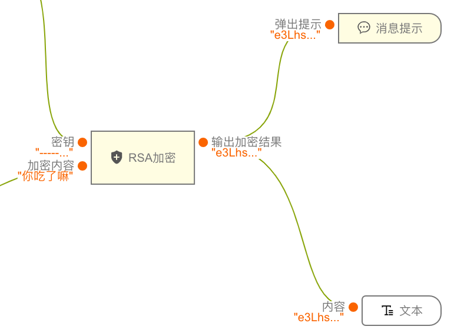
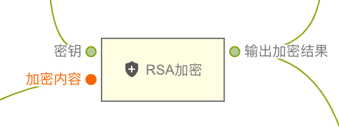
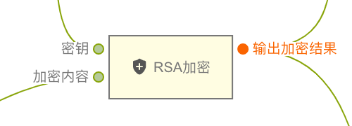

> **应用场景1**：保护敏感数据在网络传输过程中的安全\
**应用场景2**：生成和验证数字签名，以确保数据的真实性和完整性\
**应用场景3**：身份验证和密钥交换\
**应用场景4**：加密和管理对称加密算法（如AES）的密钥\

> 注2：使用[jsencrypt.js](https://www.npmjs.com/package/jsencrypt)进行RSA加密

Demo地址：[【RSA加密】基本使用](https://my.mybricks.world/mybricks-app-pcspa/index.html?id=472323969294405)

----
## 基本操作
### RSA加密
#### 加密

传入需要加密的内容和密钥，加密成功即可得到密文，加密失败返回false

----
## 逻辑编排
### 输入
#### 待加密内容
一般是字符类型

#### 密钥
公钥，也是字符类型

### 输出
#### 密文
输出密文，加密成功就是对应的密文（字符串），失败则返回false

----

## 样式
暂无
