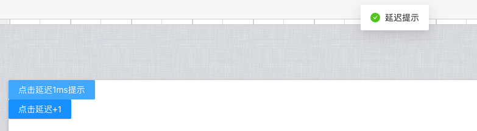
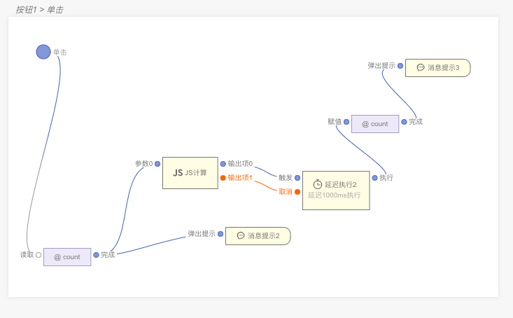

> **应用场景1**：中后台系统经常需要执行一些定时任务，例如定期生成报表、数据备份、清理临时文件等。使用延迟执行可以在指定的时间点自动触发这些任务，提高系统的自动化程度和效率。\
**应用场景2**：可用于在一定的延迟时间后执行特定的操作或任务。通常用于处理一些需求延迟处理的任务，如延迟发送短信、延迟处理订单等。

>注：逻辑组件，可以在连线中逻辑组件中找到

Demo地址：[【延迟执行】基本使用](https://my.mybricks.world/mybricks-app-pcspa/index.html?id=471499618160709)

----

## 基本操作
### 延迟执行
#### 延迟时间
配置延迟多久后执行，单位ms 1000ms == 1秒

#### 取消操作
开启后可以连线到延迟执行的取消，只要走到这里（有输入）不会执行后续操作

----

## 逻辑编排
### 延迟执行
#### 执行任务
延迟执行后的连线会在设置的时间后执行。

#### 取消任务
当达到一定条件后不想再执行可以开启取消操作，连线到取消即可，当达到不执行的条件时，不再触发后续操作。

----

## 样式
暂无

