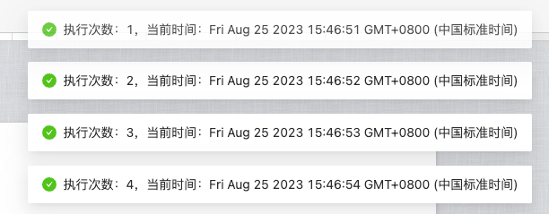
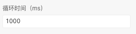
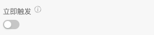
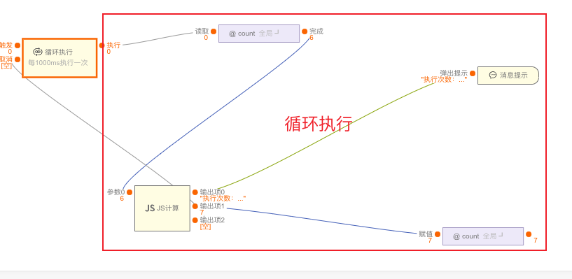

> **应用场景1**：大数据处理：在数据分析和处理过程中，往往需要对大量的数据进行循环处理。例如，对数据集进行逐行处理、批量处理或迭代处理，以便进行数据清洗、转换、聚合等操作。\
**应用场景2**：定期任务：中后台系统经常需要执行一些定期任务，例如每天生成报表、每周备份数据库、每月执行结算操作等。这些任务需要按照一定的频率和时间间隔循环执行，以确保系统运行的正常和数据的及时更新。\
**应用场景3**：实时数据处理（轮询）：对于实时数据流，循环执行是非常常见的。例如，对实时日志进行实时监控和分析，循环处理每条新的日志信息；或者对实时订单进行处理，循环检查并处理新增的订单。

> 注：逻辑组件，可以在连线中的逻辑组件中找到

Demo地址：[【循环执行】基本使用](https://my.mybricks.world/mybricks-app-pcspa/index.html?id=471499702341701)

----

## 基本操作
### 循环执行
#### 循环时间
配置循环时间，间隔多久执行一次

#### 立即触发
开启后立即执行第一次，默认是经过一次循环才会执行。

#### 取消操作
开启后可以中断循环，取消执行

----

## 逻辑编排
### 开始循环
连线后的流程会循环执行，前面的连线带来的数据会传递到连线后

### 取消循环

开启取消操作后可以连线到取消，可用于达到条件时停止循环

----

## 样式
### 默认样式
无