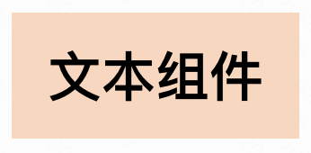
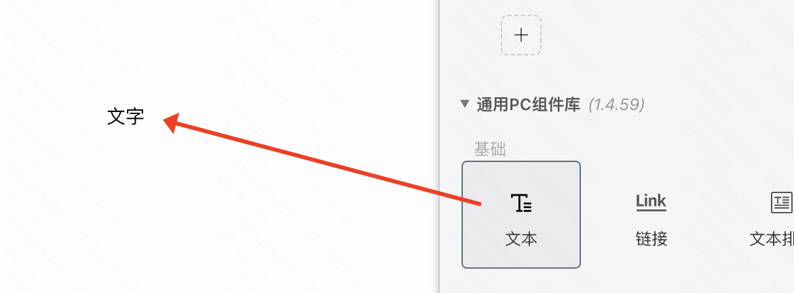
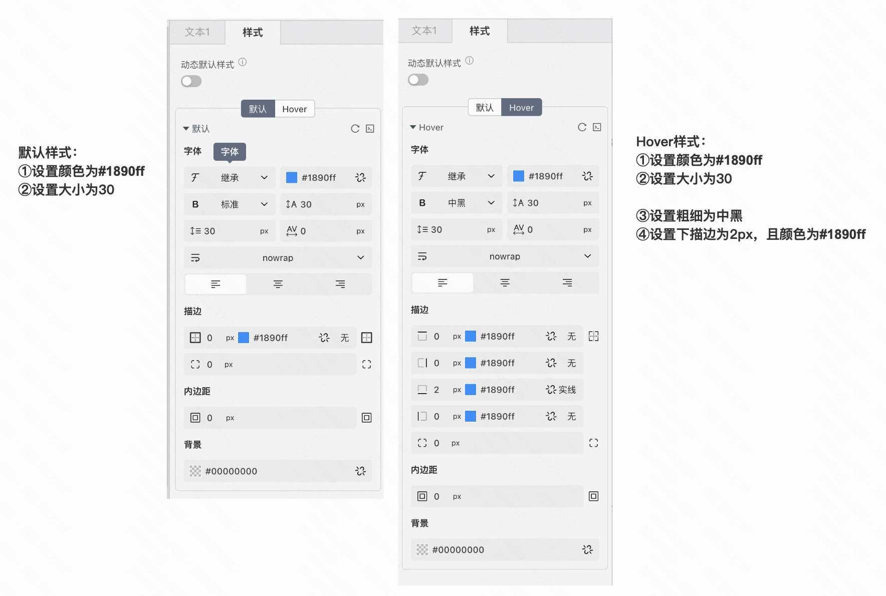
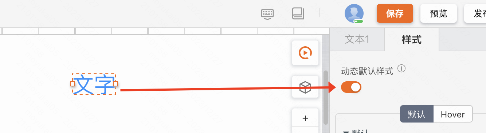
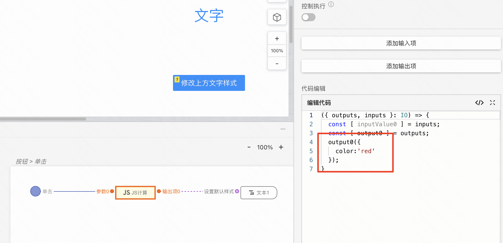
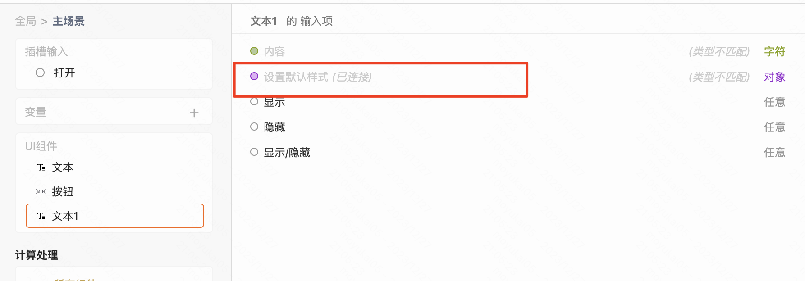

## 何时使用

- 展示一段文字时使用
- 包含了以下属性：
  - 文本溢出/忽略
  - 点击事件

## 案例一
### 案例介绍
搭建一个hover后类似超链接的文本样式

### 搭建案例链接
demo搭建链接：[hover后类似超链接的文本样式](https://my.mybricks.world/mybricks-app-pcspa/index.html?id=515455797248069)

### 操作步骤
1、从组件库中拖入文本组件

2、如下图设置好文本组件的默认样式和hover样式

### 效果展示

## 案例二
### 案例介绍
搭建一个按钮，点击后可以修改指定文本的默认样式

### 搭建案例链接
demo搭建链接：[点击按钮修改文本样式](https://my.mybricks.world/mybricks-app-pcspa/index.html?id=515455797248069)

### 操作步骤
1、从组件库中拖入文本组件

2、从组件库中拖入一个按钮组件，并开启动态默认样式

3、选中按钮，点击新建事件，在点击事件中，定义如下数据结构，连线到文本组件中的动态默认样式

### 效果展示
