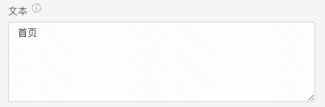
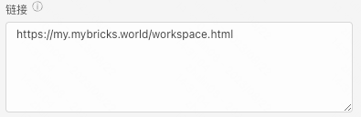
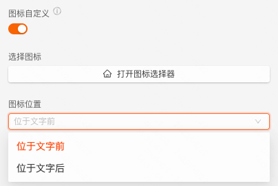
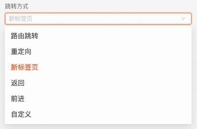
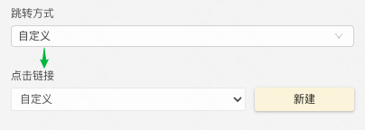
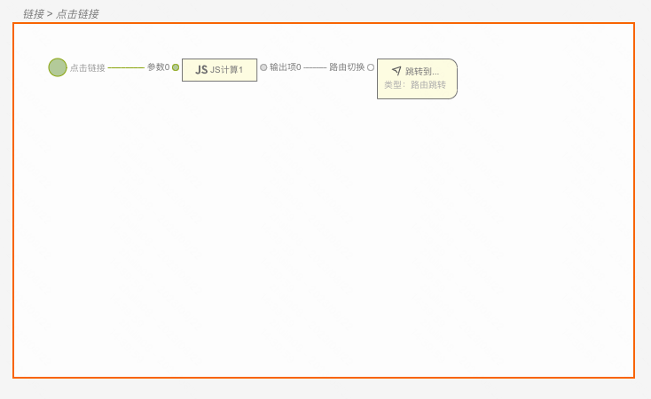
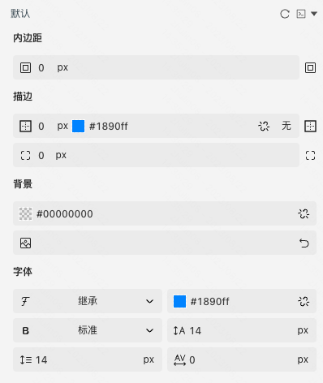
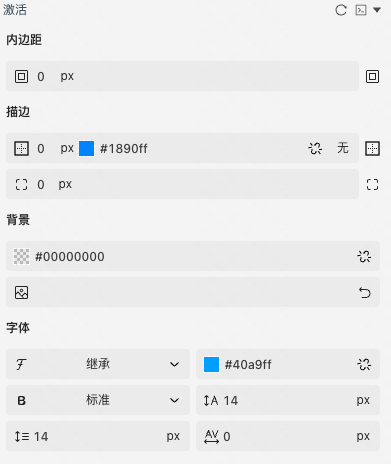

  
> **应用场景**：导航到新页面

Demo地址：[【链接】基本使用](https://my.mybricks.world/mybricks-app-pcspa/index.html?id=470421031596101)

----

## 基本操作

### 链接

#### 配置链接文案

说明：支持动态传入，为空时展示链接

  

#### 配置链接地址

说明：支持动态传入

  

#### 配置图标

  

#### 配置跳转方式

  
  

## 逻辑编排

#### 点击链接事件

1.  当一般的跳转方式不满足需求时，可以配置”自定义“跳转，如下图

2.  点击“新建”后，在 交互面板 创建一张事件卡片，如下图

说明：点击链接事件的输出数据为链接地址

  
  

## 样式

#### 默认样式

  

#### 激活样式

