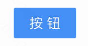
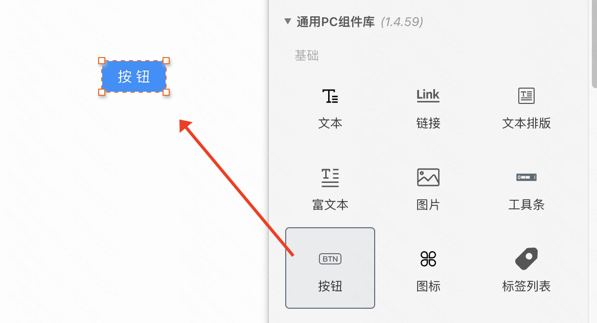
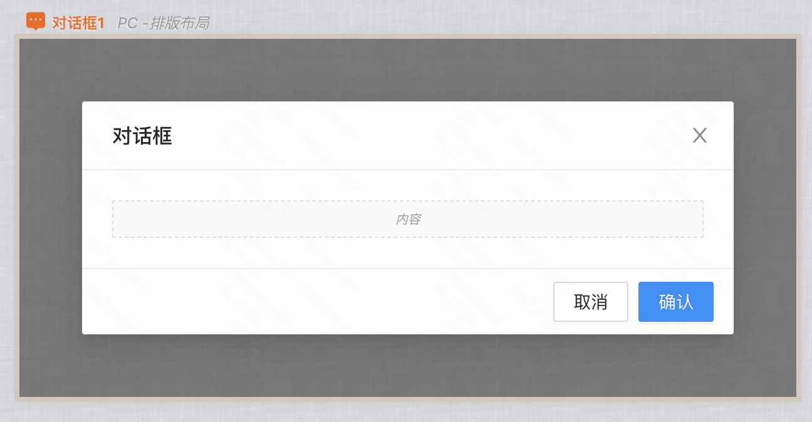
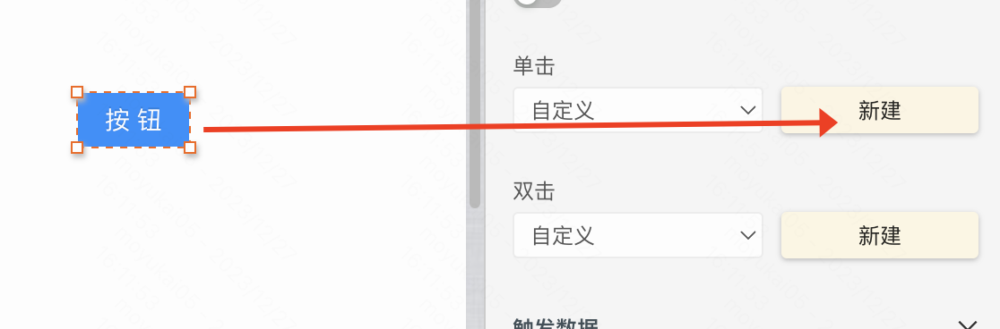
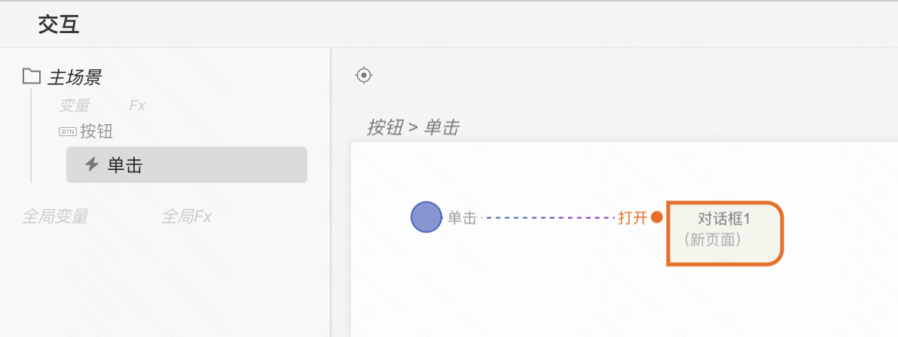
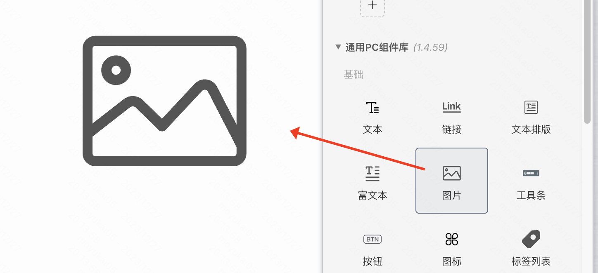
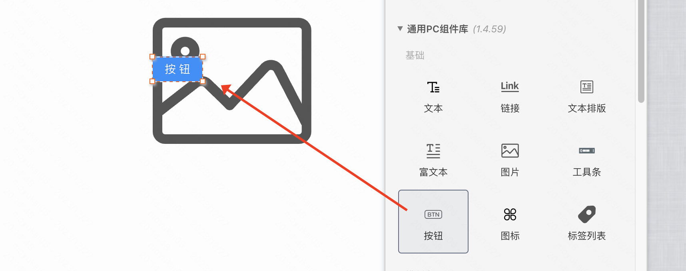
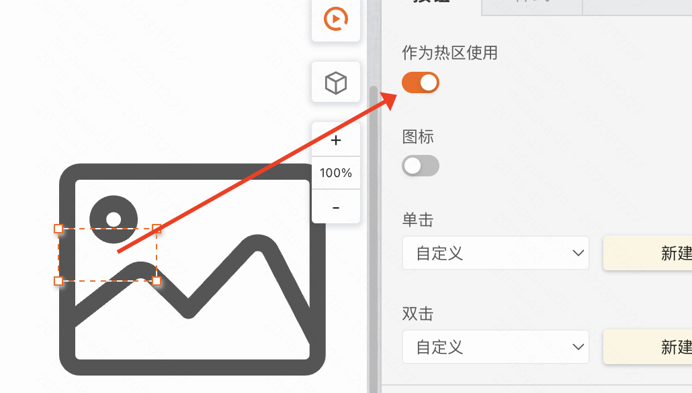
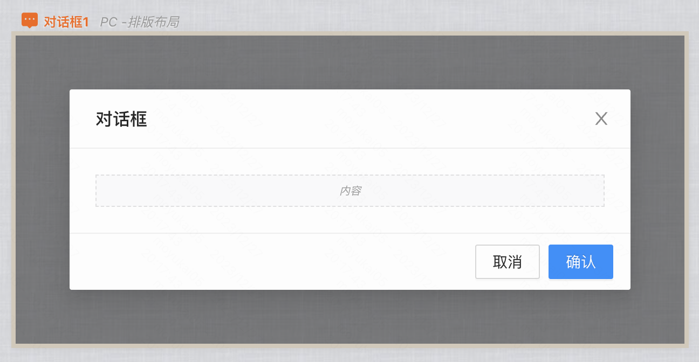
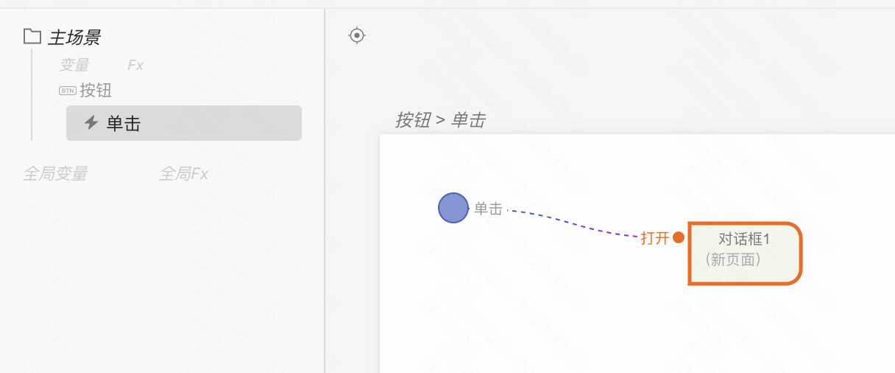

## 何时使用

- 标记了一个（或封装一组）操作命令，响应用户点击行为，触发相应的业务逻辑。
- 在mybricks中我们提供了五种按钮
  - 主按钮
  - 次按钮
  - 虚线按钮
  - 链接按钮
  - 文字按钮
- 上面五种按钮支持切换危险态，以及修改形状：默认、圆、圆角矩形

## 案例一
### 案例介绍
点击按钮后，弹出一个提示对话框

### 搭建案例链接
demo搭建链接：[点击按钮弹对话框案例](https://my.mybricks.world/mybricks-app-pcspa/index.html?id=515382273527877)

### 操作步骤
1、从组件库中拖入按钮组件

2、点击左上角#号，添加一个对话框 

3、选中按钮，点击新建事件

4、给刚刚新增的按钮事件，添加一个弹出对话框的动作

### 效果展示
如下图，点击按钮后，弹出对话框

## 案例二
### 案例介绍
按钮作为热区，覆盖在图片上，点击按钮后，弹出一个提示对话框

### 搭建案例链接
demo搭建案例：[热区按钮案例](https://my.mybricks.world/mybricks-app-pcspa/index.html?id=515447276638277)

### 操作步骤
1、从组件库中拖入图片组件

2、从组件库中拖入按钮组件，并设置为自由布局

3、选中按钮，在右侧编辑器勾选：作为热区使用

4、点击左上角#号，添加一个对话框

5、在按钮的点击事件中，添加一个弹出对话框的动作

### 效果展示

