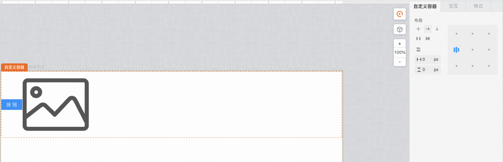
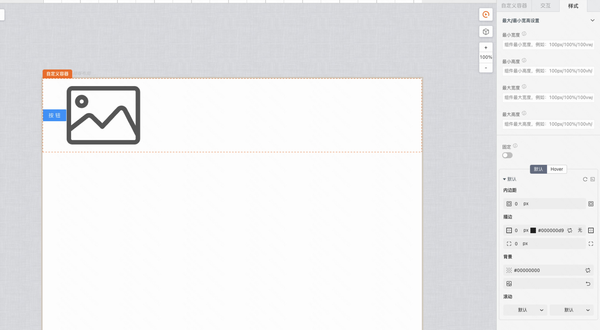

> **场景**：组件需要加一层容器包裹或者多个组件在容器内排版

Demo地址：[自定义容器](https://my.mybricks.world/mybricks-app-pcspa/index.html?id=475453420965957)

----

## 基本操作

### 内容排版

定义容器中内容的布局方式

## 样式

自定义容器目前已支持最大/最小宽/高，默认样式（内边距，边框，背景及滚动），Hover样式（内边距，边框，背景）

