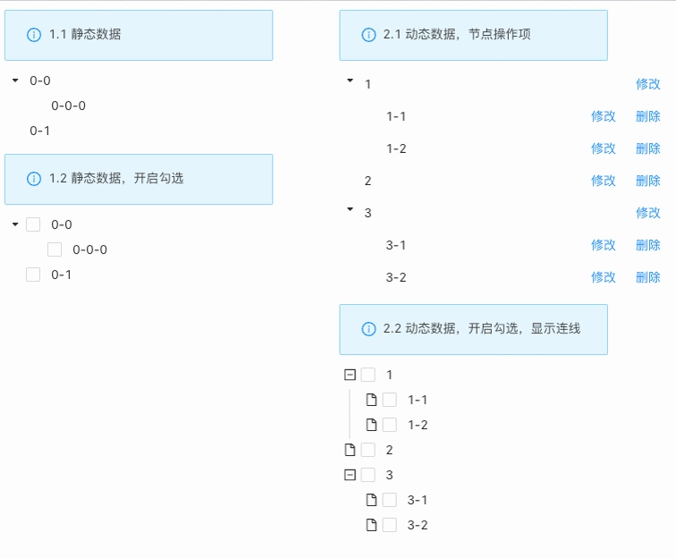

> **概述**\
> 树形结构数据的展示，同时具备节点展开收起、选中、勾选、修改、删除以及更多自定义操作等交互功能。

> **应用场景**\
> 文件夹、组织架构、生物分类、国家地区等等。

Demo地址：[【树组件】基本使用](https://my.mybricks.world/mybricks-app-pcspa/index.html?id=470870747357253)

----

## 基本操作
### 树组件
#### 节点标识字段
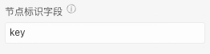

说明：默认为key，会根据节点位置生成唯一标识，存储在节点的key属性中。如果配置为节点的字段，要求所有节点的改字段值在整个树范围内不能重复。
#### 默认展开

说明：带有子项的树节点是否默认展开
#### 勾选
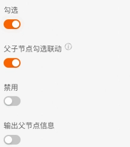

说明：开启时，树节点支持勾选
##### 父子节点勾选联动
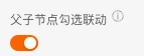

说明：开启时，当勾选子节点，父节点的勾选框会出现勾选样式
##### 禁用
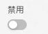

说明：配置树节点勾选框，是否默认禁用
##### 输出父节点信息
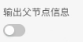

说明：开启时，当勾选子节点，获取的勾选数据会包含其父节点信息。
注：开启“父子节点勾选联动”配置项时，该配置项才生效。
#### 添加节点
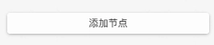

说明：一个按钮，点击后，在树中追加一个节点。用于配置静态数据
#### 勾选
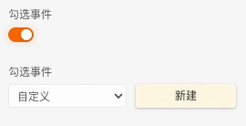

说明：开启时，可以定义勾选事件的逻辑处理
### 高级
#### 节点点击展开收起
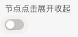

说明：开启时，点击树节点可以展开收起带有子项的节点。
#### 节点操作项
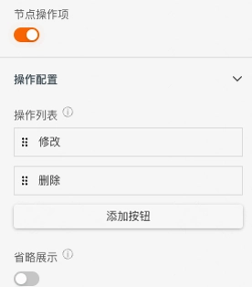

说明：开启时，树节点右侧出现操作按钮
##### 操作列表
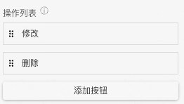

说明：展示当前树节点的操作项列表。使用方式如下

1. 点击“添加按钮”，为节点新增一个操作项
2. 选中左侧图标进行拖拽，可以修改按钮的相对位置
##### 省略展示
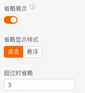

说明：开启时，可以配置树节点右侧操作项最多展示几个按钮，超出的按钮以下拉按钮的形式进行展示。
注：省略展示仅在 调试/预览/发布 生效
###### 省略显示样式

说明：下拉按钮的触发方式
###### 超过时省略
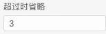

说明：展示在节点右侧的最大按钮数量，超出数量的按钮展示在下拉菜单中
#### 添加节点
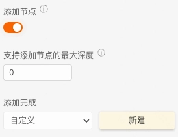

说明：开启时，树组件支持添加节点功能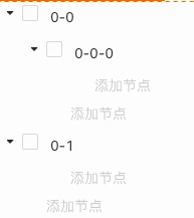
##### 支持添加节点的最大深度
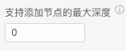

说明：设置允许添加节点的最大深度，0表示不限制
## 逻辑编排
#### 节点点击
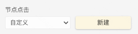

输出时机：点击树节点时
输出数据：长度为1的数组，数组项为当前节点的key字段
#### 勾选事件
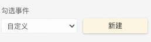

输出时机：点击树节点前的勾选框时
输出数据：一个数组，数组项为已勾选的节点的key字段
#### 添加完成
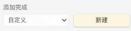

关联配置项：“高级-添加节点”配置项开启时
输出时机：点击“添加节点”，在输入框中触发回车
输出数据：当前节点数据 和 当前节点的父节点数据
## 样式
### 树组件
#### 显示连线
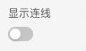
#### 树节点公共样式
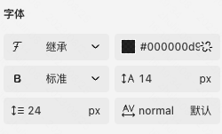
#### 树节点选中样式
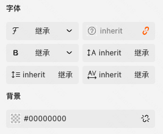
#### 树节点勾选样式
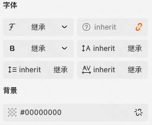
#### 树节点图标配置
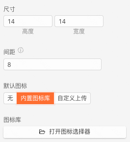
### 树节点
#### 当前节点样式

说明：用于静态数据的节点样式配置

----
### 输入项

<table>
<tr>
<th>输入项</th>
<th>说明</th>
<th>数据类型</th>
</tr>
<tr>
<td>输入数据</td>
<td></td>
<td><pre><code>[   {     "title": "文本",     "key": "文本",     "disableCheckbox": "布尔",     "children": [       "任意对象"     ]   } ]</code></pre></td>
</tr>
<tr>
<td>更新节点数据</td>
<td></td>
<td><pre><code>{   "title": "文本",   "children": [     "任意对象"   ] }</code></pre></td>
</tr>
<tr>
<td>搜索</td>
<td></td>
<td><pre><code>"文本"</code></pre></td>
</tr>
<tr>
<td>过滤</td>
<td></td>
<td><pre><code>"文本"</code></pre></td>
</tr>
<tr>
<td>设置选中节点</td>
<td></td>
<td><pre><code>[   "文本" ]</code></pre></td>
</tr>
<tr>
<td>设置展开节点</td>
<td></td>
<td><pre><code>[   "文本" ]</code></pre></td>
</tr>
<tr>
<td>设置展开深度</td>
<td></td>
<td><pre><code>"数字"</code></pre></td>
</tr>
<tr>
<td>设置拖拽功能</td>
<td></td>
<td><pre><code>{   "draggable": "enum",   "draggableScript": "文本",   "allowDrop": "enum",   "allowDropScript": "文本",   "useDropScope": "enum",   "dropScopeMessage": "文本" }</code></pre></td>
</tr>
<tr>
<td>获取数据</td>
<td></td>
<td><pre><code>"任意"</code></pre></td>
</tr>
</table>

### 输出项

<table>
<tr>
<th>输出项</th>
<th>说明</th>
<th>数据类型</th>
</tr>
<tr>
<td>数据变化</td>
<td></td>
<td><pre><code>[   {     "title": "文本",     "key": "文本",     "children": [       "任意对象"     ]   } ]</code></pre></td>
</tr>
<tr>
<td>数据输出</td>
<td></td>
<td><pre><code>[   {     "title": "文本",     "key": "文本",     "children": [       "任意对象"     ]   } ]</code></pre></td>
</tr>
<tr>
<td>勾选项数据输出</td>
<td></td>
<td><pre><code>[   "文本" ]</code></pre></td>
</tr>
<tr>
<td>节点选中事件</td>
<td></td>
<td><pre><code>[   "文本" ]</code></pre></td>
</tr>
<tr>
<td>添加完成</td>
<td></td>
<td><pre><code>{   "node": {     "title": "文本",     "value": "文本",     "key": "文本"   },   "parent": "任意对象" }</code></pre></td>
</tr>
<tr>
<td>修改</td>
<td></td>
<td><pre><code>{   "title": "文本",   "key": "文本",   "value": "文本",   "disableCheckbox": "布尔" }</code></pre></td>
</tr>
<tr>
<td>删除</td>
<td></td>
<td><pre><code>{   "title": "文本",   "key": "文本",   "value": "文本",   "disableCheckbox": "布尔" }</code></pre></td>
</tr>
<tr>
<td>拖拽完成</td>
<td></td>
<td><pre><code>{   "dragNodeInfo": {     "parent": {       "title": "文本",       "key": "文本"     },     "node": {       "title": "文本",       "key": "文本"     },     "index": "数字"   },   "dropNodeInfo": {     "parent": {       "title": "文本",       "key": "文本"     },     "node": {       "title": "文本",       "key": "文本"     },     "index": "数字"   },   "flag": "enum",   "treeData": [     {       "title": "文本",       "key": "文本",       "children": [         "任意对象"       ]     }   ] }</code></pre></td>
</tr>
</table>

### 配置项

<table>
<tr> <th>配置项</th> <th>说明</th> <th>类型</th> <th>可选项</th> <th>展示条件</th> </tr>
<tr><td colspan="5">基础</td></tr>
<tr><td>使用静态数据源</td><td></td><td>开关</td><td></td><td></td></tr>
<tr><td>标题字段</td><td></td><td>文本</td><td></td><td></td></tr>
<tr><td>标识字段</td><td>所有节点的标识字段值在整个树范围内不能重复。不填时会根据节点位置生成唯一标识，存储在key属性中。</td><td>文本</td><td></td><td></td></tr>
<tr><td>子节点字段</td><td></td><td>文本</td><td></td><td></td></tr>
<tr><td>输出数据</td><td></td><td>单选</td><td></td><td></td></tr>
<tr><td>标题超出省略</td><td>内容超出宽度后文本是否自动省略、不换行、以省略号结尾，并悬浮显示完整内容</td><td>开关</td><td></td><td></td></tr>
<tr><td>默认展开深度</td><td>0表示全部折叠, -1表示全部展开</td><td>数字输入</td><td></td><td></td></tr>
<tr><td>节点点击展开收起</td><td></td><td>开关</td><td></td><td></td></tr>
<tr><td>自定义空状态图片</td><td></td><td>开关</td><td></td><td></td></tr>
<tr><td>图片地址</td><td></td><td>图片上传</td><td></td><td>是</td></tr>
<tr><td>空状态文案</td><td>自定义描述内容</td><td>文本</td><td></td><td></td></tr>
<tr><td>节点选中</td><td></td><td>事件</td><td></td><td></td></tr>
<tr><td>数据变化</td><td></td><td>事件</td><td></td><td></td></tr>
<tr><td colspan="5">高级</td></tr>
<tr><td>过滤字段</td><td>配置树的过滤字段</td><td>下拉选择</td><td></td><td></td></tr>
<tr><td>节点禁用表达式</td><td>根据节点数据在运行时动态设置节点禁用的表达式，支持JS表达式语法, 例：{node.disabled}</td><td>表达式</td><td></td><td></td></tr>
<tr><td>支持勾选</td><td></td><td>单选</td><td></td><td></td></tr>
<tr><td>节点可勾选表达式</td><td>根据节点数据在运行时动态显示节点勾选框的表达式，支持JS表达式语法, 例：{node.checkable}</td><td>表达式</td><td></td><td>是</td></tr>
<tr><td>勾选事件</td><td></td><td>开关</td><td></td><td>是</td></tr>
<tr><td>勾选事件</td><td></td><td>事件</td><td></td><td>是</td></tr>
<tr><td>父子节点勾选联动</td><td>关闭后，可以单独勾选父节点，子节点不再被联动选择。</td><td>开关</td><td></td><td>是</td></tr>
<tr><td>禁用勾选框</td><td></td><td>开关</td><td></td><td>是</td></tr>
<tr><td>输出父节点信息</td><td></td><td>开关</td><td></td><td>是</td></tr>
<tr><td>支持拖拽</td><td></td><td>单选</td><td></td><td></td></tr>
<tr><td>节点可拖拽表达式</td><td>根据节点数据在运行时动态计算节点是否可拖拽的表达式，支持JS表达式语法, 例：{node.draggable}</td><td>表达式</td><td></td><td>是</td></tr>
<tr><td>支持放置</td><td></td><td>单选</td><td></td><td>是</td></tr>
<tr><td>节点可放置表达式</td><td>根据节点数据在运行时动态计算节点上下是否可放置节点的表达式，支持JS表达式语法, 例：{node.isLeaf}</td><td>表达式</td><td></td><td>是</td></tr>
<tr><td>放置范围限制</td><td></td><td>单选</td><td></td><td>是</td></tr>
<tr><td>禁止放置提示语</td><td></td><td>文本</td><td></td><td>是</td></tr>
<tr><td>拖拽完成</td><td></td><td>事件</td><td></td><td></td></tr>
<tr><td>节点操作项</td><td></td><td>开关</td><td></td><td></td></tr>
<tr><td>显示方式</td><td></td><td>单选</td><td></td><td>是</td></tr>
<tr><td>按钮列表</td><td>选中拖拽各项左侧手柄，可改变按钮的相对位置</td><td>数组</td><td></td><td></td></tr>
<tr><td>超出省略展示</td><td>配置按钮的最大显示个数，实现省略样式。省略样式在调试/预览/发布生效</td><td>开关</td><td></td><td></td></tr>
<tr><td>省略按钮弹出方式</td><td></td><td>单选</td><td></td><td>是</td></tr>
<tr><td>最大显示按钮数</td><td></td><td>数字输入</td><td></td><td>是</td></tr>
<tr><td>可添加节点</td><td>开启后，树组件支持添加节点功能</td><td>开关</td><td></td><td></td></tr>
<tr><td>支持添加节点的最大深度</td><td>设置允许添加节点的最大深度，0表示不限制</td><td>数字输入</td><td></td><td>是</td></tr>
<tr><td>添加完成</td><td></td><td>事件</td><td></td><td>是</td></tr>
<tr><td colspan="5">样式</td></tr>
<tr><td>显示连线</td><td></td><td>开关</td><td></td><td></td></tr>
<tr><td>可滚动高度</td><td></td><td>文本</td><td></td><td></td></tr>
<tr><td>树组件样式</td><td></td><td>样式</td><td>border,background</td><td></td></tr>
<tr><td>树节点公共样式</td><td></td><td>样式</td><td>font</td><td></td></tr>
<tr><td>树节点公共样式</td><td></td><td>样式</td><td>border,background</td><td></td></tr>
<tr><td>空状态图片</td><td></td><td>样式</td><td>size,border,background</td><td></td></tr>
<tr><td>空状态文案</td><td></td><td>样式</td><td>font</td><td></td></tr>
<tr><td>树节点公共样式</td><td></td><td>样式</td><td>font</td><td></td></tr>
<tr><td>树节点公共样式</td><td></td><td>样式</td><td>border,background</td><td></td></tr>
<tr><td>树节点公共样式</td><td></td><td>样式</td><td>font</td><td></td></tr>
<tr><td>树节点公共样式</td><td></td><td>样式</td><td>border,background</td><td></td></tr>
<tr><td>树节点公共样式</td><td></td><td>样式</td><td>font</td><td></td></tr>
<tr><td>树节点公共样式</td><td></td><td>样式</td><td>border,background</td><td></td></tr>
</table>

#### 树节点配置项

<table>
<tr> <th>配置项</th> <th>说明</th> <th>类型</th> <th>可选项</th> <th>展示条件</th> </tr>
<tr><td colspan="5">样式</td></tr>
<tr><td>当前节点样式</td><td></td><td>样式</td><td>font</td><td></td></tr>
</table>

#### 操作项

<table>
<tr> <th>配置项</th> <th>说明</th> <th>类型</th> <th>可选项</th> <th>展示条件</th> </tr>
<tr><td colspan="5">基础</td></tr>
<tr><td>隐藏修改操作</td><td></td><td>开关</td><td></td><td></td></tr>
<tr><td>隐藏删除操作</td><td></td><td>开关</td><td></td><td></td></tr>
<tr><td>支持非叶节点删除</td><td></td><td>开关</td><td></td><td>是</td></tr>
<tr><td>显示方式</td><td></td><td>单选</td><td></td><td>是</td></tr>
<tr><td>按钮列表</td><td>选中拖拽各项左侧手柄，可改变按钮的相对位置</td><td>数组</td><td></td><td></td></tr>
<tr><td>超出省略展示</td><td>配置按钮的最大显示个数，实现省略样式。省略样式在调试/预览/发布生效</td><td>开关</td><td></td><td></td></tr>
<tr><td>省略按钮弹出方式</td><td></td><td>单选</td><td></td><td>是</td></tr>
<tr><td>最大显示按钮数</td><td></td><td>数字输入</td><td></td><td>是</td></tr>
</table>

#### 操作

<table>
<tr> <th>配置项</th> <th>说明</th> <th>类型</th> <th>可选项</th> <th>展示条件</th> </tr>
<tr><td colspan="5">样式</td></tr>
<tr><td>风格</td><td></td><td>下拉选择</td><td></td><td></td></tr>
<tr><td>危险按钮</td><td></td><td>开关</td><td></td><td></td></tr>
<tr><td>图标来源</td><td></td><td>单选</td><td></td><td></td></tr>
<tr><td>图标库</td><td></td><td>图标</td><td></td><td>是</td></tr>
<tr><td>上传</td><td></td><td>图片上传</td><td></td><td>是</td></tr>
<tr><td>尺寸</td><td></td><td>数字输入</td><td></td><td>是</td></tr>
<tr><td>间距</td><td>图标与文字间的距离</td><td>数字输入</td><td></td><td>是</td></tr>
<tr><td>按钮样式</td><td></td><td>样式</td><td>border,font,background</td><td></td></tr>
<tr><td>按钮样式</td><td></td><td>样式</td><td>border,font,background</td><td></td></tr>
<tr><td>按钮样式</td><td></td><td>样式</td><td>border,font,background</td><td></td></tr>
<tr><td>按钮样式</td><td></td><td>样式</td><td>border,font,background</td><td></td></tr>
</table>

### 其他

<table>
<tr>
<th>能力</th>
<th>支持</th>
</tr>
<tr><td>支持尺寸调整</td><td>宽</td></tr>
<tr><td>生成源码</td><td>不支持</td></tr>
<tr><td>AI</td><td>不支持</td></tr>
</table>

