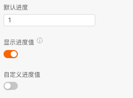
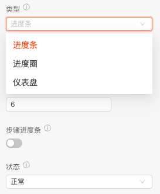
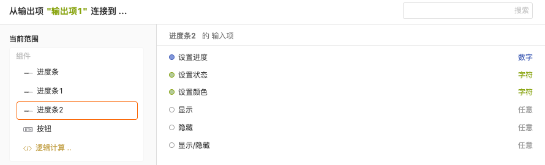
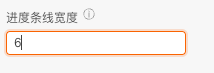
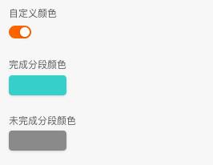

> 应用场景1：中后台场景常见的展示任务进度\
应用场景2：如文件加载、上传进度

Demo地址：[【进度条】基本使用](https://my.mybricks.world/mybricks-app-pcspa/index.html?id=471169477357637)

----

## 基本操作
### 进度
#### 配置进度
可以配置默认展示的进度值，是否展示进度值，默认格式是 ”进度%“，可以自定义

说明：支持动态传入更改进度，默认展示默认进度

### 类型、状态
#### 配置进度条类型
可以选择进度条的类型，如进度条、进度圈，仪表盘，或者是步骤进度条（类型是进度条）

----

## 逻辑编排
### 进度值
当需要改变进度值时，可以连线改变，传入数字即可

### 颜色
开启自定义颜色配置后可以通过逻辑连线改变进度条的颜色, 如当进度条进度到达100时改变颜色成红色

----

## 样式
### 尺寸
进度条整体的大小

### 进度条线宽度
配置线的宽度，进度条线的宽度，单位 进度条线是 px, 进度圈和仪表盘是画布宽度的百分比

### 颜色
开启自定义颜色可以配置加载完成和未加载部分的颜色，且可以动态配置

