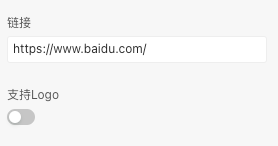
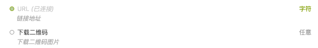
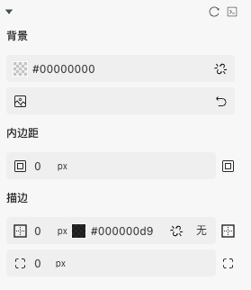

> 应用场景 1：展示二维码

Demo 地址：[【二维码】基本使用](https://my.mybricks.world/mybricks-app-pcspa/index.html?id=514689538101317)

## 基本操作

### 配置

配置静态链接和 logo,开启 logo 后可以配置中间 logo 图片地址和大小

## 逻辑编排

### URL

动态配置二维码链接地址

### 下载二维码

获取二维码图片

## 样式

### 默认样式

