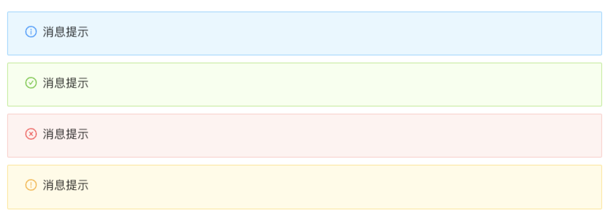
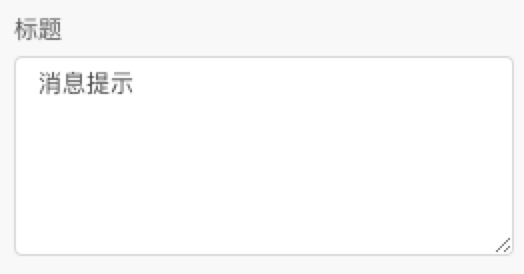
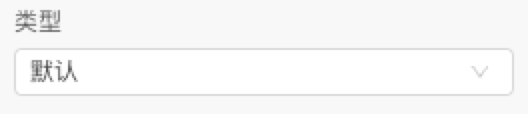
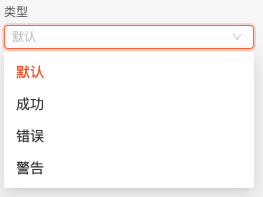
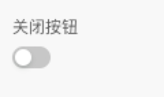
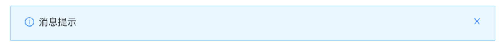

> **应用场景**\
场景 1：当某个页面需要向用户显示警告的信息时。\
场景 2：非浮层的静态展现形式，始终展现，不会自动消失，用户可以点击关闭。

Demo 地址：[【警告提示】基本使用](https://my.mybricks.world/mybricks-app-pcspa/index.html?id=473203696087109)

----

# 基本操作

## 警告提示

### 标题

**类型**

共提供四种类型，分别是默认｜成功｜错误｜警告，不同类型对应了不同样式和图标

### 关闭按钮

开启后，对应位置出现关闭按钮

**关闭按钮顶部公告**