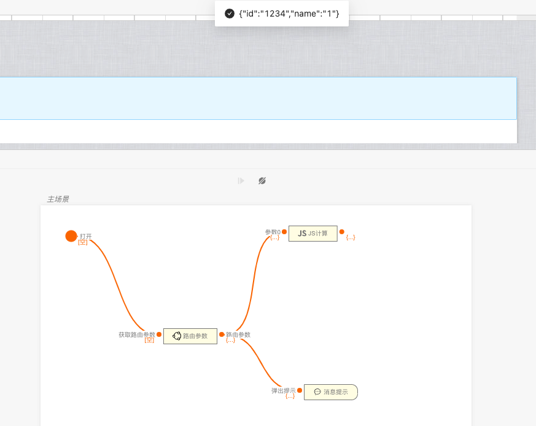
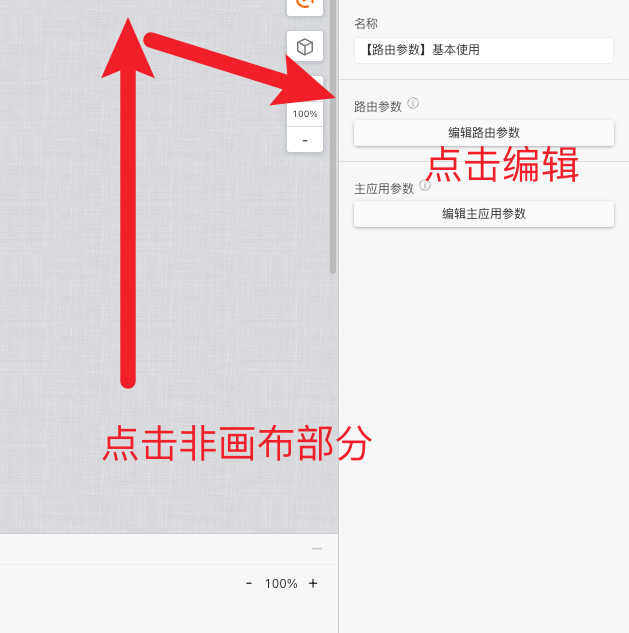
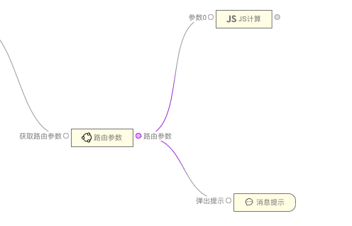

> 应用场景 1：获取路由参数\
> 注：逻辑组件，可以在连线中的逻辑组件中找到

Demo 地址：[【路由参数】基本使用](https://my.mybricks.world/mybricks-app-pcspa/index.html?id=514732190904389)

## 基本操作

### 调试模拟

调试态数据可以自行设置,预览态和发布后都是获取当前 url 后的参数

## 逻辑编排

### 获取路由参数

在需要获取路由参数的地方直接使用即可

## 样式

### 默认样式

无
