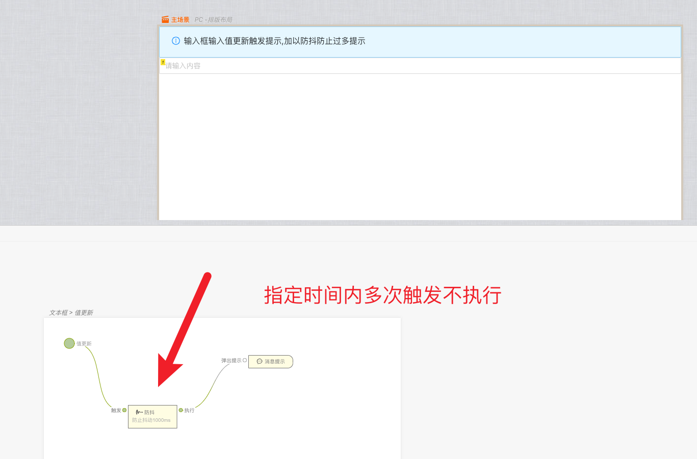

> 应用场景：高频率触发的事件,在指定的单位时间内，只响应最后一次，如果在指定的时间内再次触发，则重新计算时间,如输入框触发请求等事件

Demo 地址：[【防抖】基本使用](https://my.mybricks.world/mybricks-app-pcspa/index.html?id=512483136847941)

## 基本操作

### 防抖

#### 防抖时间

指定单位时间

## 逻辑编排

### 防抖

