> **场景**：多个独立功能或者页面嵌入到一张页面中，通过标签页切换显示

Demo：[标签页案例](https://my.mybricks.world/mybricks-app-pcspa/index.html?id=475417124335685)

----

## 基本操作
### 标签外观

默认采用简约外观
#### 简约

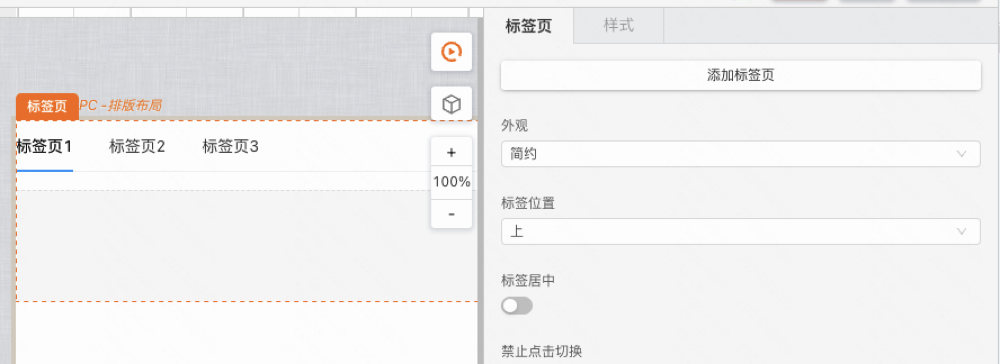
#### 卡片

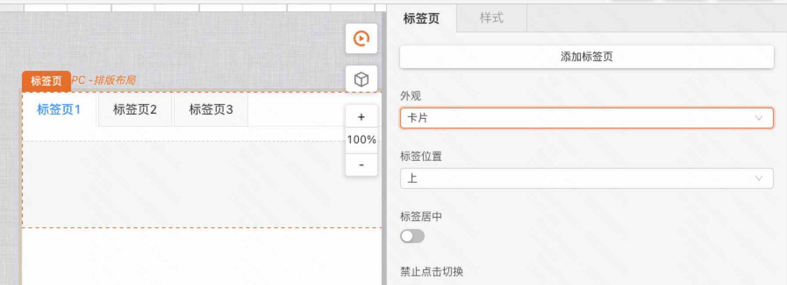
### 标签位置

默认标签位于上部

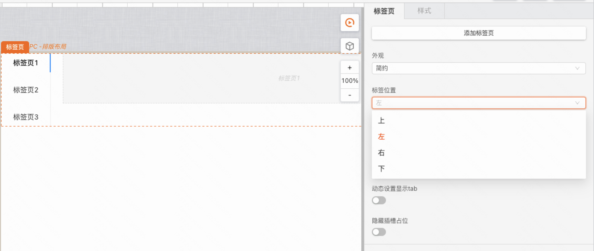
#### 标签居中

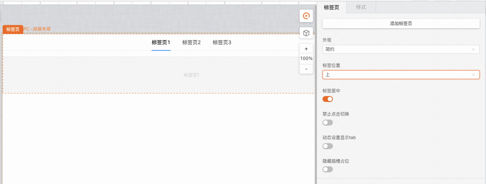
### 标签配置
#### 名称

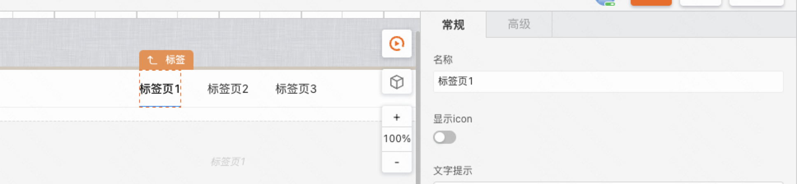
#### 图标

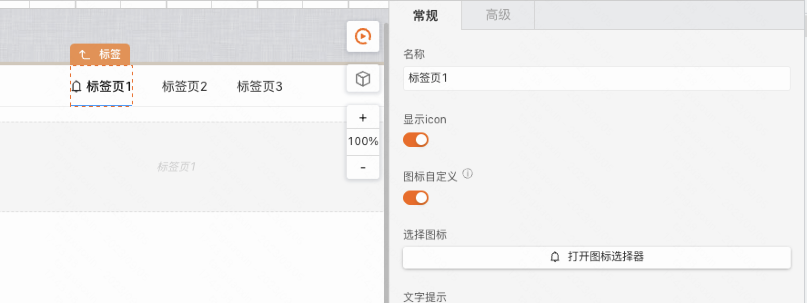
#### 提示内容

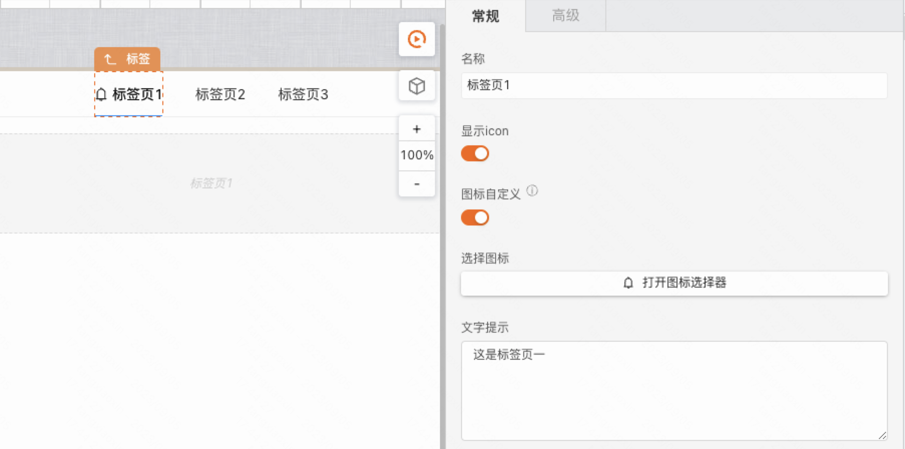

说明：提示内容在标签页运行时鼠标移入时显示
#### 事件

-   显示：标签切入（内容显示）时触发执行
-   隐藏：标签切走（内容隐藏）时触发执行

## 逻辑编排
### 设置默认激活标签

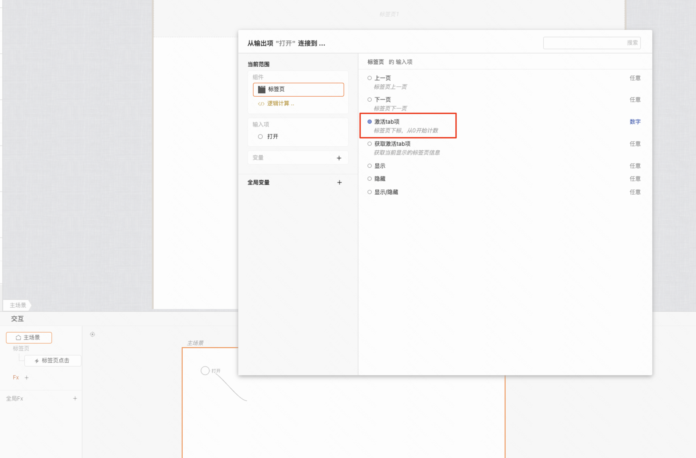

使用：传入标签序号，默认从0开始
### 标签点击事件

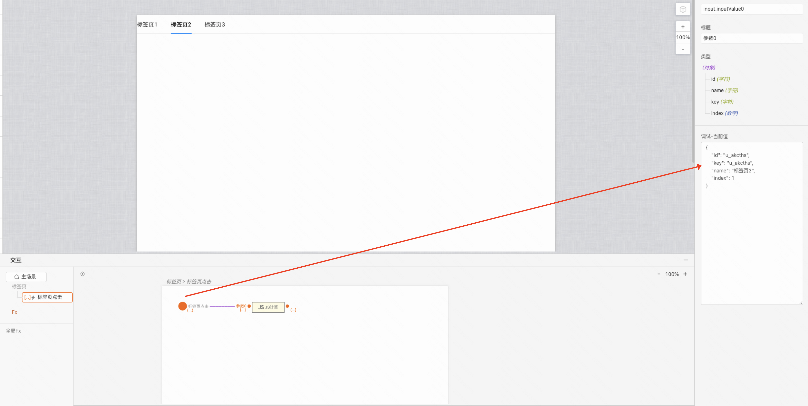

点击标签页时触发执行，并获取当前点击标签信息
## 样式

聚焦到标签页组件，在样式catelog面板中可以设置标签默认样式，包括标题文本样式，背景色，选中条背景色，边框等
### 默认样式

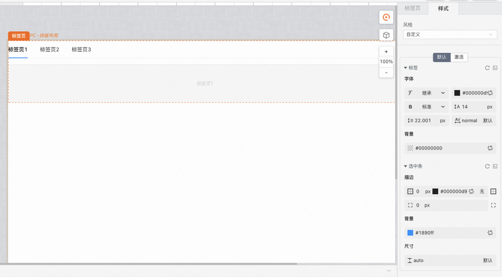
### 选中样式

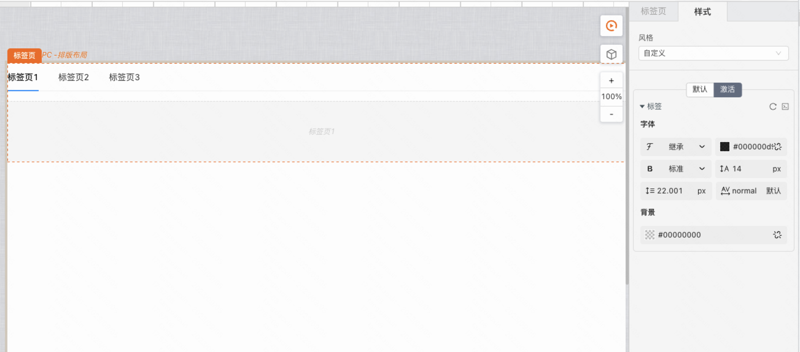