> **应用场景**\
场景1：单独使用\
场景2：在表单容器中，作为表单项使用\

Demo地址：[【下拉框】基本使用](https://my.mybricks.world/mybricks-app-pcspa/index.html?id=470800851554373)

----

## 基本操作
### 下拉框
#### 提示内容

说明：值为空时的提示文字
#### 选择框的最大高度

说明：下拉选择框的最大高度，超出后垂直滚动。不设置或设置为0，表示适应内容高度。默认单位为像素（px）
#### 下拉框模式

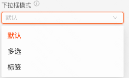

说明：可配置为多选或标签模式
#### 显示清除图标

说明：开启后，下拉框有选中项后，右侧显示清除图标
#### 默认是否禁用

#### 静态选项配置

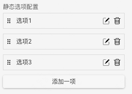

说明：

1.  点击“添加一项”，下拉框增加一个选项
2.  选项右侧的两个按钮分别为“编辑”和“删除”，点击“编辑”按钮，弹出选项的配置项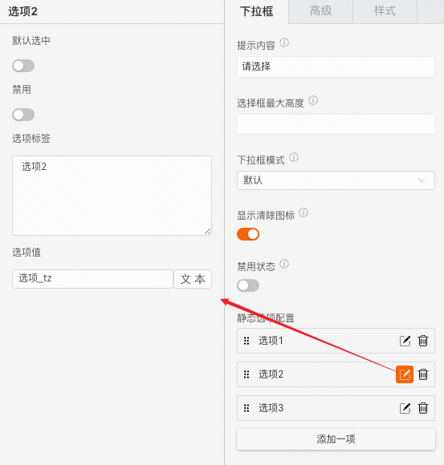
3.  选项左侧的图标为拖拽手柄，可以点击拖拽修改选项的相对位置
#### 输出数据

说明：设置下拉框输出的数据格式
#### 数据校验

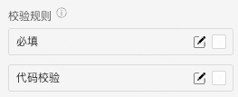

说明：

1.  配置的校验规则，需要在表单容器中使用才能生效
2.  点击右侧的勾选框，启用该项校验规则
3.  点击右侧的“编辑”按钮，弹出校验规则的配置项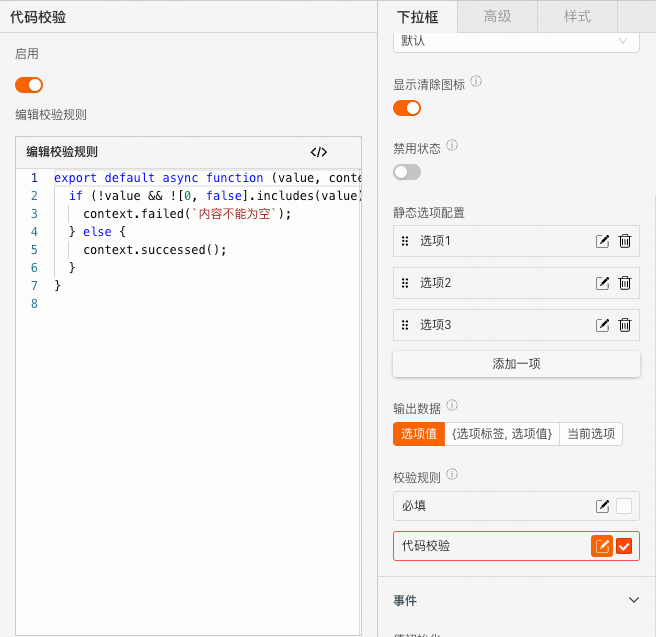
### 高级
#### 输入配置

说明：开启时下拉框支持输入，可配置搜索规则
#### 默认搜索配置

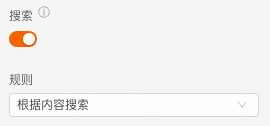

说明：开启“搜索”，下拉框可以配置默认搜索规则
#### 远程搜索

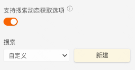

说明：开启“支持搜索动态获取选项”，“新建”搜索逻辑卡片，远程获取数据源进行设置
## 逻辑编排
#### 值初始化事件

输出时机：

1.  给下拉框的“ **设置初始值** ”输入项设置数据
2.  给下拉框所在表单容器的“ **设置表单数据** ”输入项设置数据

输出内容：

下拉框的当前值
#### 值更新事件

输出时机：

1.  给下拉框的“ **设置值** ”输入项设置数据
2.  给下拉框所在表单容器的“ **设置表单数据(触发值变化)** ”输入项设置数据
3.  用户操作下拉框的增删改操作时

输出内容：

下拉框的当前值

说明：

可以用于实现监听联动
#### 失焦事件

输出时机：

下拉框失去焦点时

输出内容：

下拉框的当前值
#### 调用接口设置选项数据源

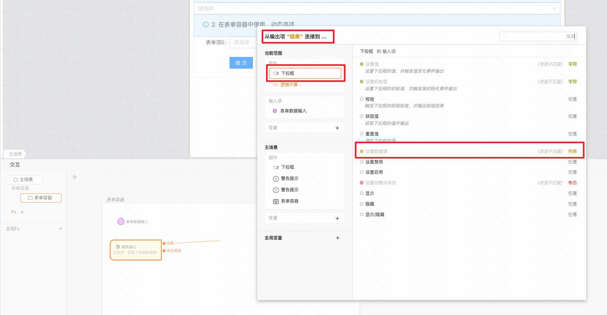

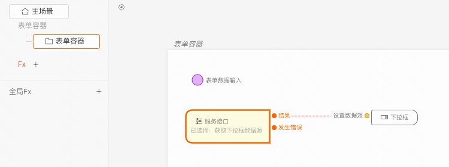
#### 搜索事件

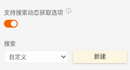

输出时机：

下拉框值发生变化时

输出内容：

下拉框的当前值

使用：

1.  点击新建，创建远程搜索的逻辑卡片
2.  进行逻辑编排

## 样式
#### 基础样式
##### 边框样式

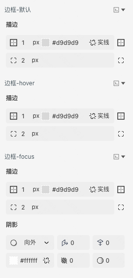
##### 选项样式

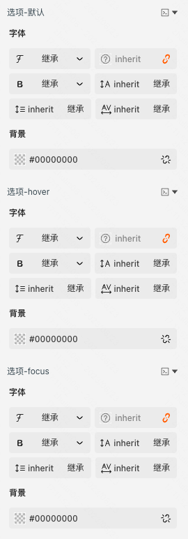
#### 作为表单项的样式

