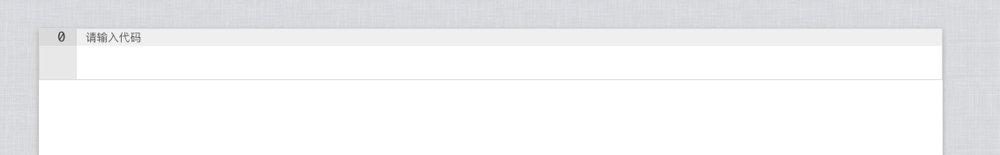
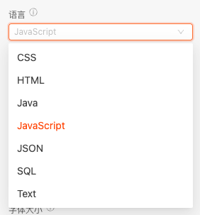
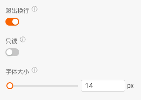
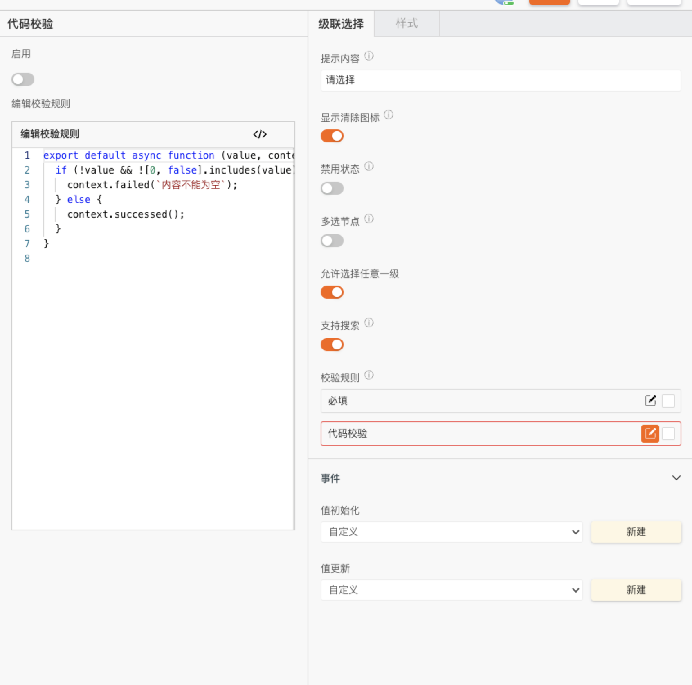

> 应用场景\
> 填写,展示代码\
> 场景1：单独使用\
> 场景2：在表单容器中，作为表单项使用

Demo地址：[【代码编辑器】基本使用](https://my.mybricks.world/mybricks-app-pcspa/index.html?id=514759563681861)

## 基本操作

### 提示内容

说明：值为空时的提示文字

### 语言

配置代码编辑器编程语言

### 行数限制

代码行数限制

### 字体

可以配置超出换行和字体大小,和只读状态

### 数据校验

说明：

1. 配置的校验规则，需要在表单容器中使用才能生效
2. 点击右侧的勾选框，启用该项校验规则
3. 点击右侧的“编辑”按钮，弹出校验规则的配置项

## 逻辑编排

### 数据改变事件

输出时机：

1. 给代码编辑器的“ **设置值** ”输入项设置数据
2. 给代码编辑器所在表单容器的“ **设置表单数据(触发值变化)** ”输入项设置数据
3. 用户操作代码编辑器的增删改操作时

输出内容：

代码编辑器的当前值

说明：

可以用于实现监听联动

### 其他

## 样式

无
