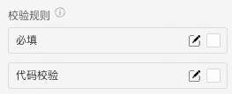

> 双栏穿梭选择框\
> 应用场景\
> 场景1：需要在多个可选项中进行多选时,比起 Select 和 TreeSelect，穿梭框占据更大的空间，可以展示可选项的更多信息。\
> 场景2：穿梭选择框用直观的方式在两栏中移动元素，完成选择行为。选择一个或以上的选项后，点击对应的方向键，可以把选中的选项移动到另一栏。

Demo地址：[【穿梭框】基本使用](https://my.mybricks.world/mybricks-app-pcspa/index.html?id=514946671517765)

## 基本操作

### 属性

两边数据标题和模式,选择单向模式只能从左到右(从数据源到目标数据源)

### 配置

开启显示描述,可以给每一项数据加后缀描述\
开启可搜索后,可以在搜索框搜索\
开启禁用状态,禁用\
开启分页,数据源都换成分页式

### 数据校验

说明：

1. 配置的校验规则，需要在表单容器中使用才能生效
2. 点击右侧的勾选框，启用该项校验规则
3. 点击右侧的“编辑”按钮，弹出校验规则的配置项

## 逻辑编排

### 值初始化事件

输出时机：

1. 给穿梭框的“ **设置值** ”输入项设置数据
2. 给穿梭框所在表单容器的“ **设置表单数据(触发值变化)** ”输入项设置数据
3. 用户操作穿梭框的增删改操作时

### 目标数据更新

输出时机: 用户操作穿梭框的增删改操作时\
输出内容：穿梭框的目标数据源的当前值\
说明：可以用于实现监听联动

### 其他

## 样式

可以配置穿梭框的默认,Hover(鼠标悬浮),Check(选项选中),Select(穿梭按钮和图标),禁用等样式

