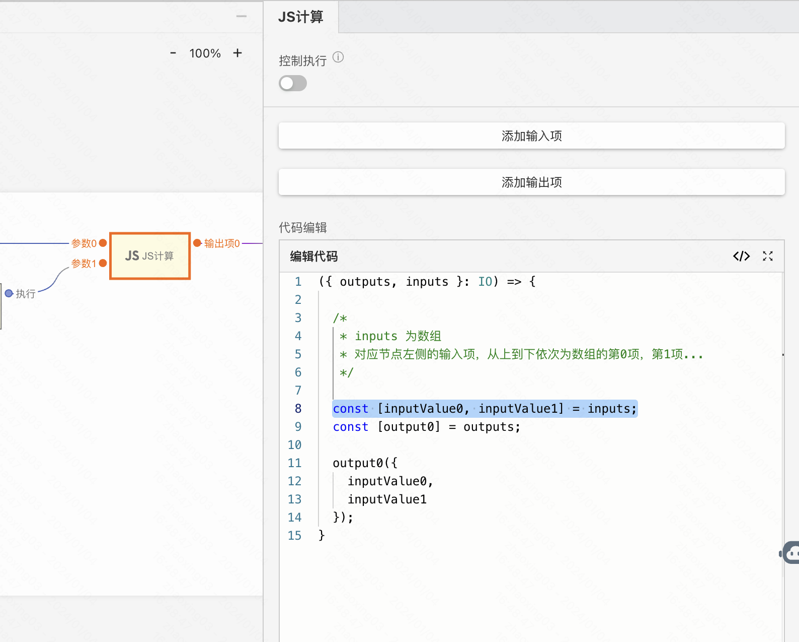
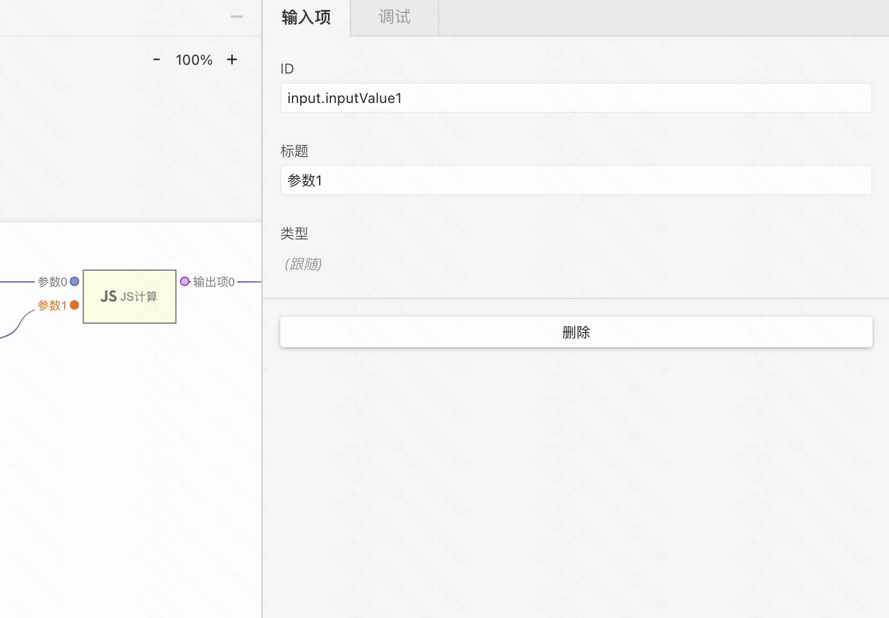
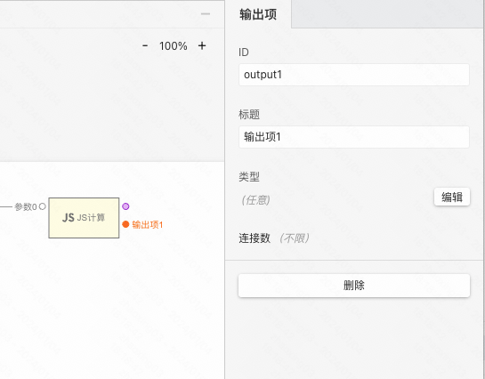
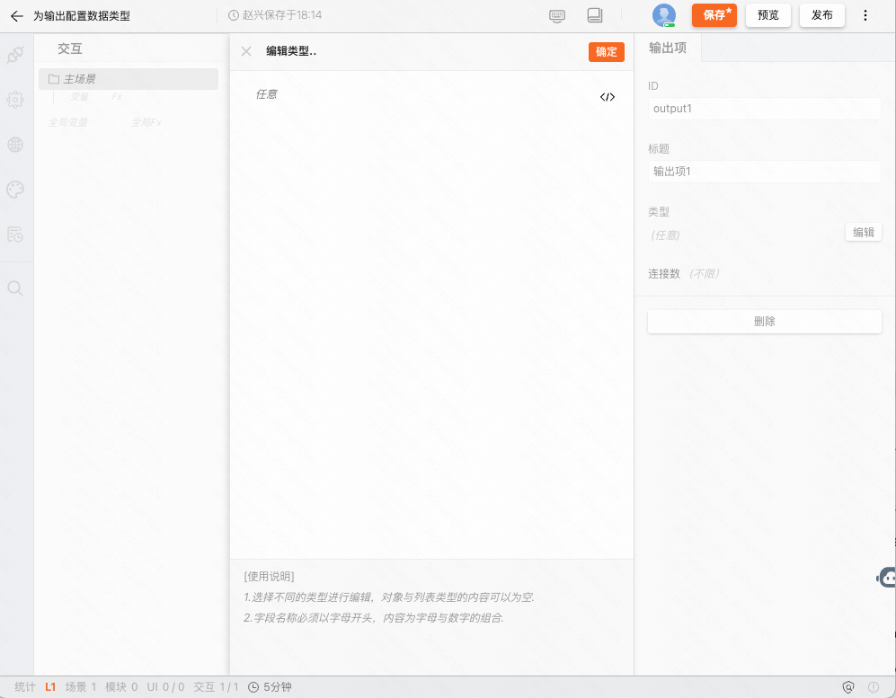

## 何时使用

编写自定义 Javascript 代码。支持 ES6 和 Typescript，在页面发布时会被编译为 ES5。

:::tip
如果你之前并没有 Javascript 开发经验也没有关系，你可以通过 [MDN](https://developer.mozilla.org/zh-CN/docs/Learn/JavaScript/First_steps) 来快速学习，这是一门非常容易上手的语言。
:::

## 案例一：多个输入

### 案例介绍
通常我们会遇到一个交互会触发执行多个并行任务，其中不乏异步的任务。我们希望在所有并行任务执行完成之后再继续进行后续任务。

### 搭建案例链接
demo：[多个输入](https://my.mybricks.world/mybricks-app-pcspa/index.html?id=517585613344837)

### 关键步骤

通过「添加输入项」可以在节点左侧添加任意的输入项。

通过聚焦节点左侧的输入项，可以「删除」输入项。

在 Javascript 代码中，inputs 入参为数组，对应左侧的输入项的值，从上到下依次为数组的第0项，第1项...

### 执行时机

:::tip
特别注意
:::

**每当** 左侧的所有输入项都到达后，会触发一次自定义函数的执行。inputs 的值为当前最新的所有输入项的最新值。当触发后，会清空所有的输入项，进入下一个等待周期。[点击查看 demo](https://my.mybricks.world/mybricks-app-pcspa/index.html?id=518241144234053)

## 案例二：多个输出

### 案例介绍
当一个交互需要给多个任务分发不同的入参时。

### 搭建案例链接
demo：[多个输出](https://my.mybricks.world/mybricks-app-pcspa/index.html?id=517585657278533)

### 关键步骤

通过「添加输出项」可以在节点左侧添加任意的输出项。通过聚焦节点右侧的输出项，可以「删除」输出项。

在 Javascript 代码中，outputs 入参为数组，对应左侧的输出项的函数，从上到下依次为数组的第0项，第1项...

每执行一次函数，都会触发一次对应的输出项。

## 案例三：为输出项配置数据类型

### 案例介绍
数据类型是 MyBricks 引擎中非常重要的特性，基于类型可以更快捷的进行数据映射。

### 搭建案例链接

demo：[为输出项配置数据类型](https://my.mybricks.world/mybricks-app-pcspa/index.html?id=517585739698245)

### 关键步骤

聚焦某输出项，点击编辑即可进行修改。

在编辑类型面板中，左侧的文字可以点击进行可视化编辑，右侧的 `</>` 按钮可以点击后切换到代码模式进行编辑。类型的规范使用 [JSON Schema 规范](https://json-schema.org/)

