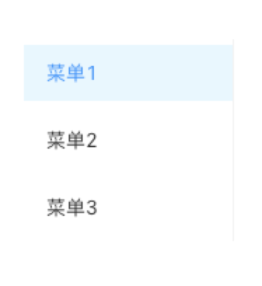

> **应用场景**\
场景1：顶部导航提供全局性的类目和功能\
场景2：侧边导航提供多级结构来收纳和排列网站架构

Demo地址：[【菜单】基本使用](https://my.mybricks.world/mybricks-app-pcspa/index.html?id=473206175535173)

----

## 基本操作
### 菜单
#### 静态数据

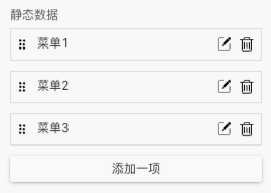

静态配置数据，点击【添加一项】可添加，点击【编辑图标】可进行具体配置，点击【删除图标】可删除对应菜单项。

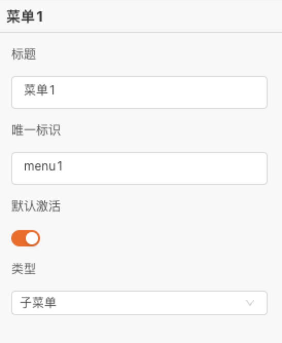

子项配置包括，【标题】【唯一标识】【默认激活】【类型】

注：类型-父菜单 和 默认激活 互斥
#### 样式

> 三种样式切换，水平｜垂直｜内联

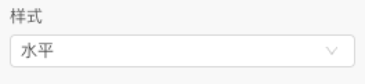

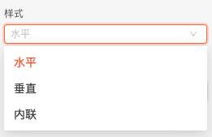
##### 1）水平

##### 2）垂直

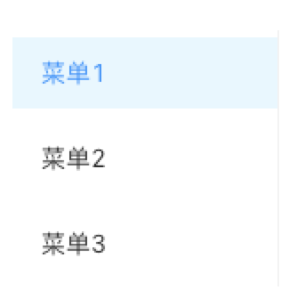
##### 3）内联

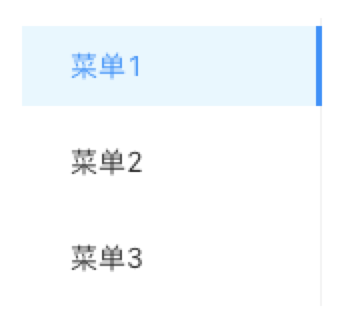
### 菜单项
#### 标题

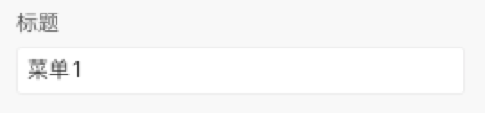

 **唯一标识** 

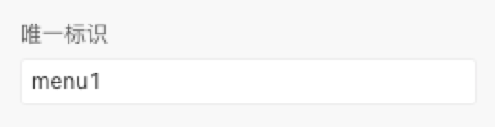
#### 默认激活

注：类型-父菜单 和 默认激活 互斥
#### 图标

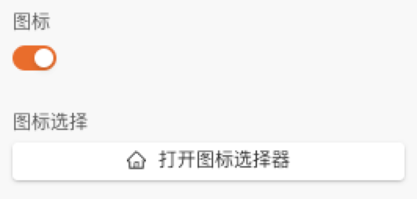

开启后可以自定义选择图标
#### 类型

类型可以选择 子菜单｜父菜单

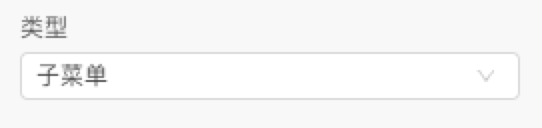

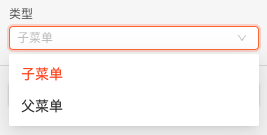

  

切换至父菜单后，可以配置子项

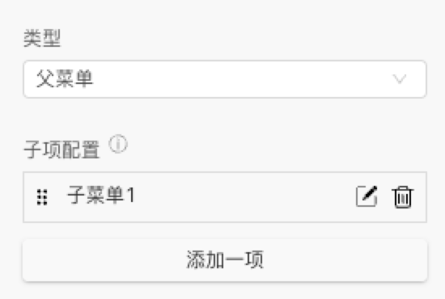

子项配置，点击【添加一项】可添加子菜单，点击【编辑图标】可进行具体子菜单配置，点击【删除图标】可删除对应菜单项。

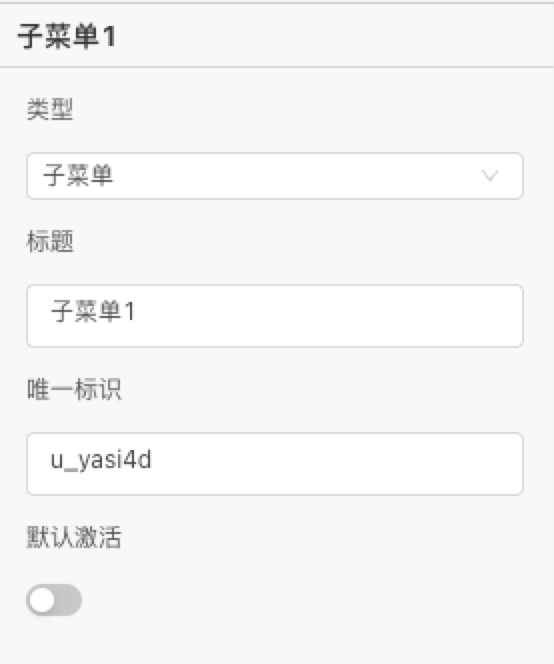

且在类型位置，可以切换类型，子菜单｜分组菜单

若子项的分组菜单类型，可以继续配置分组菜单子项，【添加一项】【编辑】【删除】

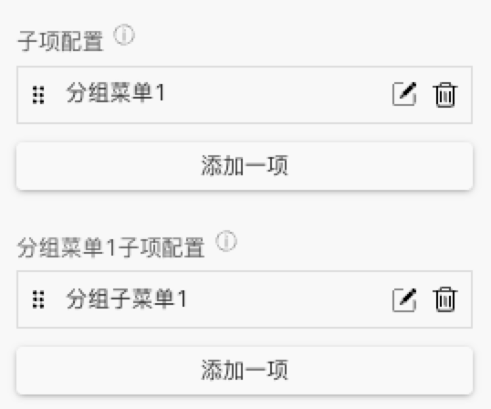

  

综上，可以总结出菜单项的结构关系：

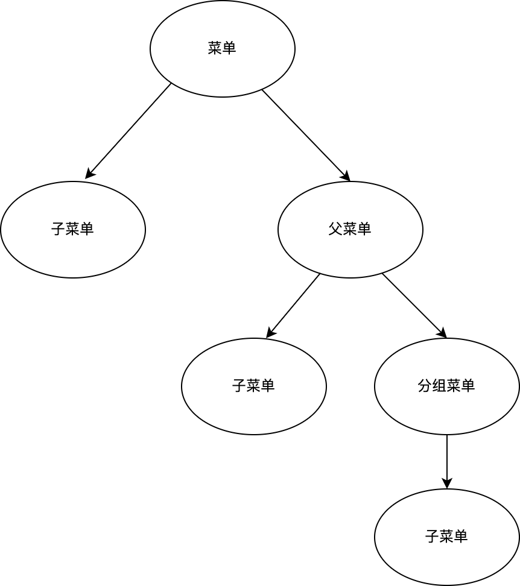

在添加每一项子菜单时，同时会添加出对应的子菜单的点击事件。
## 逻辑编排
#### 菜单点击

整个菜单的点击事件

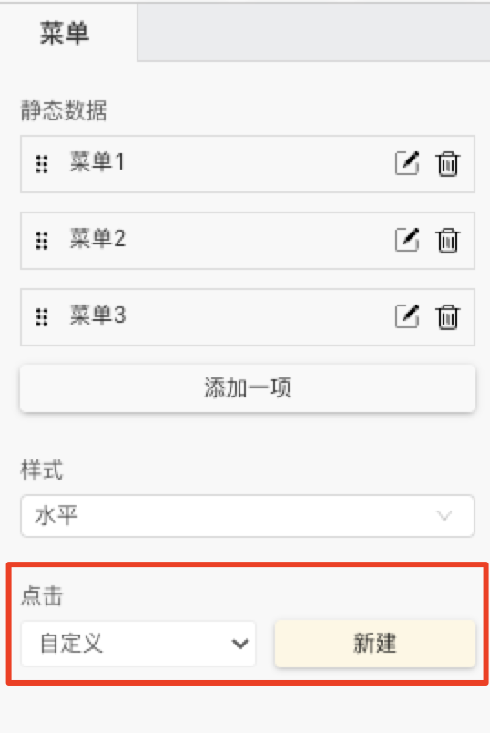

对应输出子项数据

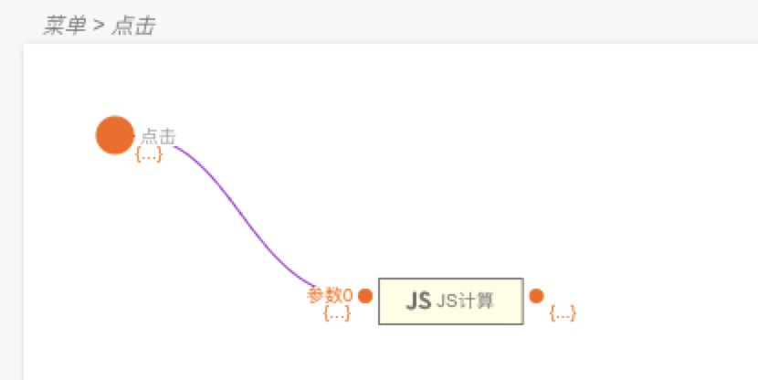
#### 菜单项点击

聚焦到菜单项，可以看到不同类别的菜单项点击事件，此处提供了分类。

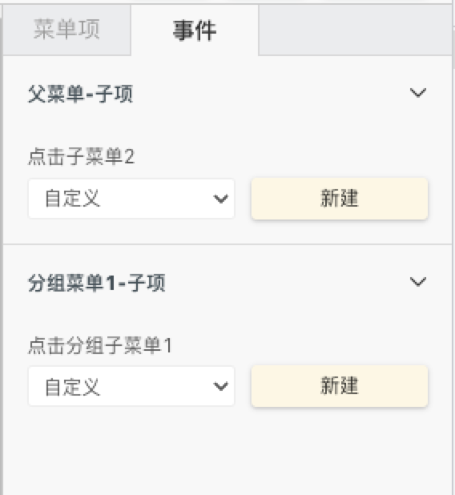
#### 设置数据和选中项

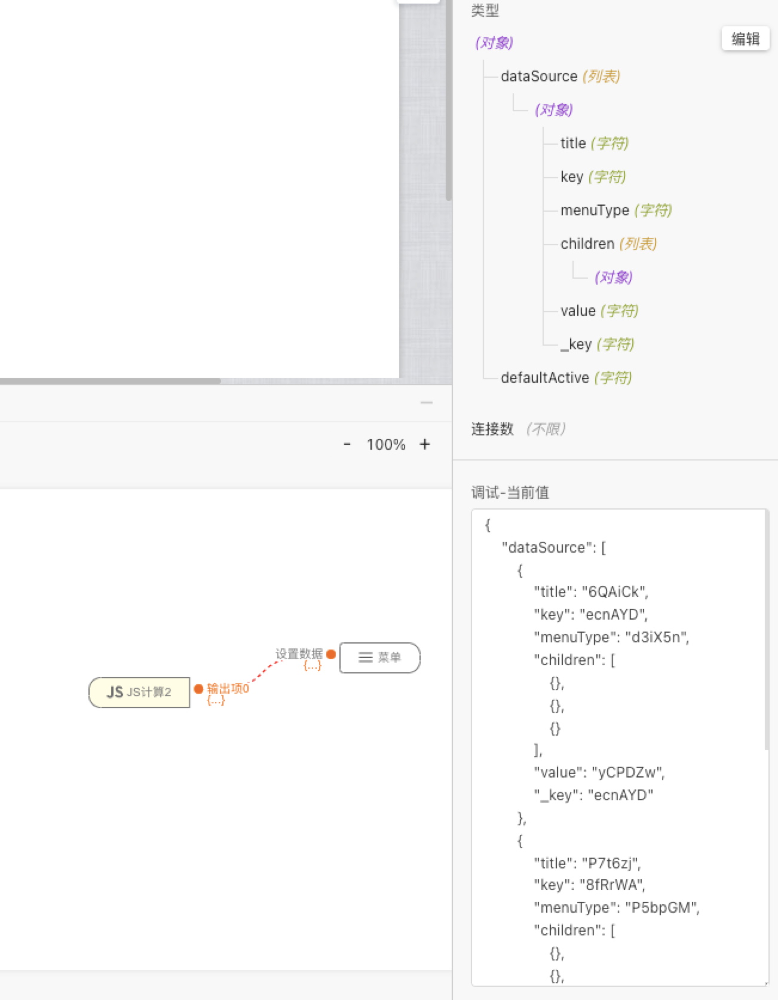

这里可以依照对应的数据结构设置数据和选中项。

#### 设置选中项

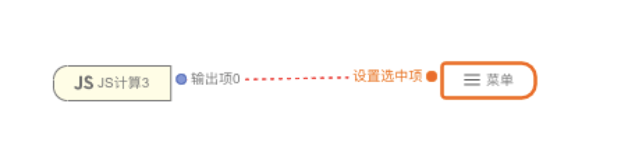

  

 **获取选中项** 

可以通过创建的事件，获取选中项

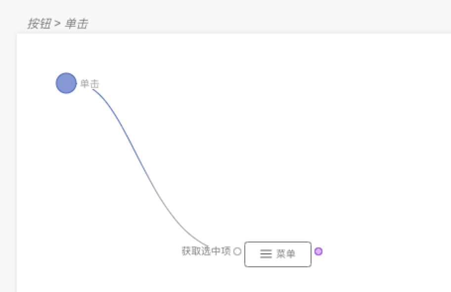
## 样式