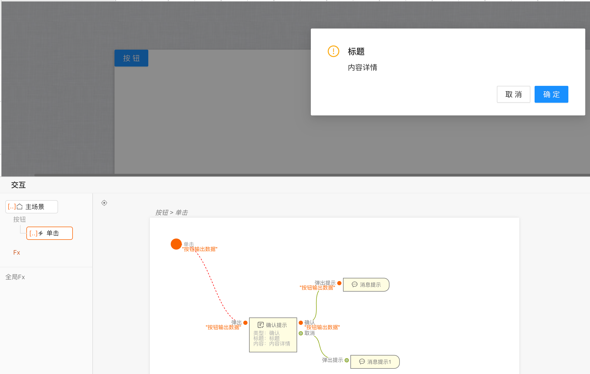
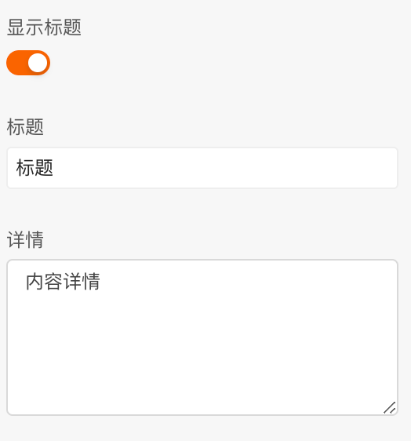
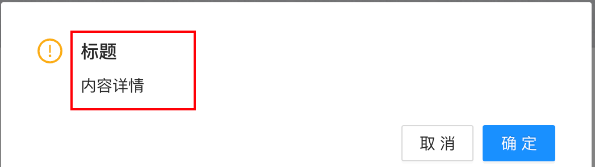
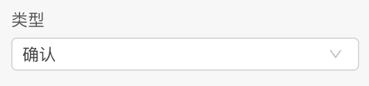
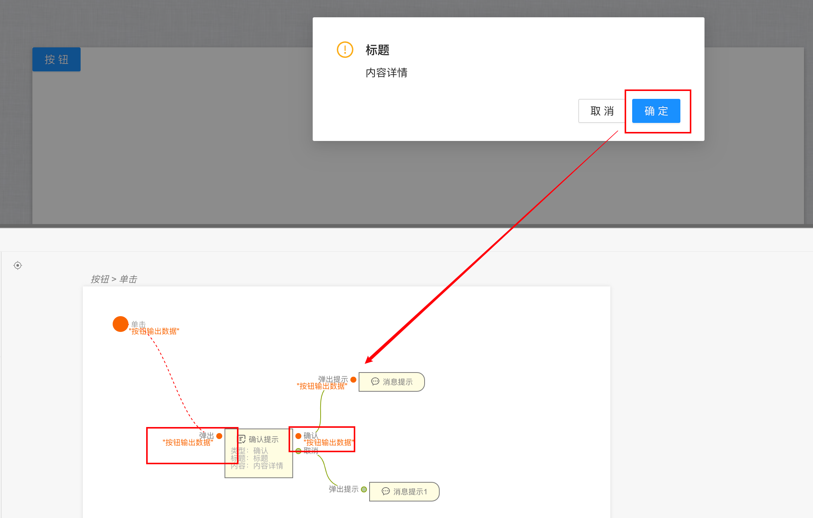

```
应用场景：弹出各种确认提示，确认用户选择
注：逻辑组件，在连线中的逻辑组件中可以找到
```
Demo地址：[【确认提示】基本使用](https://my.mybricks.world/mybricks-app-pcspa/index.html?id=471155949342789)

----
## 基本操作
### 提示内容
#### 提示标题和详情
可以设置提示的标题和内容，标题可以关闭





### 类型
切换类型会切换确认提示的类型


----
## 逻辑编排
### 打开确认提示
连线到逻辑组件中的确认提示即可，连线走到节点会自动打开，用户选择后会走选择的后续，如点击确认走确认路线，点击取消会走取消路线

### 传递数据
当需要传递数据时，可以直接在上一级连线输入，然后在确认提示的确认和取消都会获得，用户点击确认和取消会执行相应操作。



----
## 样式
暂无

