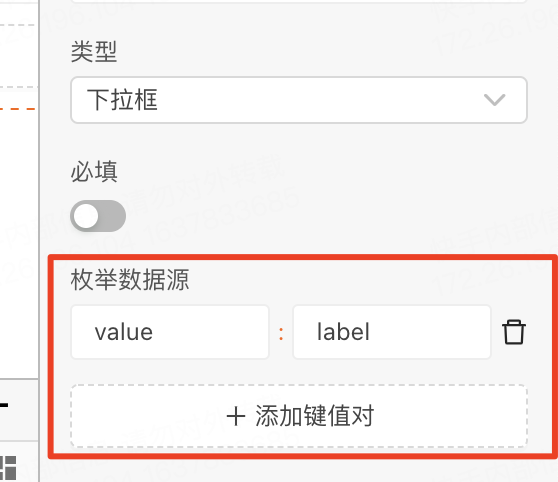
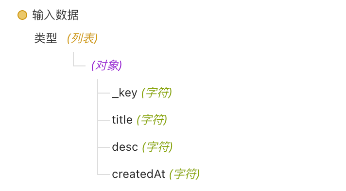
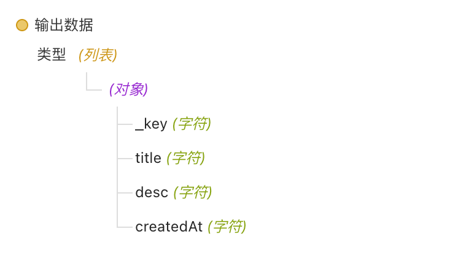
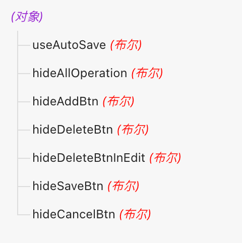
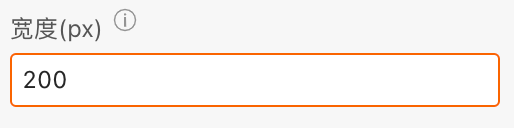

> **应用场景**：方便地对表格数据进行增删改查，如用于数据管理，例如对用户信息、产品清单、订单记录等进行编辑和更新。可以通过表格添加、修改或删除数据，实现数据的维护和管理。

Demo地址：[【可编辑表格】基本使用](https://my.mybricks.world/mybricks-app-pcspa/index.html?id=473621676113989)

----

## 基本操作
### 整体配置
#### 基础配置
新增按钮文案


#### 操作配置
##### 动态配置操作
开启后可连线配置操作列数据，所有操作配置可通过逻辑连线动态修改

##### 实时保存
开启后编辑后会直接保存数据，开启后，支持新增多条数据，新增/编辑中的数据在提交时也会同步提交
实时保存未开启情况下，每次只允许新增一条数据，未保存数据不会被提交

##### 点击切换编辑态
开启后点击对应单元格，这一行会转变到编辑态

##### 隐藏操作列
开启后隐藏操作这一列

##### 隐藏新增按钮
开启后隐藏下方的新增按钮，可以从外部连线调用新增一行事件新增数据

##### 单行编辑
开启后同时只可以编辑一行，默认可以编辑多行


##### 可展开行配置
含children字段的数据行，为可展开行，
父节点行数据只读：开启后，含children字段数据行，所有内容为只读，且无编辑按钮
注：输入时添加children字段数组，就是子节点


##### 勾选配置
开启后可以勾选，开启动态设置勾选项可以连线输入想要勾选项的勾选标识（_key）组成的数组


##### 数据变化事件
开启后新建数据变化事件可以监听到整个可编辑表格数据的变化，包括增加和编辑、删除，输入数据是变化后的可编辑表格数据


#### 列配置
聚焦到想要编辑的列的列头，可编辑列属性、删除列，点击表格可以新增列

##### 列名、字段
配置这一列的列名和字段，
列名：列头显示文字，字段：列数据在数据项中对应的路径


##### 类型
可配置这一行的类型，一般展示的时候是展示文字（除开关以外），点击编辑进入编辑态就是对应的输入类型。
一些特殊的可以设置相应配置，如下拉框和多选框可以设置对应的默认选项，或者是通过输入修改列配置来修改


###### 输入框
输出字符串数据

###### 下拉框
数据源配置



1. 通过右侧配置项 配置 数据源   
2. 通过 修改列配置 事件传入

###### 多选框

###### 日期
输出 YYYY-MM-DD 格式的数据

###### 开关
输出 布尔 数据

###### 数字输入框
输出 数字 数据

###### 开关配置
打开文案：按钮打开时，只读态下文案，默认为“打开”
关闭文案：按钮关闭时，只读态下文案，默认为“关闭”

###### 必填
开启后，该项必填

###### 只读
开启后，该项只读
只读配置，只对输入数据生效
若有新增操作，新增数据项仍可编辑只读项

-----
## 逻辑编排


### 输入数据
输入改变可编辑表格的数据，传入的列表中对象是设置的字段，如



```
// 数组类型，key-value
[
  {
    "title": "名称"
  }
]
```

### 修改列配置
输入配置列的，如下拉框的选项等，按每一列的字段分配如，这里配置title字段列下拉框的选项
目前仅支持修改 下拉类型的数据源字段，如：

```
{
  // 列对应字段
  "name": {
    // 下拉数据
    "options": [
      {
        label: '下拉项1',
        value: "1"
      }
    ]
  }
}
```


### 提交数据
输出可编辑表格的数据，可以获取到此时表格的数据并进行后续操作，格式如下：



### 新增一行
等价于默认的新增一行，新增一行数据，且这一行是编辑态。

### 修改操作配置
动态修改操作配置，如自动保存、隐藏删除按钮，需要在编辑项内开启此功能



```
{
  // 实时保存
  useAutoSave: true,
  // 隐藏操作列
  hideAllOperation: true,
  // 隐藏新增按钮
  hideAddBtn: true,
  // 默认可编辑
  defaultEditable: true,
 
  // 只读态操作 - 隐藏编辑按钮
  hideModifyBtn: true,
  // 只读态操作 - 隐藏删除按钮
  hideDeleteBtn: true,

  // 编辑态操作 - 隐藏保存按钮
  hideSaveBtn: true,
  // 编辑态操作 - 隐藏删除按钮
  hideDeleteBtnInEdit: true,
  // 编辑态操作 - 隐藏取消按钮
  hideCancelBtn: true
}
```

-----

## 样式
### 整体样式
点击整个表格进行编辑

### 布局风格
支持 默认/适中布局/紧凑布局，默认为适中布局


### 固定表头
可设置表头可滚动的高度，单位px


### 列样式
聚焦（点击）到想要编辑到的列

#### 列宽
设置某一列的宽度



#### 文字对齐


#### 提示
开启后可以在列头添加提示


## 说明
### 实时保存未开启情况下
每次只允许新增一条数据
未保存数据不会被提交

### 含children数据情况下
children数据只支持编辑/删除操作，不支持新增

### 特殊场景案例
#### 仅新增数据可编辑
配置：
- 隐藏 只读态 编辑按钮
- 隐藏 只读态 删除按钮
- 开启 实时保存
- 隐藏 编辑态 保存按钮
- 隐藏 编辑态 取消按钮


